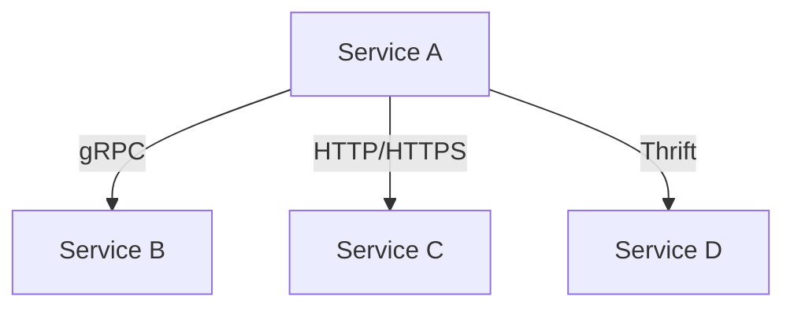
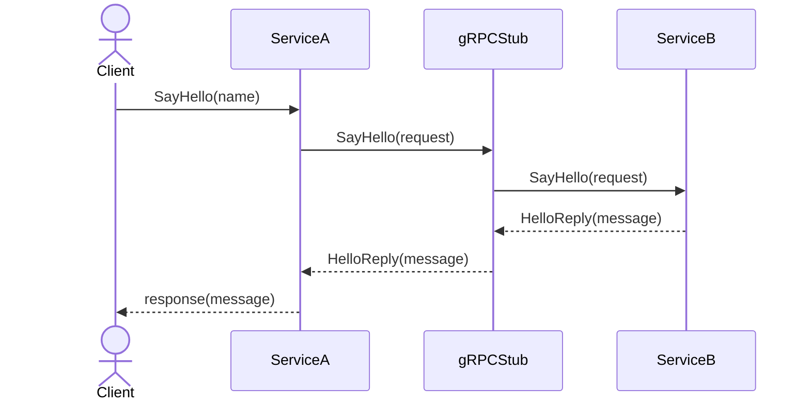

The Remote Procedure Invocation (RPI) Pattern enables services to communicate with each other and their external clients by using an RPI-based protocol such as gRPC, HTTP, or Thrift. This pattern facilitates inter-service remote communications by allowing certain services to invoke functions or procedures provided by other services over the network, simulating local procedure invocations.

## Intent

The intent of the Remote Procedure Invocation pattern is to provide a standardized way for services to communicate over a network, abstracting the complexity of performing remote calls by using familiar, simple method invocation constructs.

## Also Known As

- Remote Method Invocation (RMI)
- Remote Call Pattern
- API-based Communication

## Detailed Explanation and Mermaid Diagrams

In the context of microservices architecture, RPI plays a significant role by facilitating synchronous communications where a calling service waits for a response from a remote service. Typical RPI mechanisms include HTTP, gRPC, and Thrift.

### Key Features

- **Abstracted Interface**: The interface abstracts network complexities, appearing as local method invocations.
- **Standard Protocol**: Uses standard protocols such as HTTP/HTTPS, gRPC.
- **Language-Agnostic**: gRPC and similar frameworks are language-agnostic, making it easy to write clients and servers in different languages.

### Component Diagram



In this diagram, Service A communicates with Services B, C, and D through different RPI protocols such as gRPC, HTTP, and Thrift.

### Example Code Using gRPC

#### gRPC Service Definition (Proto File)
```proto
syntax = "proto3";

service Greeter {
    rpc SayHello (HelloRequest) returns (HelloReply);
}

message HelloRequest {
    string name = 1;
}

message HelloReply {
    string message = 1;
}
```

#### Server Implementation (Java with Spring Boot)
```java
@GRpcService
public class GreeterServiceImpl extends GreeterGrpc.GreeterImplBase {

    @Override
    public void sayHello(HelloRequest req, StreamObserver<HelloReply> responseObserver) {
        HelloReply reply = HelloReply.newBuilder().setMessage("Hello " + req.getName()).build();
        responseObserver.onNext(reply);
        responseObserver.onCompleted();
    }
}
```

#### Client Implementation (Java with Spring Boot)
```java
@Service
public class GreeterClient {

    private final GreeterGrpc.GreeterBlockingStub greeterStub;

    public GreeterClient(GreeterGrpc.GreeterBlockingStub greeterStub) {
        this.greeterStub = greeterStub;
    }

    public String sayHello(String name) {
        HelloRequest request = HelloRequest.newBuilder().setName(name).build();
        HelloReply response = greeterStub.sayHello(request);
        return response.getMessage();
    }
}
```

### Example Sequence Diagram



In this sequence diagram, a client sends a `SayHello` request to `ServiceA`, which in turn uses a gRPC stub to forward the call to `ServiceB`. `ServiceB` processes the request and sends back a response, which is propagated all the way back to the client.

## Benefits

- **Simplifies Development**: Allows use of familiar abstractions for developing complex distributed systems.
- **Interoperability**: Supports interactions between services written in different languages.
- **Standard Protocols**: Well-supported and standardized protocols enhance reliability and stability.

## Trade-Offs

- **Tight Coupling**: Service endpoints are tightly coupled through defined contracts.
- **Latency**: Synchronous calls can introduce latency especially if one service waits for responses from others.
- **Error Handling**: Requires robust error-handling mechanisms to deal with network related issues.

## When to Use

- Services need to perform synchronous operations requiring immediate responses.
- The system includes services written in different languages that need to interact.
- Operations mapping directly to network calls without complex orchestration.

### Example Use Cases

- Payment microservice requests payment status from a bank’s API using HTTP.
- User microservice invokes the authentication service using gRPC for secure communication.

## When Not to Use

- When asynchronous communication is preferred (Consider using the Event-driven pattern).
- Large payloads that can overload network resources.

### Anti-Patterns

- Overuse of synchronous RPI can lead to chained service dependencies and cascading failures.
- Bypassing API versioning which leads to frequent breaking changes across services.

## Related Design Patterns

- **Event-Driven Architecture**: Utilizes asynchronous communication and decouples service interactions.
- **API Gateway**: Manages and routes client requests to appropriate microservices providing a unified interface.
- **Backend for Frontend (BFF)**: Tailors API experiences to specific client interfaces reducing complexity.

## References and Further Reading
- [Designing Data-Intensive Applications](https://amzn.to/4cuX2Na) by Martin Kleppmann: This book provides fundamental knowledge about building robust, scalable, and maintainable applications.

## Open Source Frameworks and Tools
- **gRPC**: gRPC is a high-performance RPC framework hosted by Google.
- **Apache Thrift**: Protocol for defining and creating services used for RPCs.
- **Spring Cloud**: Part of the broader Spring ecosystem providing tools for building standard RPI services and clients.

## Cloud Computing
RPI is often used in different cloud service models including:
- **SAAS**: Software-as-a-Service platforms using HTTP or gRPC for service integration.
- **DAAS**: Data-as-a-Service applications making data requests over remote-procedure calls.
- **PAAS**: Platform-as-a-Service offerings facilitating service communication through built-in frameworks for API forwarding.

For additional knowledge, consider these books:
1. **[Building Microservices: Designing Fine-Grained Systems](https://amzn.to/3RYRz96) by Sam Newman**: Focuses on the microservices design and architecture including patterns like RPI.
2. **[Microservices Patterns: With examples in Java](https://amzn.to/4cSXzYV) by Chris Richardson**: This book details various microservice patterns including comprehensive examples in Java.

This detailed overview should equip you with necessary insights to effectively employ the Remote Procedure Invocation pattern in your microservices architecture.
