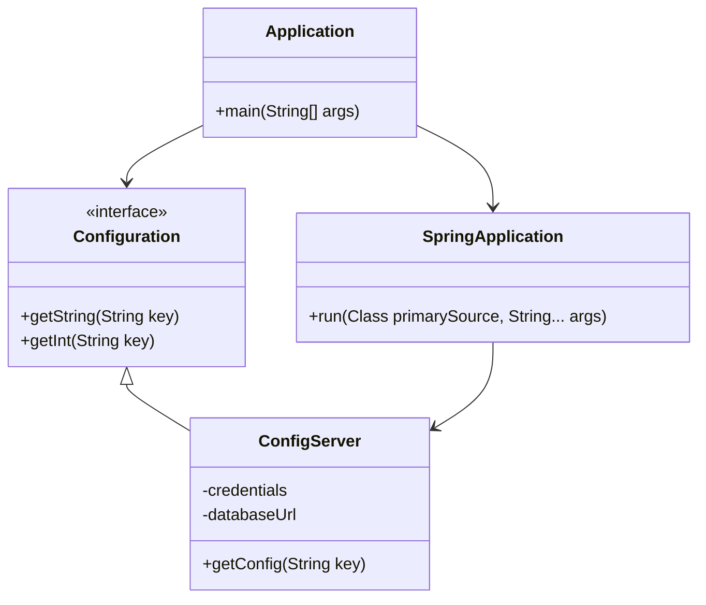
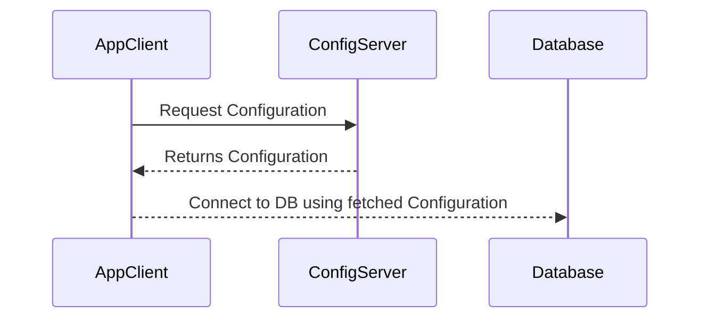
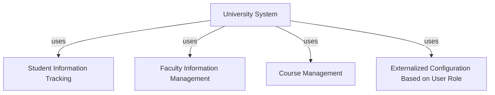

## Definition
The Externalized Configuration pattern externalizes configuration information (e.g., database locations, credentials, etc.) out of the application code to manage cross-cutting concerns, ensure flexibility and adaptability across different environments.

## Intent
The intent of the Externalized Configuration pattern is to separate configuration settings from the application's code to enhance flexibility, maintainability, and separation of concerns. Externalizing all the configuration settings allows easy updates without altering the application's source code.

## Also Known As
- Environment Configuration
- Configuration as Code

## Detailed Explanation

Externalized Configuration is central to designing microservices that can be effortlessly ported between environments like development, staging, production, etc. It supports different configurations without code change which handles cross-cutting concerns efficiently.

Mermaid class diagram example explaining components:



### Key Features
- **Separation of Concerns**: Configuration is well separated from the application code.
- **Centralized Management**: Configuration properties can be stored in a central place and managed effectively.
- **Dynamic Configuration**: Changes can be made to the configuration without redeploying or restarting the application.

## Code Example
### Spring Boot External Configuration Example
```java
@SpringBootApplication
public class MyApplication {
    public static void main(String[] args) {
        SpringApplication.run(MyApplication.class, args);
    }
}

@Configuration
@PropertySource("classpath:application.properties")
public class AppConfig {
    @Value("${database.url}")
    private String databaseUrl;

    @Value("${database.username}")
    private String databaseUsername;

    @Value("${database.password}")
    private String databasePassword;

    // Getters and Setters
}
```

### application.properties
```
database.url=jdbc:mysql://localhost:3306/mydb
database.username=root
database.password=secret
```

### Spring Cloud Config Server Example
```java
@EnableConfigServer
@SpringBootApplication
public class ConfigServerApplication {
    public static void main(String[] args) {
        SpringApplication.run(ConfigServerApplication.class, args);
    }
}
```

### config-repo/application.yml
```yaml
server:
  port: 8888

spring:
  profiles:
    active:
      - native
    include:
      - git
  cloud:
    config:
      server:
        native:
          search-locations: classpath:/configs
```

### Sequence Diagram


### Benefits
- **Flexibility**: Easily switch configurations for different environments.
- **Maintainability**: Simplifies management and understanding of application properties.
- **Scalability**: Centralized approach ensures seamless scalability.

### Trade-offs
- **Complex Setup**: Requires setting up and managing external configuration services.
- **Security Concerns**: Sensitive data managed externally requires robust security measures.

## When to Use
- When managing multiple environments (development, staging, production, etc.).
- When dealing with frequent changes in configuration.
- When having a centralized configuration management need.

## Example Use Cases
- Microservices needing different configurations for separate deployments.
- Applications where credentials and sensitive data must be secured separately from the source code.

## When Not to Use
- Small standalone applications with simple configuration needs.
- Applications where frequent configuration changes are not anticipated.

### Anti-patterns
- Hardcoding configurations
- Scattering configuration-related changes across application code

## Related Design Patterns
- **Service Discovery**: Works along with external configuration for dynamically locating and binding to services.
- **Centralized Configuration Pattern**: Managing configuration centrally for better management.

### References, Credits, Tools
- **Spring Cloud Config**: [Spring Cloud Config Documentation](https://spring.io/projects/spring-cloud-config)
- **Docker**: For managing configuration with containers.
- **Kubernetes ConfigMaps**: For handling configuration in cloud native applications.

## Suggested Books
- **"Spring Microservices in Action" by John Carnell**
- **[Microservices Patterns: With examples in Java](https://amzn.to/4cSXzYV) by Chris Richardson**

## Related Patterns Grouping Diagram


This group addresses different concerns for handling configuration, user roles, and information management in large-scale distributed systems.

With a well-organized configuration externalization, developers and architects can manage cross-cutting concerns effectively, handle environment-specific settings professionally and ensure the separation of configuration from the application codes.

By adopting Externalized Configuration, you can enhance your application's adaptability, scalability, and manageability significantly.
