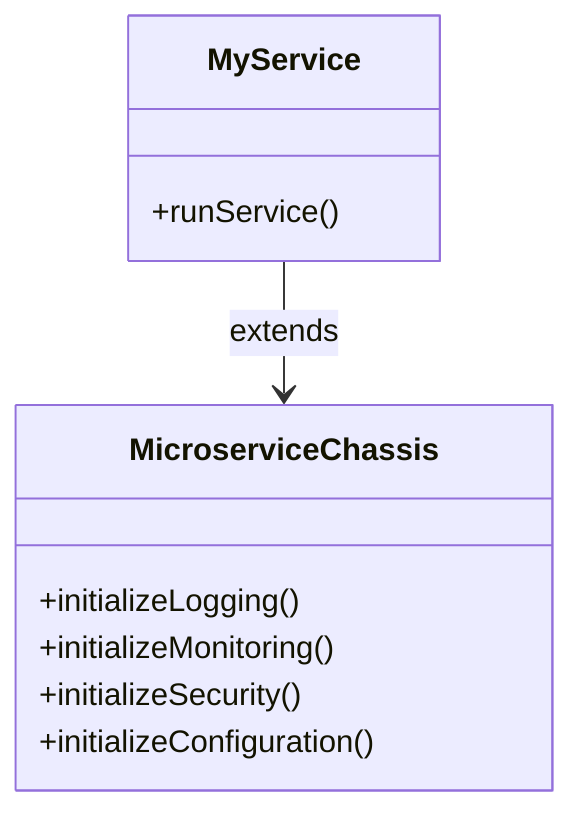
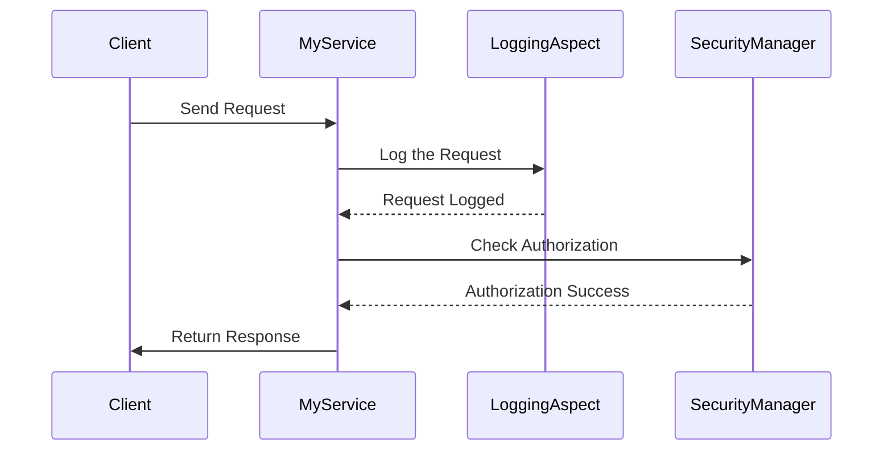
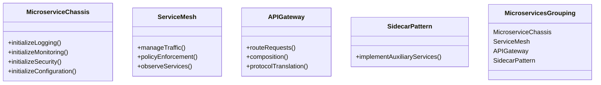

## Definition
A **Microservice Chassis** is a framework that externalizes and handles cross-cutting concerns such as logging, monitoring, security, and configuration management, to simplify the development of microservices.

## Intent
The intent of a Microservice Chassis is to provide a common infrastructure layer that can be reused across multiple microservices within an architecture, allowing developers to focus on the core business logic instead of boilerplate code.

## Also Known As
- Microservice Framework
- Service Template

## Detailed Explanation
A Microservice Chassis provides a set of built-in functionalities and best practices for handling common concerns that are needed across multiple services. These functionalities include but are not limited to:
- **Logging**: Standardized logging mechanisms.
- **Monitoring**: Health checks, metrics collection, and alerts.
- **Security**: Authentication, authorization, and encryption.
- **Configuration**: Externalized configuration management.
- **Service Discovery**: Registration and lookup for service instances.
- **Retry and Circuit Breaker**: Resilience patterns for network calls.
  
By using a microservice chassis, teams can avoid duplicating these concerns across services, ensuring consistency and reducing development time.

### Example Class Diagrams


### Example Sequence Diagrams


## Key Features
- **Centralized Logging** for capturing logs across services.
- **Unified Monitoring** through metrics and health checks.
- **Standardized Security** to handle authentication and authorization.
- **Externalized Configuration** managed via config files or environment variables.
- **Service Discovery** to manage dynamic service instantiation.
- **Retry and Circuit Breaker Mechanisms** for fault tolerance.

## Code Example in Java with Spring Boot and Spring Cloud
```java
// Microservice Chassis Framework
public class MicroserviceChassis {

    public void initializeLogging() {
        // Setup centralized logging
    }

    public void initializeMonitoring() {
        // Setup monitoring and metrics
    }

    public void initializeSecurity() {
        // Setup security mechanisms
    }

    public void initializeConfiguration() {
        // Externalized configuration setup
    }
}

// Microservice that extends the Chassis Framework
@SpringBootApplication
public class MyService extends MicroserviceChassis {

    public static void main(String[] args) {
        SpringApplication.run(MyService.class, args);
        initializeLogging();
        initializeMonitoring();
        initializeSecurity();
        initializeConfiguration();
        
        runService();
    }

    public static void runService() {
        // Service logic
    }
}
```

## Benefits
- **Consistency**: Provides common infrastructural services consistently across all microservices.
- **Reusability**: Infrastructural code is written once and used everywhere.
- **Focused Development**: Developers can concentrate on business logic.
- **Reduced Boilerplate**: Minimizes redundancy by removing boilerplate code.

## Trade-offs
- **Learning Curve**: Teams need to learn the chassis framework.
- **Rigidity**: Additional setup can introduce constraints or limit customization.
- **Complexity**: Adds a level of abstraction that might be overkill for simple applications.

## When to Use
- **Large Scale Systems**: When managing and developing a system with numerous microservices.
- **Consistency and Reusability**: When consistency across services and reusable infrastructure code is essential.
- **Complex Cross-Cutting Concerns**: When dealing with complex cross-cutting concerns that need consistent management.

## Example Use Cases
- **E-commerce Platforms**: Where multiple microservices like payment, inventory, and order management need logging, security, and configuration.
- **Financial Systems**: Ensuring compliance with security regulations and standardized monitoring across services.
- **Healthcare Systems**: Managing sensitive information with strict security and consistent logging.

## When Not to Use and Anti-patterns
- **Simple Applications**: Where the majority of services don’t have complex cross-cutting concerns.
- **Over-engineered Solutions**: Adding a microservice chassis to a small application may lead to unnecessary complexity.

## Related Design Patterns
- **Service Mesh**: A dedicated infrastructure layer for handling service-to-service communication.
- **API Gateway**: A single entry point that provides routing, composition, and protocol translation.
- **Sidecar Pattern**: A microservice design pattern where sidecar services help manage cross-cutting concerns.

### Comparisons
- **Microservice Chassis vs Service Mesh**: Service Mesh focuses specifically on service communication, whereas Microservice Chassis covers broader cross-cutting concerns.
- **Microservice Chassis vs API Gateway**: While API Gateway handles incoming traffic at the edge, Microservice Chassis manages concerns within services.

## References and Credits
- [Spring Boot Documentation](https://spring.io/projects/spring-boot)
- [Spring Cloud Documentation](https://spring.io/projects/spring-cloud)
- [Microservices Architecture on AWS](https://aws.amazon.com/microservices/)

## Open Source Frameworks and Tools
- **Spring Boot**: A framework for building production-ready applications.
- **Spring Cloud**: Tools for managing distributed systems.
- **Istio**: Service mesh to connect, secure, control, and observe services.

## Cloud Computing
Functionalities provided by Microservice Chassis can be supplementary to PAAS and SAAS offerings where the platform or service handles many infrastructural concerns.

## Suggested Books for Further Studies
- *Building Microservices* by Sam Newman
- *Microservices Patterns* by Chris Richardson

## Grouping Related Patterns


Through these visual diagrams and explanatory sections, we can effectively comprehend the usage and integration of the Microservice Chassis in a modern microservices architecture.
