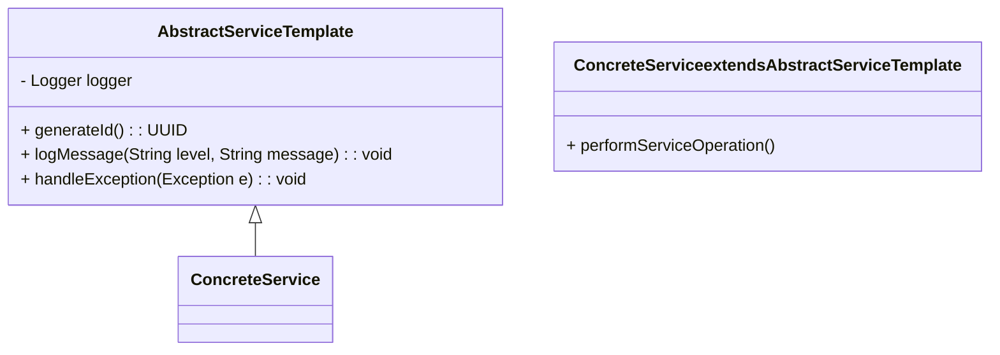
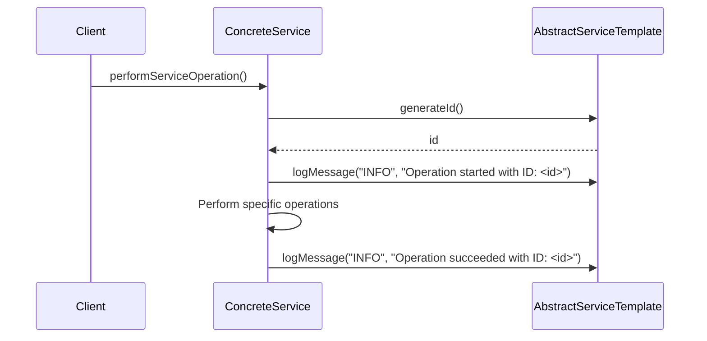

---

title: Service Template
linkTitle: Service Template
description: "A Service Template pattern helps to quickly start developing a new service by implementing standard cross-cutting concerns. This article covers its definition, benefits, trade-offs, and examples in Java with Spring Boot and Spring Cloud."
type: docs
date: 2024-08-17
draft: false
meta: 
  date: false
  reading_time: false
authors:
  - fuadefendi
series:
  - Microservices
categories:
  - Service Template
tags:
  - Service Template Pattern
  - Microservices Architecture
  - Spring Boot
  - Spring Cloud
  - Cross-Cutting Concerns
  - Code Quality
  - Fast Development
  - Reusability
canonical: "https://softwarepatternslexicon.com/java-microservices/cross-cutting-concerns/service-template"
license: "© 2024 Tokenizer Inc. CC BY-NC-SA 4.0"
---

## Definition
The Service Template pattern offers a standardized template that implements common functionalities (cross-cutting concerns) for services, allowing developers to quickly start developing new services by copying the template.

## Intent
- To streamline the creation and onboarding of new services by providing a ready-to-use, standardized starting template.
- To consistently address cross-cutting concerns such as logging, monitoring, error handling, security, etc.

## Also Known As
- Service Blueprints
- Boilerplate Service Template

## Detailed Definitions and Explanations

### Key Features
- **Consistency**: Ensures uniformity across different services.
- **Standardization**: Standardizes the implementation of cross-cutting concerns.
- **Reusability**: Encourages code reuse.
- **Fast Setup**: Reduces the setup time for new services.

### Cross-Cutting Concerns
Cross-cutting concerns are aspects of a program that tend to affect other parts of the system and include:
- Logging
- Monitoring
- Security
- Configuration
- Exception Handling
- Transaction Management

### Article Index 
1. **Definition and Intent**
2. **Key Features**
3. **Detailed Mermaid Class Diagram**
4. **Detailed Code Example**
5. **Example Sequence Diagram**
6. **Benefits**
7. **Trade-offs**
8. **When to Use**
9. **Example Use Cases**
10. **When Not to Use**
11. **Anti-patterns**
12. **Related Design Patterns**
13. **References**

### Class Diagram



### Explanation
- **AbstractServiceTemplate**: Implements the common functionalities that address cross-cutting concerns.
- **ConcreteService**: Inherits the template and adds service-specific operations.

### Code Example

```java
// AbstractServiceTemplate.java
import java.util.UUID;
import org.slf4j.Logger;
import org.slf4j.LoggerFactory;

public abstract class AbstractServiceTemplate {
    protected Logger logger = LoggerFactory.getLogger(this.getClass());
    
    protected UUID generateId() {
        return UUID.randomUUID();
    }
    
    protected void logMessage(String level, String message) {
        switch(level) {
            case "INFO":
                logger.info(message);
                break;
            case "ERROR":
                logger.error(message);
                break;
            default:
                logger.debug(message);
                break;
        }
    }

    protected void handleException(Exception e) {
        logger.error("Exception occurred: ", e);
    }
}
```

### Concrete Example

```java
// ConcreteService.java
public class ConcreteService extends AbstractServiceTemplate {

    public void performServiceOperation() {
        try {
            UUID id = generateId();
            logMessage("INFO", "Operation started with ID: " + id);
            // Service specific code
            logMessage("INFO", "Operation succeeded with ID: " + id);
        } catch (Exception e) {
            handleException(e);
        }
    }
}
```

### Sequence Diagram



### Benefits
- **Reduced Boilerplate Code**: Spares developers from writing repetitive code.
- **Uniformity**: Ensures a consistent approach to handling cross-cutting concerns.
- **Rapid Onboarding**: Speeds up setting up new services.
- **Improved Maintenance**: Makes the system easier to maintain.

### Trade-offs
- **Overhead**: Might introduce some performance overhead due to additional abstractions.
- **Learning Curve**: Developers need to learn and understand the template thoroughly.
- **Inflexibility**: It might be rigid in scenarios needing unique customizations.

### When to Use
- When you want to speed up the set-up of new microservices.
- When standardizing the implementation of cross-cutting concerns is necessary.

### Example Use Cases
- Rapidly growing organizations where new services are a regular necessity.
- Applications where consistency in logging, monitoring, and security is mandatory.

### When Not to Use
- For very unique services that don’t align with the standardized approaches.
- When performance overheads are not acceptable.

### Anti-patterns
- **Ignoring** customization needs that certain services may have.
- **Overloading** the template with too many generalized functionalities.

### Related Design Patterns
- **Aspect-Oriented Programming (AOP)**: Handles cross-cutting concerns via aspects.
- **Microservices Chassis**: Combines multiple cross-cutting concerns into a single framework.

## References
- [Spring Boot Documentation](https://spring.io/projects/spring-boot)
- [Spring Cloud Documentation](https://spring.io/projects/spring-cloud)
- [Microservices Patterns by Chris Richardson](https://www.oreilly.com/library/view/microservices-patterns/9781617294549/)

## Books
- [Microservices Patterns: With examples in Java](https://amzn.to/4cSXzYV) by Chris Richardson
- [Building Microservices: Designing Fine-Grained Systems](https://amzn.to/3RYRz96) by Sam Newman

## Open Source Frameworks
- **Spring Boot**
- **Spring Cloud**

---

This structured article provides all the necessary information about the "Service Template" design pattern using the requested format and outlines.
