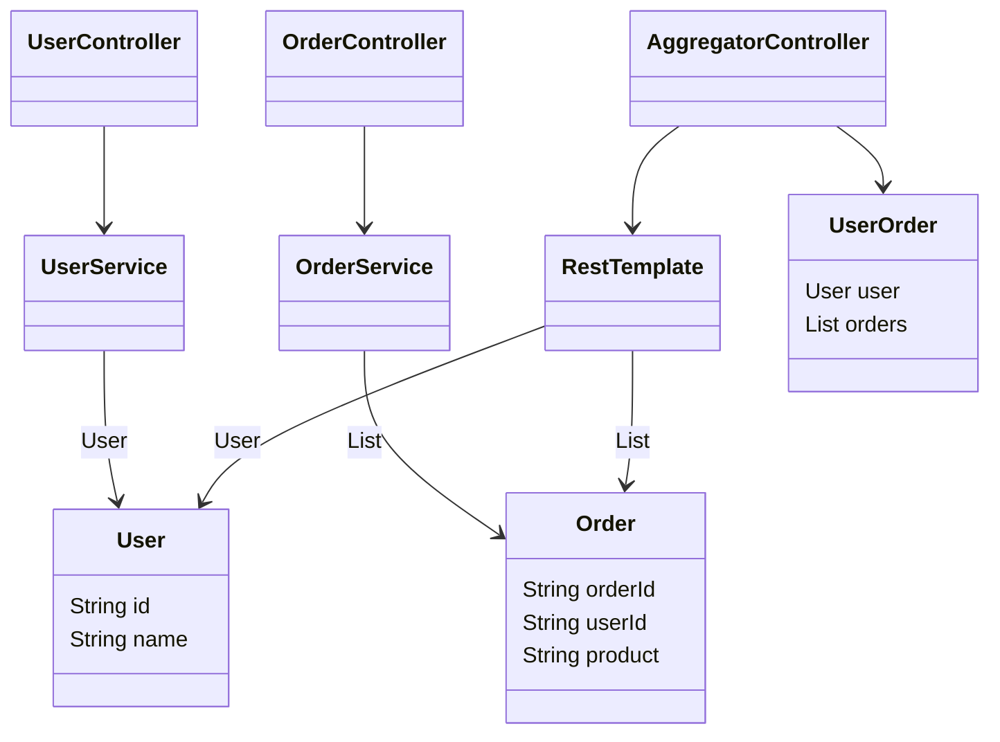
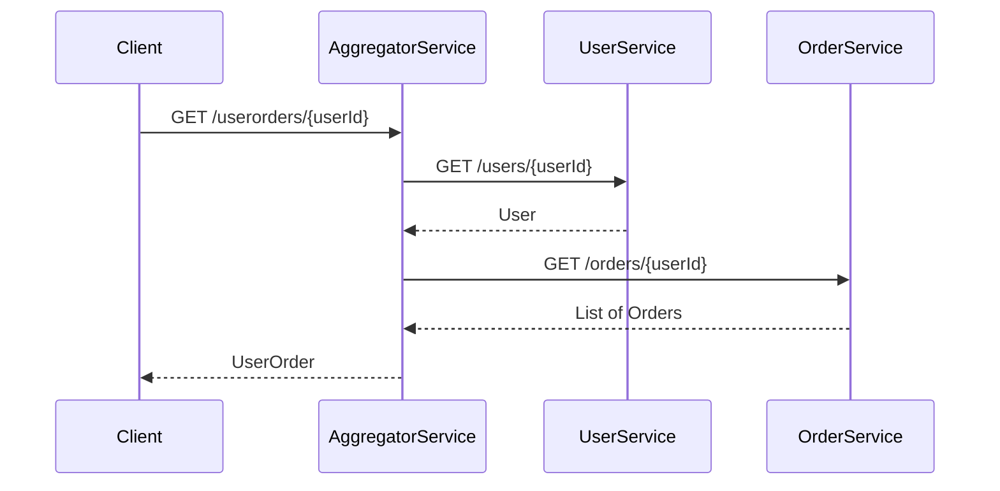

## API Composition

### Definition
The API Composition pattern implements complex queries by invoking various services that own the required data and then performing an in-memory join to compile the results.

### Intent
To enable efficient querying and data aggregation in a microservices-based architecture without direct database joins across services.

### Also Known As
- **Aggregator Microservice**
- **Query Aggregator**

### Detailed Explanation

In a microservice architecture, each service owns its own data. When a complex query spans multiple services, the API Composition pattern is used to gather data from different services and perform an in-memory join. This pattern helps maintain data consistency by ensuring that each service remains responsible for its own data.

#### Key Features
1. **Data Aggregation:** Aggregates data from multiple microservices.
2. **In-Memory Join:** Performs data aggregation or joins in memory.
3. **Loose Coupling:** Maintains loose coupling between services.
4. **Data Consistency:** Ensures data consistency by making services responsible for their own data.

### Code Examples

Here's a simple example using **Spring Boot** and **Spring Cloud**:

#### Service A - User Service

```java
// UserController.java
@RestController
@RequestMapping("/users")
public class UserController {

    @Autowired
    private UserService userService;

    @GetMapping("/{userId}")
    public User getUser(@PathVariable String userId) {
        return userService.getUserById(userId);
    }
}

// UserService.java
@Service
public class UserService {

    public User getUserById(String userId) {
        // Implement method to fetch user details
    }
}

// User.java
public class User {
    private String id;
    private String name;
    // getters and setters
}
```

#### Service B - Order Service

```java
// OrderController.java
@RestController
@RequestMapping("/orders")
public class OrderController {

    @Autowired
    private OrderService orderService;

    @GetMapping("/{userId}")
    public List<Order> getOrdersByUserId(@PathVariable String userId) {
        return orderService.getOrdersByUserId(userId);
    }
}

// OrderService.java
@Service
public class OrderService {

    public List<Order> getOrdersByUserId(String userId) {
        // Implement method to fetch orders by user
    }
}

// Order.java
public class Order {
    private String orderId;
    private String userId;
    private String product;
    // getters and setters
}
```

#### API Composition - Aggregator Service

```java
// AggregatorController.java
@RestController
@RequestMapping("/userorders")
public class AggregatorController {

    @Autowired
    private RestTemplate restTemplate;

    @GetMapping("/{userId}")
    public UserOrder getUserOrders(@PathVariable String userId) {
        User user = restTemplate.getForObject("http://USER-SERVICE/users/" + userId, User.class);
        List<Order> orders = restTemplate.getForObject("http://ORDER-SERVICE/orders/" + userId, List.class);
        return new UserOrder(user, orders);
    }
}

// UserOrder.java
public class UserOrder {
    private User user;
    private List<Order> orders;

    // constructor, getters and setters
}
```

### Example Class Diagram



### Example Sequence Diagram



### Benefits

1. **Decoupled Services:** Each service can be developed and deployed independently.
2. **Improved scalability:** Services can scale independently based on the load.
3. **Flexible Aggregation:** Supports flexible and complex data aggregation needs by performing in-memory composition.

### Trade-offs

1. **Latency:** Multiple network calls can increase overall response time.
2. **Complexity:** Complexity in handling failures and consistency across services.
3. **Resource Intensive:** In-memory operations can be resource-intensive for large datasets.

### When to Use

- When you need to aggregate data from multiple services.
- When the consistency of each service’s data must be maintained independently.
- When database joins across tables owned by different services are not feasible.

### Example Use Cases

- Building complex views like user dashboards that need data from multiple services.
- Aggregating purchase history and user preferences for an e-commerce platform.
- Compiling reports for customers that encapsulate data across various departments.

### When Not to Use and Anti-patterns

- **Extremely High Latency:** In scenarios where network latency between services is extremely high.
- **Large Data Sets:** For queries that return large datasets, the in-memory join might not be efficient.

### Related Design Patterns

- **CQRS:** Command Query Responsibility Segregation - separation of read and write operations.
- **Event Sourcing:** For tracing operations top-down by events.

### References

- "Microservices Patterns" by Chris Richardson
- [Designing Data-Intensive Applications](https://amzn.to/4cuX2Na) by Martin Kleppmann
- [Spring Cloud Documentation](https://spring.io/projects/spring-cloud)

### Credits
- Chris Richardson - Microservices Patterns
- Spring Team - Spring Boot and Spring Cloud documentation

### Open Source Frameworks and Tools

- **Spring Boot**: Framework for building microservices.
- **Spring Cloud**: Provides tools for managing configurations, service discovery, etc.
- **Netflix OSS**: For handling inter-service communication and load balancing.

### Cloud Computing and Platforms

- **AWS API Gateway**: Aggregates services in AWS.
- **Google Cloud Endpoints**: API management solutions on Google Cloud.

### Suggested Books for Further Studies

- "Microservices Patterns" by Chris Richardson
- [Building Microservices: Designing Fine-Grained Systems](https://amzn.to/3RYRz96) by Sam Newman
- [Designing Data-Intensive Applications](https://amzn.to/4cuX2Na) by Martin Kleppmann
