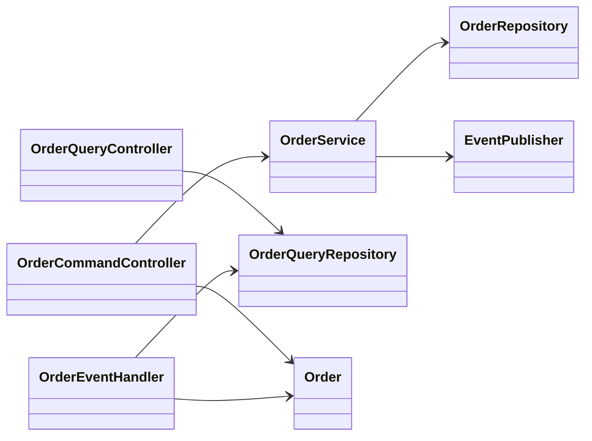
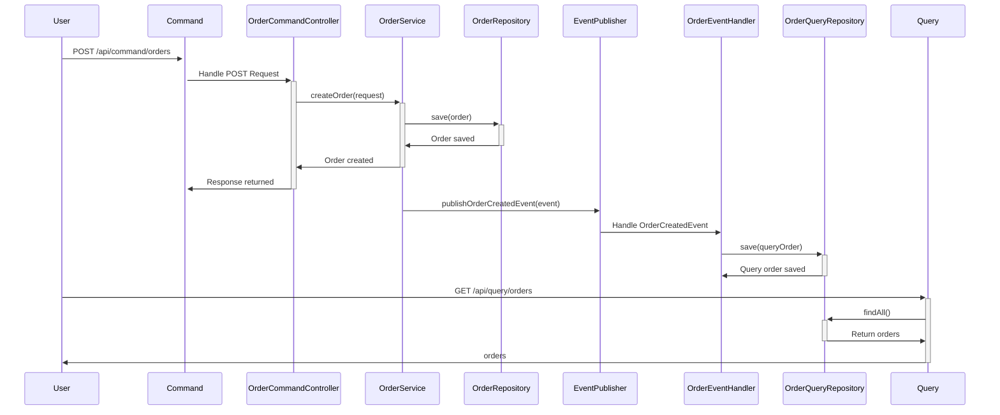
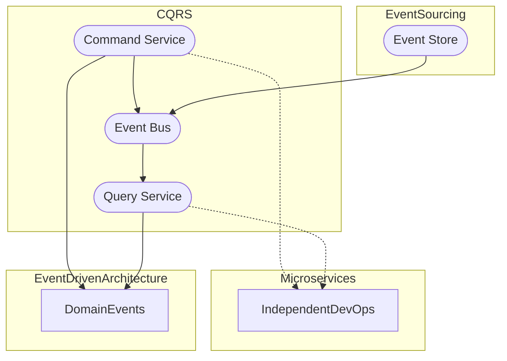

## Command-Side Replica

### Definition
The Command-Side Replica pattern involves maintaining a separate, queryable replica of data in a service that primarily handles commands. This pattern helps in maintaining data consistency and optimizing query execution.

### Intent
- To separate the concerns of command processing and query execution.
- To ensure data consistency between command and query models.
- To improve performance by optimizing queries.

### Also Known As
- CQRS (Command Query Responsibility Segregation)
- Query Model

### Key Features
- **Separation of Command and Query Operations:** Commands are responsible for updates, and queries only retrieve data.
- **Eventual Consistency:** Ensures that the command-side and query-side databases are eventually consistent.
- **Flexible Scalability:** Command and query sides can be scaled independently.

### Code Example

#### Java Implementation with Spring Boot and Spring Cloud

**Command Service**
```java
@RestController
@RequestMapping("/api/command/orders")
public class OrderCommandController {

    @Autowired
    private OrderService orderService;

    @PostMapping
    public ResponseEntity<String> createOrder(@RequestBody OrderCreateRequest request) {
        orderService.createOrder(request);
        return ResponseEntity.ok("Order created successfully");
    }
}

@Service
public class OrderService {

    @Autowired
    private OrderRepository orderRepository;

    @Autowired
    private EventPublisher eventPublisher;
    
    public void createOrder(OrderCreateRequest request) {
        Order order = new Order(request.getOrderId(), request.getProduct(), request.getQuantity());
        orderRepository.save(order);
        eventPublisher.publishOrderCreatedEvent(new OrderCreatedEvent(order));
    }
}
```

**Query Service**
```java
@RestController
@RequestMapping("/api/query/orders")
public class OrderQueryController {

    @Autowired
    private OrderQueryRepository orderQueryRepository;

    @GetMapping
    public ResponseEntity<List<Order>> getAllOrders() {
        return ResponseEntity.ok(orderQueryRepository.findAll());
    }
}

@Repository
public interface OrderQueryRepository extends JpaRepository<Order, Long> {
}
```

**Event Handling for Data Consistency**
```java
@Component
public class OrderEventHandler {

    @Autowired
    private OrderQueryRepository orderQueryRepository;

    @EventListener
    public void on(OrderCreatedEvent event) {
        Order order = new Order(event.getOrderId(), event.getProduct(), event.getQuantity());
        orderQueryRepository.save(order);
    }
}
```

### Class Diagram



### Sequence Diagram



### Benefits
- **Improved Performance:** Queries do not interfere with command operations.
- **Data Isolation:** Command and query operations are isolated for better consistency.
- **Scalability:** Scalability at a granular level allows for optimized resource usage.

### Trade-offs
- **Data Synchronization Complexity:** Achieving eventual consistency introduces complexity.
- **Increased Latency:** Event propagation may introduce delays.
- **Duplicated Data Storage:** Maintains separate storages for command and query.

### When to Use
- When you need to separate read and write workloads for better performance.
- In systems where distinct scalability of command and query operations is crucial.
- When eventual consistency is acceptable.

### Example Use Cases
- E-commerce platforms where order creation and order querying are done at a massive scale.
- Financial systems where transactions are recorded separately from transaction queries.
- Large-scale CMS with high traffic for both content creation and content consumption.

### When Not to Use
- For simple applications where the overhead of maintaining two separate models is unnecessary.
- In real-time systems where eventual consistency is not acceptable.
- In systems with a uniform access pattern for both read and write operations.

### Anti-Patterns
- **Monolith Systems:** Combining command and query in a monolith negates the benefits.
- **Ignored Event Handling:** Not properly synchronizing data leads to data inconsistency.
- **Over-Engineering:** Using this pattern unnecessarily adds complexity.

### Related Design Patterns
- **Event Sourcing:** Works well with CQRS for capturing all state changes as events.
- **Microservices:** Enables better separation and scaling by decomposing applications.
- **Event-Driven Architecture:** Facilitates decoupling by utilizing asynchronous messaging.

### References and Credits
- **Books:**  
  [Designing Data-Intensive Applications by Martin Kleppmann](https://amzn.to/3Ch5RIh)  
  [Building Microservices by Sam Newman](https://amzn.to/38XmTgv)

- **Open Source Frameworks and Tools:**  
  [Spring Boot](https://spring.io/projects/spring-boot)  
  [Spring Cloud](https://spring.io/projects/spring-cloud)  
  [Kafka](https://kafka.apache.org/)

### Grouped Patterns to Manage Command Query Separation


- **CQRS:** Separation of command and query models.
- **Event Sourcing:** Provides a way to log every state change in the event store.
- **Microservices:** Enable separation of responsibilities and independent scaling.
- **Event-Driven Architecture:** Encourages decoupled services that react to domain events.


That should give you a robust and well-structured guide on the Command-Side Replica pattern with practical usage examples in Java using the Spring Boot and Spring Cloud frameworks.
