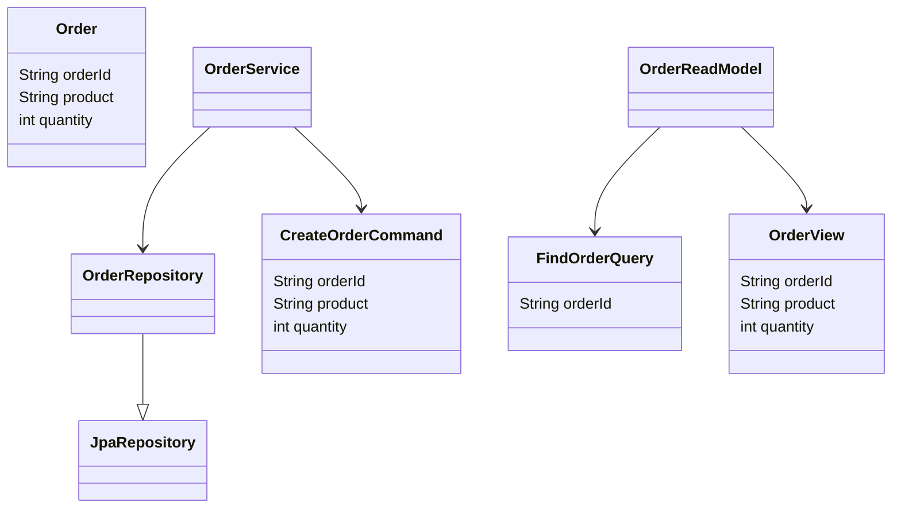
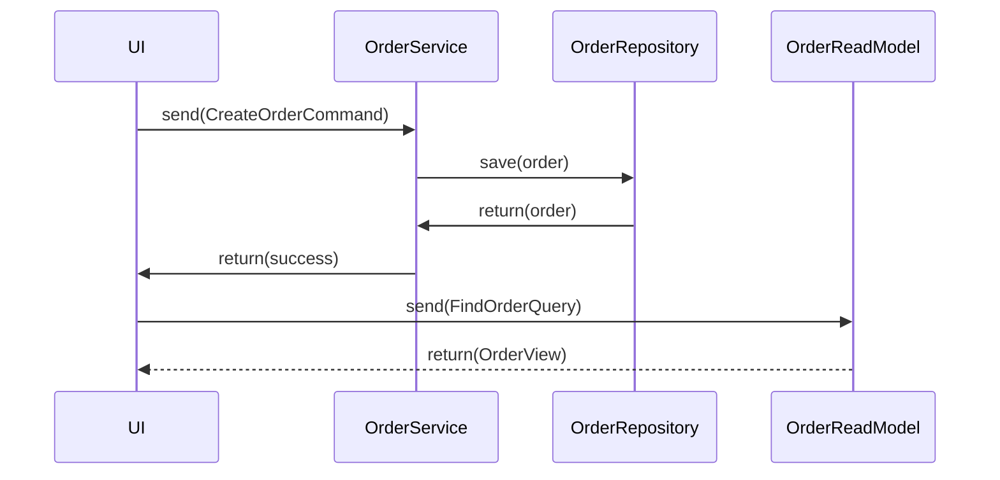
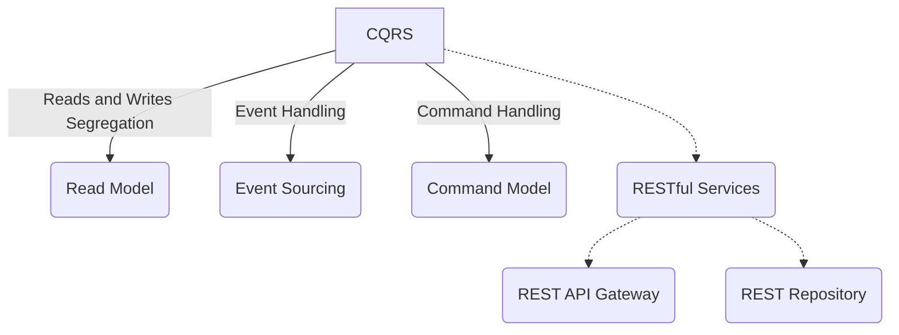

## Definition
CQRS stands for Command Query Responsibility Segregation, a pattern that separates the read and write operations of a database into two different models.

## Intent
- To separate read and write logic into separate models to optimize performance, scalability, and simplicity.
- To maintain data consistency by handling materialized views and using domain events.

## Also Known As
- Command Query Separation

## Detailed Definition and Explanations
The CQRS pattern is based on the principle of separating concerns. By splitting the read and write operations, each side can be optimized independently. The write model (commands) updates data while the read model (queries) fetches data from one or more materialized views.

### Key Features
- Separate read and write models
- Eventual consistency between models
- Scalability and performance improvements
- Clear separation of concerns
- Improved security by segregating permissions

### Code Examples

Let's create a simple e-commerce application in Java with Spring Boot to demonstrate the CQRS pattern.

#### Pom.xml

```xml
<dependencies>
    <!-- Spring Data JPA for ORM and Database interactions -->
    <dependency>
        <groupId>org.springframework.boot</groupId>
        <artifactId>spring-boot-starter-data-jpa</artifactId>
    </dependency>
    <!-- H2 Database for in-memory database -->
    <dependency>
        <groupId>com.h2database</groupId>
        <artifactId>h2</artifactId>
        <scope>runtime</scope>
    </dependency>
    <!-- Spring Web for REST endpoints -->
    <dependency>
        <groupId>org.springframework.boot</GroupId>
        <artifactId>spring-boot-starter-web</artifactId>
    </dependency>
</dependencies>
```

#### Write Model

```java
// Command for creating an order
public class CreateOrderCommand {
    private String orderId;
    private String product;
    private int quantity;
    // Getters and Setters...
}

// OrderService to handle commands
@Service
public class OrderService {
    @Autowired
    private OrderRepository orderRepository;

    public void createOrder(CreateOrderCommand command) {
        Order order = new Order(command.getOrderId(), command.getProduct(), command.getQuantity());
        orderRepository.save(order);
    }
}

// Write Model repository
@Repository
public interface OrderRepository extends JpaRepository<Order, String> {}
```
#### Read Model

```java
// Query for finding Order
public class FindOrderQuery {
    private String orderId;
    // Constructor and Getters...
}

// OrderReadModel to handle queries
@Service
public class OrderReadModel {
    private Map<String, OrderView> orderViewDatabase = new HashMap<>();

    public OrderView handle(FindOrderQuery query) {
        return orderViewDatabase.get(query.getOrderId());
    }
}

// OrderView to represent read entity
public class OrderView {
    private String orderId;
    private String product;
    private int quantity;
    // Constructor, Getters and Setters...
}
```

### Example Class Diagrams



### Example Sequence Diagrams



### Benefits
- Improved scalability by segregating read and write workloads.
- Enhanced maintainability by clearly separating concerns.
- Simplified read operations with optimized queries.
- Better security with isolated command and query models.

### Trade-offs
- Increased complexity due to maintaining multiple models.
- Eventual consistency can be challenging to manage.
- Requires careful synchronization and event management.

### When to Use
- When you have a large amount of read operations compared to write operations.
- When your application's read and write concerns differ significantly.
- When you need to optimize performance and scalability separately.

### Example Use Cases
- High-traffic e-commerce applications.
- Content management systems with frequent reads and occasional writes.
- Applications with complex read models and simpler write models.

### When Not to Use and Anti-patterns
- When the application is simple and does not demand the complexity of separate models.
- When strong consistency is required more than performance or scalability.
- When it leads to unnecessary complexity without substantial benefits.

### Related Design Patterns

- **Event Sourcing**: Often used in conjunction with CQRS to handle state changes.
- **Command Pattern**: CQRS builds on this principle by separating commands from queries.

### References
- [CQRS Pattern - Microsoft Docs](https://docs.microsoft.com/en-us/azure/architecture/patterns/cqrs)
- [Spring Data JPA - Spring Doc](https://spring.io/projects/spring-data-jpa)

### Credits and Open Source Frameworks
- [Axon Framework](https://axoniq.io/)
- [Spring Boot](https://spring.io/projects/spring-boot)
- [Amazon DynamoDB](https://aws.amazon.com/dynamodb/) (For materialized views)

### Third Party Tools
- [Kafka](https://kafka.apache.org/) for event streaming.
- [RabbitMQ](https://www.rabbitmq.com/) for messaging and event handling.

### Cloud Computing
- **SAAS**: Large-scale apps like CRM software could leverage CQRS.
- **PAAS**: Utilize services like Azure Functions or AWS Lambda for data synchronization.
  
### Suggested Books for Further Studies
- *[Patterns of Enterprise Application Architecture](https://amzn.to/4cGutvM)* by Martin Fowler
- *[Domain-Driven Design: Tackling Complexity in the Heart of Software](https://amzn.to/3zyYxeB)* by Eric Evans
- *[Implementing Domain-Driven Design](https://amzn.to/3SnNqvq)* by Vaughn Vernon
  
## Grouping Related Patterns with Mermaid Diagrams



**Effective Resolution Guidance:**
1. **For High Read Operations**:
   - Use **CQRS Pattern** with **Separate Read Models** for efficient queries.
2. **For State Handling**:
   - Combine **CQRS** with **Event Sourcing** for historical state tracking.
3. **For Centralized API Management**:
   - Implement **REST API Gateway** in combination with **CQRS**.
  
By appropriately organizing related patterns, one can address high-read traffic, state persistence, and single-point API management effectively.

---
