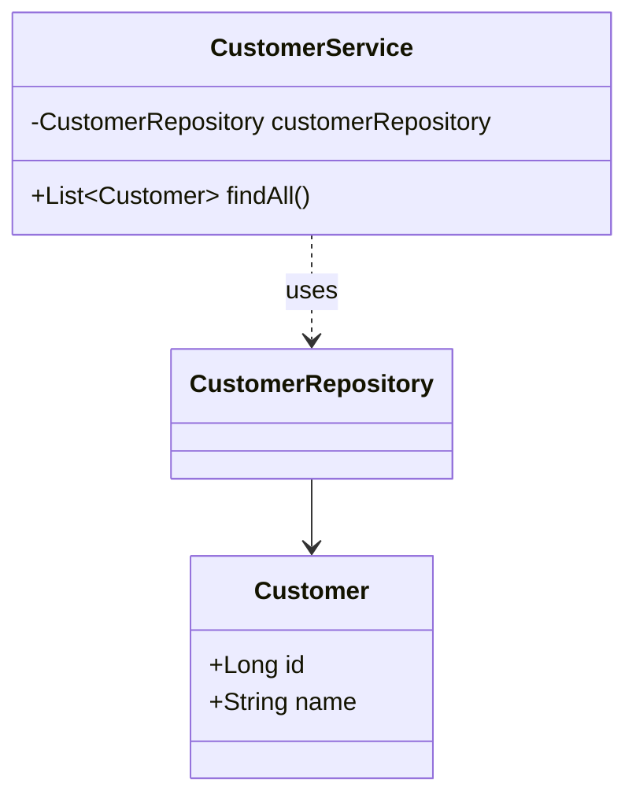
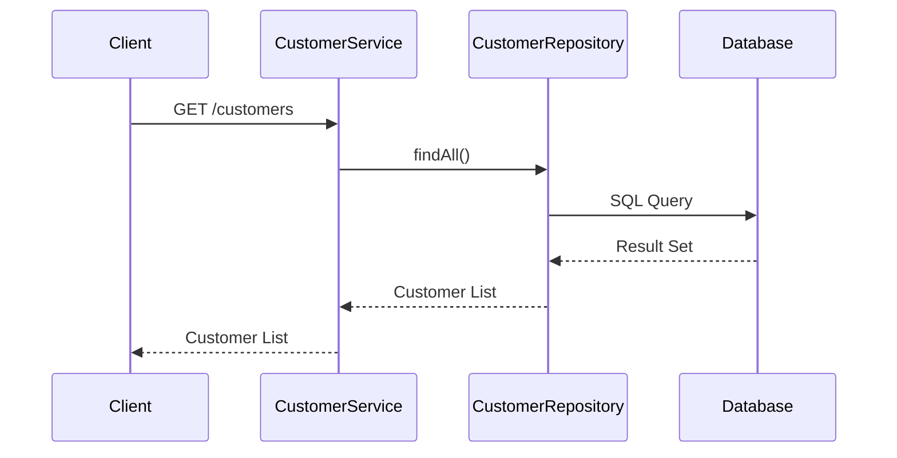

## Definition
The Database per Service pattern mandates that each microservice in an architecture has its own private database. This ensures each service can manage its own data independently without being affected by changes in other services.

## Intent
The primary intent of using Database per Service is to achieve data encapsulation and autonomy. Each service is responsible only for its own data, allowing independent scaling, development, and deployment.

## Also Known As
- Service-Specific Database
- Service-Owned Database
- Microservice Database

## Detailed Explanation
In microservices architecture, sharing a single database among multiple services can lead to tight coupling and data inconsistency problems. The Database per Service pattern avoids these issues by providing each microservice its own database.

### Key Features
- **Encapsulation**: Each service accesses only its private database, ensuring data isolation.
- **Autonomy**: Independent database schema allowing services to evolve without dependency on other services.
- **Independent Scalability**: Each service’s database can be scaled independently based on its specific requirements.

### Code Example
Here's an example in Java using Spring Boot and Spring Data JPA to demonstrate one microservice with its own database:

#### `application.properties` 
```properties
spring.datasource.url=jdbc:mysql://localhost:3306/serviceA_db
spring.datasource.username=root
spring.datasource.password=root
spring.datasource.driver-class-name=com.mysql.cj.jdbc.Driver
spring.jpa.hibernate.ddl-auto=update
```

#### `Customer.java`
```java
import javax.persistence.Entity;
import javax.persistence.Id;

@Entity
public class Customer {
    @Id
    private Long id;
    private String name;
    
    // Getters and Setters
}
```

#### `CustomerRepository.java`
```java
import org.springframework.data.jpa.repository.JpaRepository;

public interface CustomerRepository extends JpaRepository<Customer, Long> {

}
```

#### `CustomerService.java`
```java
import org.springframework.beans.factory.annotation.Autowired;
import org.springframework.stereotype.Service;
import java.util.List;

@Service
public class CustomerService {

    @Autowired
    private CustomerRepository customerRepository;

    public List<Customer> findAll() {
        return customerRepository.findAll();
    }
    // Other methods
}
```

### Example Class Diagram


**Explanation**: The `CustomerService` uses `CustomerRepository` to perform CRUD operations on `Customer`, with `Customer` representing an entity in the private database for the service.

### Example Sequence Diagram


**Explanation**: The sequence starts with the client requesting a list of customers. The `CustomerService` interacts with the `CustomerRepository`, which in turn queries the database and returns the data back through the service to the client.

## Benefits
- **Service Isolation**: Each service operates independently with its own schema.
- **Resiliency**: Isolated databases enhance the resiliency of the overall system.
- **Independent Deployment**: Easier to update/deploy individual services without affecting other parts of the system.
- **Optimized Scaling**: Scale services and their databases independently based on specific load requirements.

## Trade-offs
- **Data Consistency**: Maintaining data consistency across services can be complex.
- **Query Complexity**: Implementing cross-service queries becomes challenging.
- **Increased Resources**: Each service requires its own database resources, leading to increased overhead.

## Maintaining Data Consistency
- **Saga Pattern**: Use distributed transactions where each service transaction is a step in a larger transaction.
- **Event-Driven Architecture**: Services publish and subscribe to events to keep data in sync.
- **CQRS (Command Query Responsibility Segregation)**: Separate data write and read models to manage consistency.

## Implementing Queries
- **API Composition**: Aggregate data from various services by making multiple service calls.
- **Database View**: Create read-only views combining data from multiple services.
- **Materialized Views**: Use periodically refreshed views for read-heavy operations.

## When to Use
- When you need strong service encapsulation and independence.
- For systems requiring independent scaling of different services.
- In scenarios where teams work on separate microservices independently.

## Example Use Cases
- E-commerce platforms managing products, orders, and users with different services.
- Financial systems where customer, transaction, and account data are handled by distinct services.

## When Not to Use
- Small scale systems where the overhead of multiple databases is not justified.
- Applications where strong transactional consistency is crucial and difficult to maintain through compensating transactions.

## Anti-patterns
- **Shared Database**: Avoid multiple services directly accessing the same database to prevent tight coupling.
- **Tightly Coupled Services**: Ensure services do not heavily depend on each other’s databases to avoid complex interdependencies.

## Related Design Patterns
### Saga Pattern
Handles distributed transactions across microservices using compensating transactions to maintain consistency.
### CQRS
Separates the read and write operations facilitating performance optimization and complex querying.

## References and Further Reading
- [Building Microservices: Designing Fine-Grained Systems](https://amzn.to/3RYRz96) by Sam Newman
- [Microservices Patterns: With examples in Java](https://amzn.to/4cSXzYV) by Chris Richardson

## Open Source Frameworks and Tools
- **Spring Boot**: Simplifies the development of microservices with its ecosystem support.
- **Apache Kafka**: Event streaming platform.
- **Axon Framework**: CQRS and event-sourcing framework for Java.

## Cloud Computing and Services
- **AWS**: Various database services like RDS for microservices.
- **Azure**: Azure SQL Database and Cosmos DB for microservice databases.
- **GCP**: Cloud SQL and Spanner for scalable microservice databases.

