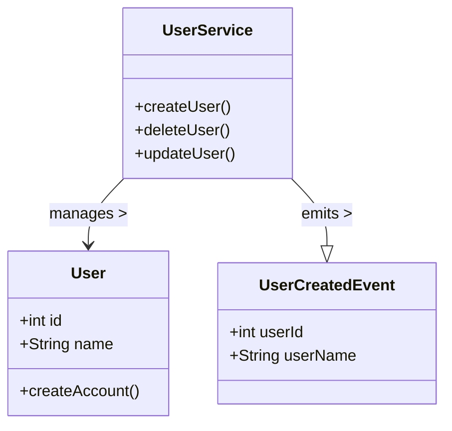
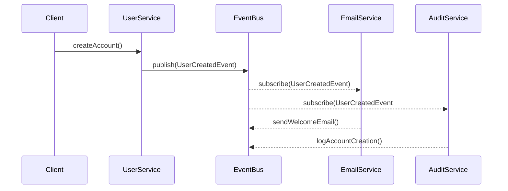

## Definition

The Domain Event pattern involves publishing an event whenever state-changing operations occur within a microservice. These events propagate to other microservices or components, which subscribe to these events and perform relevant actions, ensuring data consistency and aiding in implementing queries.

## Intent

To decouple tightly coupled services and maintain data consistency across multiple microservices by using events to propagate information about changes.

## Also Known As

- Event Sourcing
- Event-Driven Architecture

## Detailed Definitions and Explanations

The Domain Event pattern is essential in microservices architectures to achieve a responsive, flexible, and resilient system. When business logic in a microservice domain changes the state, an event is created and published. Other services subscribe to these events to react accordingly, ensuring that the state remains consistent across the entire system.

### Key Features

- **Loose Coupling**: Separates services from being tightly coupled.
- **Asynchronous Communication**: Services communicate in a non-blocking manner.
- **Scalability**: Easily scalable due to the decoupled nature.
- **Resilience**: Failure is isolated to specific services, increasing the system's overall resilience.

### Diagrams

#### Example Class Diagram



#### Example Sequence Diagram


### Java Example Code with Spring Boot and Spring Cloud

```java
// User.java
@Entity
public class User {
    @Id 
    @GeneratedValue(strategy = GenerationType.IDENTITY)
    private Long id;
    private String name;

    // getters and setters
}

// UserCreatedEvent.java
public class UserCreatedEvent {
    private Long userId;
    private String userName;
    
    // Constructors, getters & setters
}

// UserService.java
@Service
public class UserService {
    @Autowired private EventBus eventBus; // Could be an actual RPC or Messaging Interface    
    @Autowired private UserRepository userRepository;
    
    public User createUser(String name) {
        User user = new User();
        user.setName(name);
        User createdUser = userRepository.save(user);
        eventBus.publish(new UserCreatedEvent(createdUser.getId(), createdUser.getName()));
        return createdUser;
    }
}

// EventBus.java
public interface EventBus {
    void publish(Object event);
}

// EmailService.java
@Service
public class EmailService {
    @EventListener
    public void handleUserCreated(UserCreatedEvent event) {
        // send welcome email logic here
    }
}

// AuditService.java
@Service
public class AuditService {
    @EventListener
    public void handleUserCreated(UserCreatedEvent event) {
        // log audit entry logic here
    }
}
```

### Benefits

- **Decoupling**: Events allow services to be decoupled, aiding maintainability and scalability.
- **Scalability**: Different parts of the application can scale independently.
- **Fault tolerance**: Isolates failing components without affecting others.

### Trade-offs

- **Complexity**: Introducing an event-driven architecture increases system complexity.
- **Eventual Consistency**: Immediate consistency is harder to maintain; the system mostly achieves eventual consistency.
- **Debugging**: Harder to trace because of the asynchronous nature of events.

### When to Use

- When implementing a microservices-based system that requires services to be loosely coupled.
- When you need to maintain data consistency across multiple services.
- When the system should be capable of reacting to changes asynchronously.

### Example Use Cases

- **E-commerce Platforms**: Updating stock levels, sending an order confirmation mail once a purchase is complete.
- **User Management Systems**: Send a welcome email after creating a user, log audit trails for compliance.

### When Not to Use

- When immediate consistency and strict data control are necessary.
- In simple systems where the complexity of an event-driven architecture would be unnecessary.
- Systems unable to bear the operational overhead of maintaining an event bus and related infrastructure.

### Anti-patterns

- **Event Overuse**: Emitting too many events for trivial state changes can lead to system overload.
- **Synchronous calls masked as events**: Making synchronous calls in event processing defeats the purpose of event-driven patterns.

### Related Design Patterns

#### Event Sourcing

Event Sourcing captures all changes to application state as a sequence of events. Differing from Domain Event in that the source of truth is the sequence of events rather than the current state of the data.

#### CQRS (Command Query Responsibility Segregation)

While Domain Event allows for decoupled microservices, CQRS often works in tandem to segregate write operations (commands) from read operations (queries), optimized for the respective use cases.

#### Comparison with Related Patterns

- **Event Sourcing vs Domain Events**:
  - Event Sourcing: Sequence of state-changing events is the primary state.
  - Domain Events: Higher-level events containing business significance without necessarily storing every state change.

- **CQRS Integration**:
  - Combining Domain Events with CQRS can enhance system performance and scalability as commands and queries are segregated.

### References

- **Books**:
  - "Microservices Patterns: With Examples in Java" by Chris Richardson
  - [Building Microservices: Designing Fine-Grained Systems](https://amzn.to/3RYRz96) by Sam Newman
  - [Enterprise Integration Patterns: Designing, Building, and Deploying Messaging Solutions](https://amzn.to/3XXncn8) by Gregor Hohpe

- **Open Source Frameworks**:
  - Spring Boot
  - Spring Cloud Stream
  - Apache Kafka
  - RabbitMQ

### Cloud Computing and Third Party Tools

- **PAAS Options**:
  - Pivotal Cloud Foundry, AWS Elastic Beanstalk, Heroku
   
- **SAAS and DAAS **:
  - Logging as a Service: Splunk, ELK stack
  
- **Event Streaming Services**:
  - AWS Kinesis, Google Pub/Sub

By understanding and following this guide, you will be able to effectively use the Domain Event pattern to enhance your microservice architecture's scalability, fault tolerance, and maintainability.

