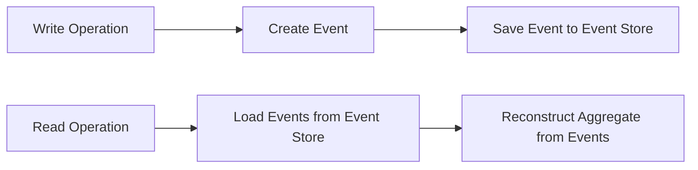
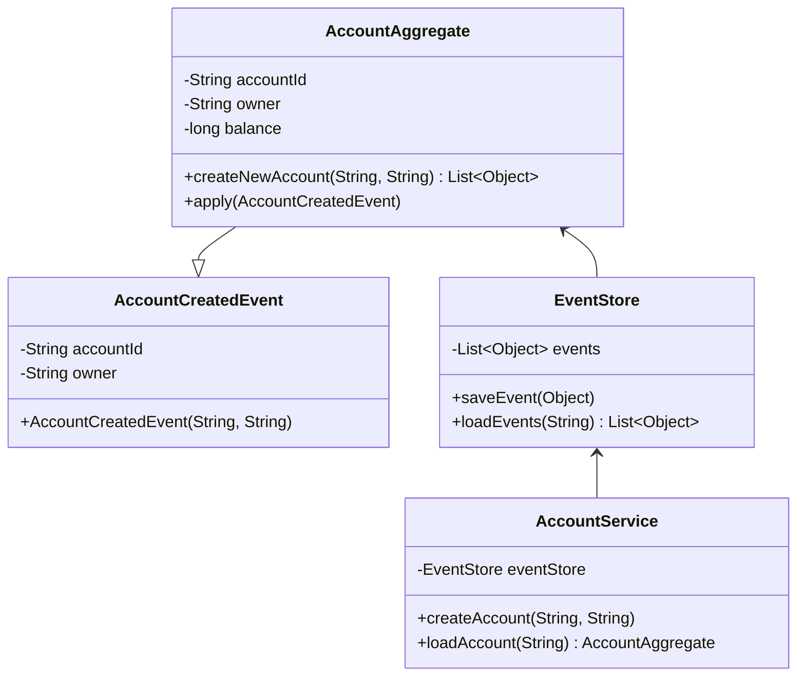
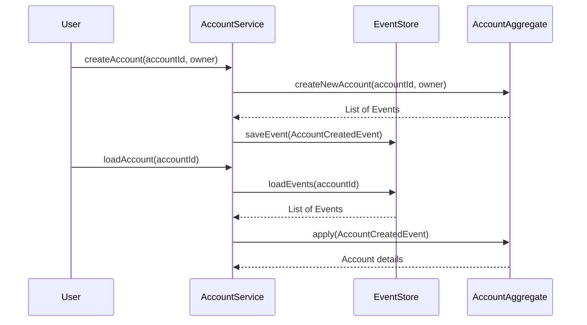
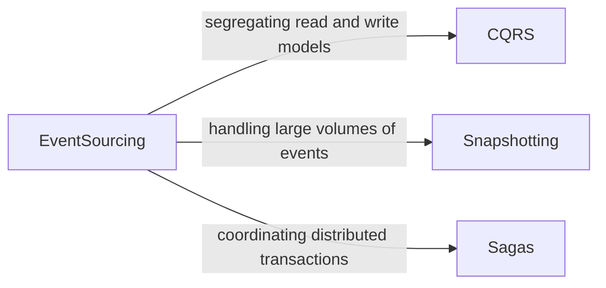

## Event Sourcing

### Definition

Event Sourcing is a microservices pattern where aggregates are persisted as a sequential series of actionable events rather than current state representations. Each change to an application's state is captured in an event, which is then stored and can be replayed to reconstruct the system's state.

### Intent

* To maintain a history of all changes in the application indefinitely.
* To enable rebuilding of the current state from a series of events.
* To provide data consistency and a complete audit log.

### Also Known As

Event Store, Accounting Log, Event Stream

### Detailed Explanation with Diagrams

Event Sourcing captures changes as events that describe the transition of states. This flow ensures immutability and allows disparate services to process changes asynchronously while preserving data consistency.



### Key Features

- **Immutability**: Events are immutable; they never change through their lifecycle.
- **Reproducibility**: Reconstruct the current state or snapshots by replaying past events.
- **Audit log**: Complete history of changes in the system.
- **Asynchronous Updates**: Different services can process events asynchronously.
- **Optimized for Write Operations**: Designed to handle frequent, small updates.

### Example Code

**Spring Boot Entities and Event Handling Example**

```java
// Event class representing a change in the application's state
public class AccountCreatedEvent {
    private String accountId;
    private String owner;

    // Constructor, getters, setters
}

// Aggregate root storing the state and generating events
public class AccountAggregate {
    private String accountId;
    private String owner;
    private long balance;

    // Apply method to handle events
    public void apply(AccountCreatedEvent event) {
        this.accountId = event.getAccountId();
        this.owner = event.getOwner();
    }

    // Example method to generate the event
    public List<Object> createNewAccount(String accountId, String owner) {
        AccountCreatedEvent event = new AccountCreatedEvent(accountId, owner);
        this.apply(event);
        return List.of(event);
    }
}

// Event Store to persist and load events
@Service
public class EventStore {
    private final List<Object> events = new ArrayList<>();

    public void saveEvent(Object event) {
        events.add(event);
    }

    public List<Object> loadEvents(String aggregateId) {
        return events.stream()
                      .filter(event -> /* some criteria to filter by aggregateId*/)
                      .collect(Collectors.toList());
    }
}

// Example service to handle commands and events
@Service
public class AccountService {
    private final EventStore eventStore;

    public AccountService(EventStore eventStore) {
        this.eventStore = eventStore;
    }

    public void createAccount(String accountId, String owner) {
        AccountAggregate account = new AccountAggregate();
        List<Object> events = account.createNewAccount(accountId, owner);
        events.forEach(eventStore::saveEvent);
    }

    public AccountAggregate loadAccount(String accountId) {
        AccountAggregate account = new AccountAggregate();
        eventStore.loadEvents(accountId).forEach(event -> account.apply((AccountCreatedEvent) event));
        return account;
    }
}
```

### Example Class Diagram



### Example Sequence Diagram



### Benefits

- **Data Consistency**: Ensures consistency as each change is captured as an event.
- **Auditability**: Provides a full history of changes and operations.
- **Scalability**: Efficient handling of frequent writes.
- **Flexibility in Queries**: Supports reconstructing any state necessary for the query.

### Trade-offs

- **Complexity**: Increases system complexity and requires event handlers.
- **Storage Size**: Requires more storage as every state change is recorded.
- **Replaying Events**: Costly and time-consuming, especially when dealing with large volumes.

### When to Use

- **Audit Requirements**: When full auditability and history of changes are mandatory.
- **High-Write Workloads**: When optimizing for frequent state changes.
- **Data Recovery**: When being able to recover any past state is crucial.

### Example Use Cases

- **Finance**: Record of transactions, balance changes.
- **E-commerce**: Order histories, changes in inventory.
- **Healthcare**: Patient records and treatment history.

### When Not to Use and Anti-patterns

Avoid using Event Sourcing when:

- **Simplicity is Key**: The application does not need audit logs and the complexity isn't warranted.
- **Read-Optimized Operations**: Applications that require rapid reads more frequently than writes.
  
Anti-patterns:
- **Ignoring Event Evolution**: Assuming initial event definitions will never change.
- **Stateful Services**: Services designed to hold state in memory without proper event replay handling.

### Related Design Patterns

- **CQRS**: Segregate data modification from data reading to optimize both.
- **Snapshotting**: Periodically capturing the full state to limit event replay time.
- **Sagas**: Coordinating complex business transactions spanning services.

### References and Credits

- **Books**: 
  - "Designing Event-Driven Systems" by Ben Stopford.
  - "Microservices Patterns" by Chris Richardson.
  - "Enterprise Integration Patterns" by Gregor Hohpe.
- **Blogs and Articles**:
  - Martin Fowler's articles on Event Sourcing: [martinfowler.com](https://martinfowler.com/eaaDev/EventSourcing.html)

### Open Source Frameworks and Tools

- **Axon Framework**: A popular Java framework for implementing CQRS and Event Sourcing.
- **Eventuate Tram**: Supports microservices patterns like Event Sourcing and CQRS.
- **Apache Kafka**: Often used for durable, high-throughput event log storage.

### Cloud Computing Context

- **PaaS**: Platforms like Google App Engine and AWS Elastic Beanstalk support services crucial for microservice ecosystems.
- **SaaS**: Providers like Salesforce or Atlassian enforcing patterns where auditability and historical data tracking are essential.
- **DaaS**: Offerings like Snowflake provide high-performance data services ensuring reliability and explosion of data usually accompanying event-sourcing architectures.

### Diagram: Grouping Related Patterns

Grouping Event Sourcing with its immediate related patterns:



By combining these patterns, you can build robust architectures capable of ensuring data consistency, efficient handling of high-frequency transactions, and maintaining a return to any state across multiple distributed services.
```

