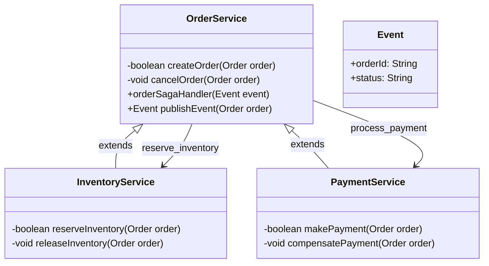
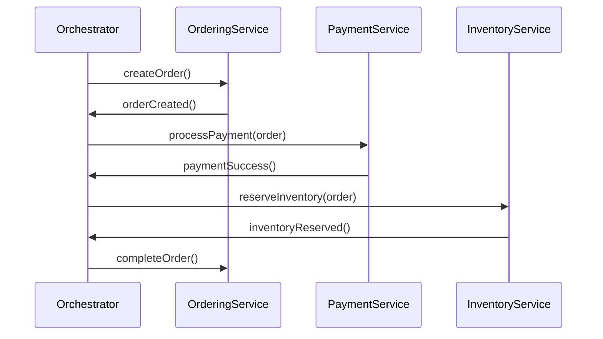
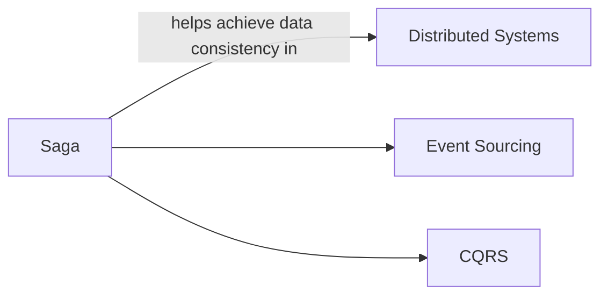

## Definition

The Saga Pattern is a design pattern used to maintain data consistency in a distributed microservices architecture by using a sequence of local transactions. Each local transaction updates data within a single microservice and publishes an event or message to trigger the next local transaction.

## Intent

The intent of the Saga Pattern is to ensure data consistency and reliability in distributed systems without relying on distributed transactions or two-phase commits, which can be complex and inefficient.

## Also Known As

- Choreography Saga
- Orchestration Saga

## Detailed Explanation

### Saga Types

1. **Choreography-Based Saga**: Each service that completes a transaction publishes an event carrying sufficient information, which triggers the next transaction.
2. **Orchestration-Based Saga**: A central orchestrator service manages the Saga by invoking the individual services involved in the transaction. 

Example Class Diagram for Choreography-Based Saga:


Explanation:
1. **OrderService**: Creates the order and handles the saga events.
2. **PaymentService**: Responsible for making payments and compensating them if needed.
3. **InventoryService**: Reserves inventory and releases it if the transaction fails.
4. **Event**: Represents events that trigger the local transactions in each microservice.

### Sequence Diagram for Orchestration-Based Saga:


Explanation:
1. A central **Orchestrator** service manages the workflow.
2. After each transaction, the orchestrator moves the workflow forward based on the outcomes.

## Key Features

- **Distributed Transactions**: Breaks down a large transaction into multiple distributed transactions.
- **Compensation Mechanisms**: Each local transaction can rollback if subsequent transactions fail.
- **Eventual Consistency**: Achieves consistency in an eventually consistent manner.

## Code Examples

### Example in Java with Spring Boot (Choreography-Based)

1. **OrderService**: Publishes an event after successfully creating an order.
    ```java
    @Service
    public class OrderService {

        @Autowired
        private EventPublisher eventPublisher;

        public void createOrder(Order order) {
            // Save order to DB
            orderRepository.save(order);
            // Publish order created event
            eventPublisher.publishOrderCreatedEvent(order);
        }

        public void handleEvent(Event event) {
            // Act based on the event data
        }
    }
    ```

2. **PaymentService**: Listens to the event and processes payment.
    ```java
    @Service
    public class PaymentService {

        @EventListener
        public void handleOrderCreatedEvent(OrderCreatedEvent event) {
            // Handle payment process
        }

        public void compensatePayment(Order order) {
            // Compensate payment through refund
        }
    }
    ```

3. **Event Publisher**:
    ```java
    @Service
    public class EventPublisher {

        private final ApplicationEventPublisher applicationEventPublisher;

        @Autowired
        public EventPublisher(ApplicationEventPublisher applicationEventPublisher) {
            this.applicationEventPublisher = applicationEventPublisher;
        }

        public void publishOrderCreatedEvent(Order order) {
            applicationEventPublisher.publishEvent(new OrderCreatedEvent(this, order));
        }
    }
    ```

## Benefits

- **Resilience**: Can handle partial failures and compensate accordingly.
- **Decoupled Services:** Each service handles its own transaction and failure compensation. 
- **Scalability**: Services can be independently scaled.

## Trade-offs

- **Complexity**: Managing compensation and ensuring eventual consistency can add complexity.
- **Latency:** Eventual consistency can lead to a visible delay in state convergence.

## When to Use

- Complex workflows involving multiple microservices that need to maintain data consistency.
- Systems that require high resilience and must handle partial failures gracefully.

## Example Use Cases

- E-commerce order processing.
- Money transfer between accounts.
- Booking services (e.g., hotel, flight).

## When Not to Use and Anti-patterns

- Transactions that require immediate consistency.
- Simpler systems where the overhead of implementing Sagas does not justify the benefits.
  
## Related Patterns

1. **Event Sourcing**: Captures all changes to an application state as a sequence of events. Similar in ensuring eventual consistency but focuses on storing events.
2. **CQRS (Command Query Responsibility Segregation)**: Segregates the operations that modify data from those that query data, often used in conjunction with Event Sourcing.



### Guidance for Solving Data Consistency Issues

When implementing design patterns for distributed transactions, consider starting with simple transactions and gradually implementing more complex workflows. It is essential to thoroughly test each individual service and the overall system to ensure that compensations are correctly managed and that the system achieves an eventually consistent state.

## References

- [Designing Data-Intensive Applications](https://amzn.to/4cuX2Na) by Martin Kleppmann
- "Microservices Patterns" by Chris Richardson

## Open Source Frameworks

- Spring Boot
- Spring Cloud
- Axon Framework

## Third Party Tools

- Kafka (for event streaming)
- RabbitMQ (for messaging)

## Cloud Computing Platforms

1. **SaaS (Software as a Service)**: Google Workspace, Salesforce
2. **PaaS (Platform as a Service)**: Google App Engine, AWS Elastic Beanstalk
3. **DaaS (Database as a Service)**: Amazon RDS, Azure SQL Database

## Suggested Books for Further Studies

- [Microservices Patterns: With examples in Java](https://amzn.to/4cSXzYV) by Chris Richardson
- [Building Microservices: Designing Fine-Grained Systems](https://amzn.to/3RYRz96) by Sam Newman

