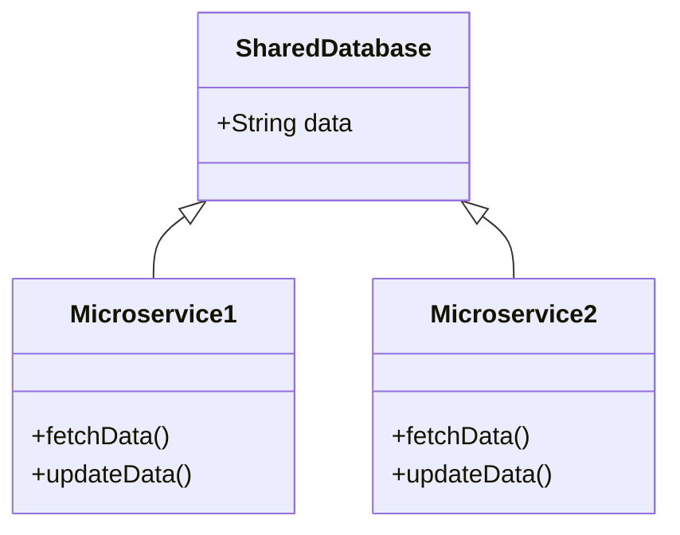
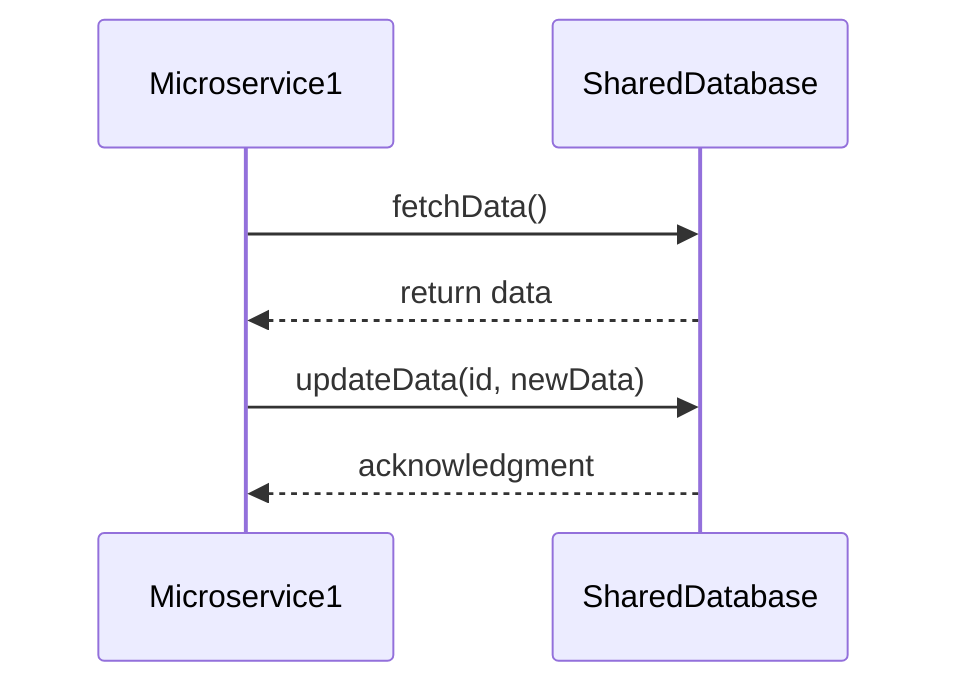
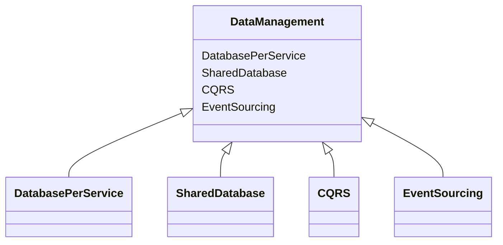

## Definition
The Shared Database pattern is an architectural pattern where multiple microservices share a single, centralized database to ensure data consistency and to facilitate complex queries across services.

## Intent
- To maintain data consistency across multiple microservices.
- To simplify data sharing and querying when services need to access the same data frequently.

## Also Known As
- Shared Database Architecture
- Centralized Database Pattern

## Detailed Definitions and Explanations

### Key Features
- **Unified Data Source**: All microservices access the same database, which ensures that they operate on consistent data.
- **Simplified Data Management**: Easier to implement complex queries that span multiple services because the data is centralized.
- **Ease of Use**: Developers don't need to worry about data synchronization across different databases.

### Class Diagram


### Code Example in Spring Boot

**SharedDatabase.java**
```java
@Entity
public class SharedDatabase {

    @Id
    @GeneratedValue(strategy = GenerationType.IDENTITY)
    private Long id;

    private String data;

    // getters and setters
}
```

**Microservice1Service.java**
```java
@Service
public class Microservice1Service {
    
    @Autowired
    private SharedDatabaseRepository repository;
    
    public void fetchData() {
        List<SharedDatabase> data = repository.findAll();
        // process data
    }

    public void updateData(Long id, String newData) {
        SharedDatabase record = repository.findById(id).orElseThrow();
        record.setData(newData);
        repository.save(record);
    }
}
```

**Microservice2Service.java**
```java
@Service
public class Microservice2Service {
    
    @Autowired
    private SharedDatabaseRepository repository;
    
    public void fetchData() {
        List<SharedDatabase> data = repository.findAll();
        // process data
    }

    public void updateData(Long id, String newData) {
        SharedDatabase record = repository.findById(id).orElseThrow();
        record.setData(newData);
        repository.save(record);
    }
}
```

### Database Repository

**SharedDatabaseRepository.java**
```java
@Repository
public interface SharedDatabaseRepository extends JpaRepository<SharedDatabase, Long> {}
```

### Example Sequence Diagram


## Benefits
- **Data Consistency**: Centralized data storage ensures that all services always see the same data.
- **Complex Queries**: Easier to implement and optimize complex queries that span multiple services.

## Trade-offs
- **Coupling**: Tight coupling between services via the shared database schema.
- **Scalability Issues**: Single database may become a bottleneck as the number of services grows.
- **Failure Impact**: Database failure impacts all services.

## When to Use
- When multiple services need to frequently access the same set of data.
- When data consistency is a critical requirement.
- For small to medium-sized applications where database being a bottleneck is less concerning.

## Example Use Cases
- E-commerce applications where orders, inventories, and customer records are tightly coupled.
- Banking systems where different services need access to transaction histories.

## When Not to Use and Anti-patterns
- Avoid for highly scalable or highly available systems where a single database could be a risk.
- Do not use if independent scalability of microservices is a top priority.

## Related Design Patterns
- **Database per Service**: Each service maintains its own database, reducing coupling but requiring careful management of data consistency and integrity.
- **CQRS**: Separates read and write operations into respective models, facilitating performance and scalability.
- **Event Sourcing**: Ensures consistency by storing events that represent state changes.

### Organizing Related Patterns


- **Shared Database** ensures consistent and central data storage.
- **Database per Service** brings decoupling and independent service scaling.
- **CQRS** increases performance with separated read/write data models.
- **Event Sourcing** ensures accuracy across distributed systems with event logs.

## References & Further Study
- [Designing Data-Intensive Applications](https://amzn.to/4cuX2Na) by Martin Kleppmann
- [Building Microservices: Designing Fine-Grained Systems](https://amzn.to/3RYRz96) by Sam Newman
- Spring Cloud Documentation
- Spring Data JPA Documentation

## Open Source Frameworks and Third Party Tools
- **Spring Boot**: For building microservices with Java.
- **Spring Data JPA**: For easy database interaction.
- **H2 Database**: Simple in-memory database for testing.

---

The Shared Database pattern works well for maintaining data consistency in systems with tightly coupled data needs. However, it introduces risks in scalability and availability, which suggests careful consideration before implementation.
