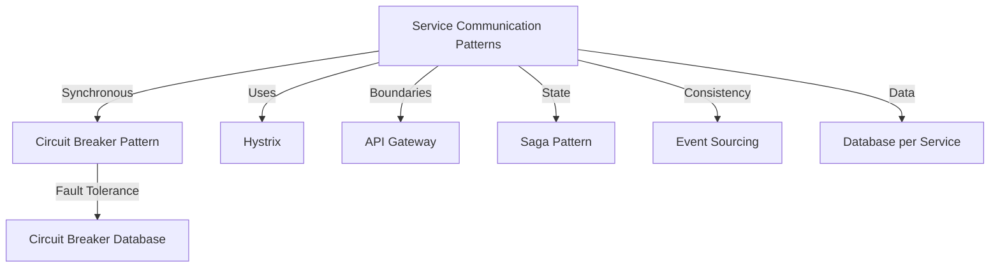

## Decomposing an Application into Services

## Definition
Decomposing an application into services involves breaking down a monolithic application into smaller, well-defined, cohesive, and loosely-coupled services that each handle a specific part of the application's functionality.

## Also Known As
- Service decomposition
- Microservice splitting
- Microservice segmentation

## Detailed Explanation
Decomposing into services aims to enhance modularity, making applications easier to manage, scale, and evolve. Effective decomposition involves identifying boundaries, modules, and responsibilities that can become discrete services.

### Patterns for Decomposition

1. **Domain-Driven Design (DDD)**
- Using bounded contexts to define service boundaries and ensure services align with business domains.
- Example:
    ```mermaid
    graph TD
        Domain -->|Part| BoundedContext1
        Domain -->|Aux| BoundedContext2
        BoundedContext1 -->|Activity| Service1
        BoundedContext1 -->|Business| Service2
        BoundedContext2 -->|Line| Service3
        BoundedContext2 -->|2ndAct| Service4
    ```

2. **Business Capability**
- Decomposing services along business capabilities ensures that services encapsulate a distinct piece of business functionality.
- Example Entities: InventoryService, OrderService, PaymentService

3. **Subdomains**
- Deconstructing by subdomains where each subdomain encapsulates closely related tasks and commands.
- Example Entities: Shopping Cart Service, Customer Profile Service.

4. **Event-Storming**
- Using event-storming sessions to identify domain events that pinpoint integral components that can form services.
6. **Strangler Fig Pattern**
- Incrementally extracting services by replacing parts of a monolithic application with microservices.
    ```mermaid
    graph LR
        A[Monolithic Application]
        A-->B[Extracted Service 1]
        B-->C[Strangler Fig Proxy]
        A-->C
        C-->D[Client]
        subgraph EdgeProxy
            C
        end
        subgraph Monolithic
            A
        end
    ```

### Example Use Cases
- Large applications needing scaling and better modular structure.
- Systems facing operational bottlenecks in a monolithic setup.
- Application modernization initiatives.

### When Not to Use
- Small and simple applications.
- Teams without DevOps capabilities to manage multiple services.

## Trade-Offs
- Increased complexity in inter-service communication.
- Additional overhead due to multiple deployments, monitoring, and increased network latency.

## Related Patterns
- **Service Mesh**: Handles inter-service communication.
- **API Gateway**: Centralized request routing.
- **Saga**: Manages distributed transaction consistency.

## References and Credits
- "Domain-Driven Design Distilled" by Vaughn Vernon
- [Building Microservices: Designing Fine-Grained Systems](https://amzn.to/3RYRz96) by Sam Newman

## Suggested Books for Further Studies
- [Domain-Driven Design: Tackling Complexity in the Heart of Software](https://amzn.to/3zyYxeB) by Eric Evans
- "Microservices Design Patterns" by Arun Ravi


# Patterns Tackling Service Communication

## Overview

Effective service-to-service communication is essential for achieving the benefits of a microservices architecture, such as scalability, maintainability, and fault tolerance. The following patterns address key aspects of service communication:

### Patterns Overview



### Circuit Breaker Pattern

- **Definition**: Helps prevent repeated access to a failing service, thereby preserving system stability.
- **Use Cases**: Services encountering temporal slowdowns.
- **Related Patterns**: Fallback Service.

### Hystrix

- **Definition**: Library focusing on latency tolerance and fault tolerance using Circuit Breaker.
- **Use Cases**: Services prone to failures and requiring fallback strategies.
- **Related Patterns**: Circuit Breaker.

### API Gateway

- **Definition**: Entry point to mask internal service topology.
- **Use Cases**: Centralized API control and service discovery.
- **Related Patterns**: Edge Service, Load Balancer.

### Saga Pattern

- **Definition**: Orchestration based pattern ensuring distributed data consistency.
- **Use Cases**: Distributed transactions scenarios.
- **Related Patterns**: Orchestration, State Machine.

### Event Sourcing

- **Definition**: Ensures consistency by storing sequence events to reconstruct state.
- **Use Cases**: Audit logging, Event reconstruction.
- **Related Patterns**: Command Query Responsibility Segregation (CQRS).

### Database per Service

- **Definition**: Each service keeps its own database for data management.
- **Use Cases**: Service-specific schema needs.
- **Related Patterns**: Shared Database, CQRS.

## Conclusion
Understanding various service communication patterns and effectively implementing them can significantly improve the robustness and maintainability of microservices architecture.

## References and Credits
- [Designing Data-Intensive Applications](https://amzn.to/4cuX2Na) by Martin Kleppmann
- [Microservices Patterns: With examples in Java](https://amzn.to/4cSXzYV) by Chris Richardson


By understanding these patterns and their relationships, one can make informed decisions when decomposing monolithic applications and handle service communication effectively. For "Decomposing an Application into Services," you can dig deeper into the principles of domain-driven design, bounded contexts, business capabilities, and incremental modularization while further consulting the suggested reading materials.
