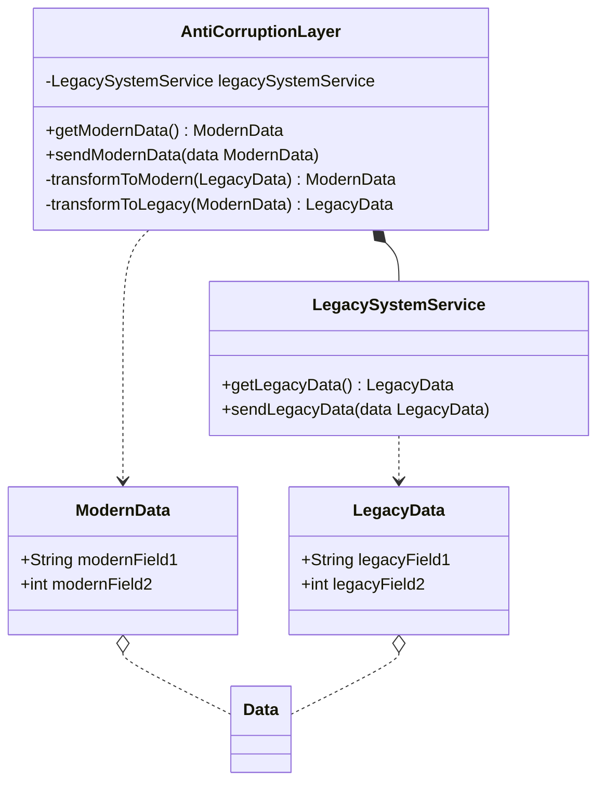
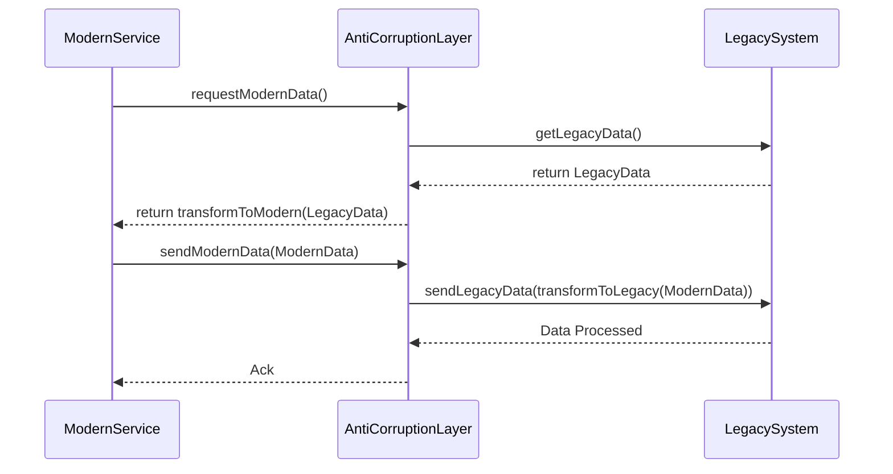

## Definition
The Anti-Corruption Layer (ACL) pattern helps to isolate legacy systems and protect new systems from unintended side effects caused by outdated or incompatible system changes. It acts as a shield ensuring that the new system communicates with legacy systems without getting "polluted" by their complexities or inconsistencies.

## Intent
To create a layer that translates requests and responses between a modern microservices application and a legacy system, facilitating integration while protecting the new application from the legacy system's design issues or technical debts.

## Also Known As
- Boundary Layer
- Adapter Pattern

## Detailed Explanation
The ACL essentially works as a translator or adapter that sits between the microservices and the legacy system. It ensures that the modern system only interacts through the clean, well-defined interfaces of the ACL, thus keeping the new system "clean." 

### Key Features
- **Isolation**: Protects the microservices architecture from the internal complexity and possibly poor design of the legacy system.
- **Separation of Concerns**: Decouples the new system's implementation details from the legacy system.
- **Encapsulation**: Encapsulates the communication between different systems.
- **Transformation**: Converts data and requests to formats acceptable by both systems.

## Code Example

```java
// Assume `LegacySystemService` is a class that represents a legacy system's API.

@Data
class LegacyData {
    private String legacyField1;
    private int legacyField2;
}

@Data
class ModernData {
    private String modernField1;
    private int modernField2;
}

interface LegacySystemService {
    LegacyData getLegacyData();
    void sendLegacyData(LegacyData data);
}

class AntiCorruptionLayer {
    private final LegacySystemService legacySystemService;

    public AntiCorruptionLayer(LegacySystemService legacySystemService) {
        this.legacySystemService = legacySystemService;
    }

    public ModernData getModernData() {
        LegacyData legacyData = legacySystemService.getLegacyData();
        return transformToModern(legacyData);
    }

    public void sendModernData(ModernData data) {
        LegacyData legacyData = transformToLegacy(data);
        legacySystemService.sendLegacyData(legacyData);
    }

    private ModernData transformToModern(LegacyData legacyData) {
        ModernData modernData = new ModernData();
        modernData.setModernField1(legacyData.getLegacyField1());
        modernData.setModernField2(legacyData.getLegacyField2());
        return modernData;
    }

    private LegacyData transformToLegacy(ModernData modernData) {
        LegacyData legacyData = new LegacyData();
        legacyData.setLegacyField1(modernData.getModernField1());
        legacyData.setLegacyField2(modernData.getModernField2());
        return legacyData;
    }
}
```

### Example Class Diagram



### Example Sequence Diagram



## Benefits
- Protects the new system from the outdated or poorly designed interfaces of a legacy system.
- Encourages the incremental migration of systems by isolating legacy code.
- Reduces the risk and complexity when integrating with legacy systems.
- Facilitates ongoing improvements and refactoring of the legacy system without affecting the new system.

## Trade-Offs
- Adds additional complexity to the new system due to the creation and maintenance of the ACL.
- May have performance overhead due to the overhead of transformation and translation.

## When to Use
- When integrating with legacy systems that have poorly designed interfaces or data structures.
- When you want to keep your microservices architecture clean and free from legacy issues.
- When migrating functionalities incrementally from legacy systems to new systems.

## Example Use Cases
- Modernizing a monolithic application by gradually extracting microservices.
- Integrating with a third-party system that has a complex API.
- Situations where the legacy system cannot be refactored or only incrementally updated.

## When Not to Use
- If the legacy system is simple and changes infrequently.
- When the overheads of implementing and maintaining the ACL outweigh the benefits.
- In cases where the integration can be handled via simpler adapter patterns.

## Anti-Patterns
- Directly exposing the legacy system's complex and inefficient APIs to new client applications.
- Creating monolithic ACLs that become a bottleneck or single point of failure.
- Tight coupling between the ACL and the new system's core services.

## Related Design Patterns
- **Adapter Pattern**: Usually used for simple adaptations, ACLs are more complex, encompassing transformations and business logic.
- **Facade Pattern**: Provides a simplified interface to a complex subsystem; ACL also transforms data structures and commands.
- **Gateway Pattern**: Provides a way for the microservices to access external services. ACL extends this by incorporating data translation.

## References and Credits
- Microservice Patterns by Chris Richardson
- Design Patterns: Elements of Reusable Object-Oriented Software by Erich Gamma, Richard Helm, Ralph Johnson, and John Vlissides
- Spring Boot and Spring Cloud documentation

## Open Source Frameworks and Tools
- Spring Integration
- Apache Camel

## Cloud Computing and SAAS, DAAS, PAAS
- Use ACLs to integrate with Cloud Services where there is a need to isolate your system from the inherent complexities and varying APIs of cloud services.

## Suggested Books for Further Studies
- [Building Microservices: Designing Fine-Grained Systems](https://amzn.to/3RYRz96) by Sam Newman
- "Migrating to Microservice Databases" by Edson Yanaga
- [Microservices Patterns: With examples in Java](https://amzn.to/4cSXzYV) by Chris Richardson
