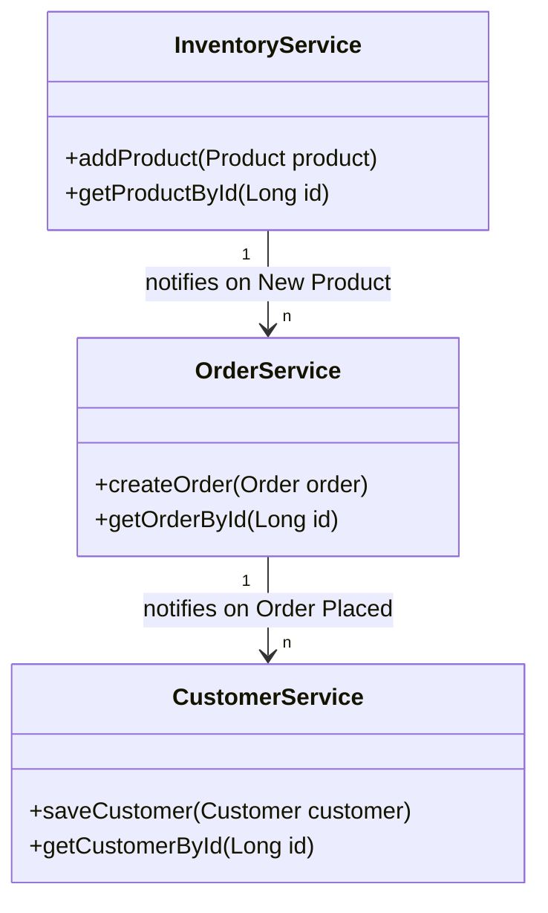
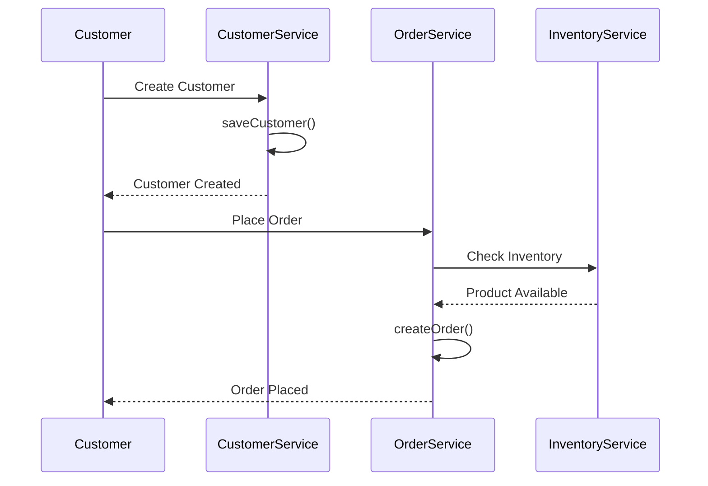

## Definition

Decomposing by business capability is a strategy of breaking down an application into distinct microservices, each related to a particular business function or capability. These microservices are aligned with the business domains as defined in domain-driven design.

## Intent

The intent of this pattern is to achieve high modularity, with services that can be independently developed, deployed, and scaled. Each service is designed around a specific business capability, making it easier to maintain and evolve.

## Also Known As

- Bounded Context Decomposition
- Domain Decomposition

## Detailed Definition and Explanation

In microservices architecture, services are commonly organized around business capabilities. This method of decomposition provides clarity to the relation between software components and the actual business functionalities they serve.

### Key Features

- **Autonomy**: Each service operates independently.
- **Scalability**: Services can be scaled individually according to their load.
- **Modularity**: Services can be independently developed, deployed, and maintained.
- **Resilience**: Failure in one service doesn't affect others.

### Code Example

#### Application Structure

```plaintext
ecommerce-app/
├── inventory-service/
│   ├── src/
│   └── Dockerfile
├── order-service/
│   ├── src/
│   └── Dockerfile
└── customer-service/
    ├── src/
    └── Dockerfile
```

#### Example `CustomerService.java`

```java
@RestController
@RequestMapping("/customers")
public class CustomerController {
    @Autowired
    private CustomerService customerService;

    @PostMapping
    public ResponseEntity<Customer> createCustomer(@RequestBody Customer customer) {
        Customer createdCustomer = customerService.saveCustomer(customer);
        return new ResponseEntity<>(createdCustomer, HttpStatus.CREATED);
    }

    @GetMapping("/{id}")
    public ResponseEntity<Customer> getCustomerById(@PathVariable Long id) {
        Customer customer = customerService.getCustomerById(id);
        return new ResponseEntity<>(customer, HttpStatus.OK);
    }
}
```

### Class Diagrams



### Sequence Diagrams



### Benefits

- **Expressive Design**: Clear mapping to business concepts.
- **Individual Scalability**: Scale different parts of the app separately.
- **Improved Maintainability**: Teams can work on different services without conflict.
- **Tech Heterogeneity**: Different services can employ different tech stacks.

### Trade-offs

- **Complexity**: Managing multiple services introduces deployment and operational complexity.
- **Latency**: Cross-service communication might add latency.
- **Consistency**: Maintaining consistency across services becomes challenging.
- **Integration**: Requires sophisticated monitoring and logging mechanisms.

### When to Use

- **Modularization Need**: When the system needs a high degree of modularity.
- **Independent Scaling**: When different parts of the application have differing load and scaling requirements.
- **Organized by Domain**: When your organization aligns teams with business capabilities.

### Example Use Cases

- **E-commerce Applications**: Decomposing by catalog, inventory, ordering system, payment, and user management.
- **Banking Systems**: Splitting by customer management, account management, and transaction processing.

### When Not to Use and Anti-patterns

- **Simple Applications**: An overly complex architecture for a simple application.
- **Early-stage Startups**: Introducing microservices too early could lead to over-engineering.
- **Improper Service Boundaries**: Poorly defined boundaries that increase inter-service dependencies.

### Related Design Patterns

- **Domain-Driven Design (DDD)**: Helps in identifying the bounded contexts.
- **Service Registry**: For locating and connecting services.
- **API Gateway**: Managing requests across multiple services.

### References and Credits

- **Domain-Driven Design**: Eric Evans.
- **Building Microservices**: Sam Newman.

### Open Source Frameworks and Third-Party Tools

- **Spring Boot**: For building Java microservices.
- **Spring Cloud**: For orchestrating microservices.
- **Netflix OSS Tools**: For Service Discovery, Load Balancing, and Circuit Breakers.

### Cloud Computing and SaaS, PaaS, DaaS

- **AWS Lambda**: For serverless paradigms in microservices.
- **Heroku**: PaaS for easily deploying and scaling applications.
- **Docker**: To containerize services for better modularity and deployment.

### Suggested Books for Further Studies

- **[Designing Data-Intensive Applications](https://amzn.to/4cuX2Na)** by Martin Kleppmann.
- **"Microservice Patterns"** by Chris Richardson.

---

By following the guidance above, you can effectively decompose your application into services that align with business capabilities using Spring Boot and Spring Cloud frameworks. Each service can independently scale and evolve, continuously aligning with organizational growth and delivering resilient, modular architecture.
