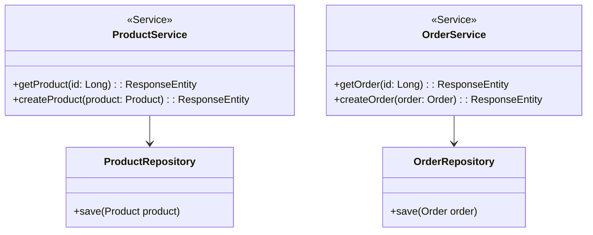
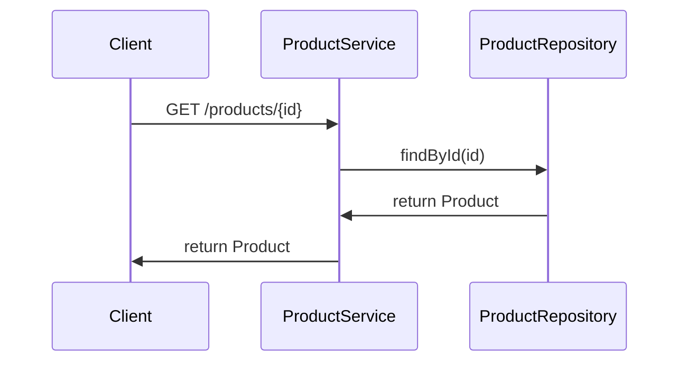
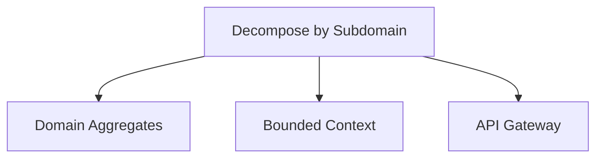

## Definition
The Decompose by Subdomain pattern involves splitting an application into multiple services, each corresponding to a specific subdomain as defined by Domain-Driven Design (DDD).

## Intent
The goal is to ensure that each service encapsulates a single subdomain's business logic and data, thereby improving modularity, scalability, and maintainability.

## Also Known As
- Subdomain Service Decomposition

## Detailed Definitions and Explanations
In a microservices architecture, one of the major challenges is how to slice the application into independent services. Domain-Driven Design (DDD) aids this process by identifying "subdomains" that represent different areas of functionality or business logic. Each subdomain then maps to a microservice. This helps to ensure that each service has a clear boundary and aligns with business capabilities.

### Key Features
- **Bounded Contexts**: Define clear boundaries around services.
- **Encapsulation**: Each service has its own database schema and code.
- **Loose Coupling**: Minimize dependencies between services.
- **Cohesion**: Maximize the cohesion within each service.

## Code Examples
The following Java Spring Boot example demonstrates a simple e-commerce application decomposed into `ProductService` and `OrderService` corresponding to their respective subdomains.

### Example Code

#### ProductService.java
```java
@RestController
@RequestMapping("/products")
public class ProductService {

    @Autowired
    private ProductRepository productRepository;

    @GetMapping("/{id}")
    public ResponseEntity<Product> getProduct(@PathVariable Long id) {
        Optional<Product> product = productRepository.findById(id);
        return product.map(ResponseEntity::ok)
                      .orElse(ResponseEntity.notFound().build());
    }

    @PostMapping
    public ResponseEntity<Product> createProduct(@RequestBody Product product) {
        Product savedProduct = productRepository.save(product);
        return ResponseEntity.status(HttpStatus.CREATED).body(savedProduct);
    }
}
```

#### OrderService.java
```java
@RestController
@RequestMapping("/orders")
public class OrderService {

    @Autowired
    private OrderRepository orderRepository;

    @GetMapping("/{id}")
    public ResponseEntity<Order> getOrder(@PathVariable Long id) {
        Optional<Order> order = orderRepository.findById(id);
        return order.map(ResponseEntity::ok)
                    .orElse(ResponseEntity.notFound().build());
    }

    @PostMapping
    public ResponseEntity<Order> createOrder(@RequestBody Order order) {
        Order savedOrder = orderRepository.save(order);
        return ResponseEntity.status(HttpStatus.CREATED).body(savedOrder);
    }
}
```

### Example Class Diagram


### Example Sequence Diagram
This sequence diagram shows the basic interactions between a client, the `ProductService`, and its repository.



## Benefits
- **Modularization**: Decomposing by subdomain helps create more modular services.
- **Business Alignment**: Services are aligned closely with business capabilities.
- **Scalability**: Enables each service to scale independently based on demand.

## Trade-Offs
- **Complexity**: Initial decomposition might be complex.
- **Cross-Cutting Concerns**: Handling cross-cutting concerns (e.g., logging, authentication) can become tricky.
- **Inter-Service Communication**: Overhead and potential latency due to increased inter-service communication.

## When to Use
- When the application has clear subdomains that map well to business functionalities.
- When scalability and modularity are important concerns.
- When the development teams can be organized around subdomain boundaries.

## Example Use Cases
- E-commerce applications with distinct subdomains such as Product, Order, and Payment.
- ERP systems where each module (e.g., HR, Finance) can be treated as a separate subdomain.

## When Not to Use
- When the application is small and does not warrant such decomposition.
- When the development team lacks sufficient experience with DDD and microservices.

## Anti-Patterns
- **Anemic Domain Model**: Designing services that do not encapsulate business logic and only hold data.
- **Tight Coupling**: Creating services with high dependencies on each other.

## Related Design Patterns
- **Domain Aggregates**: Defines consistency boundaries for a specific group of entities within a subdomain.
- **Bounded Context**: Provides a clear boundary around business logic within a subdomain.
- **API Gateway**: Facilitates routing and communication between the client and multiple services.

### Grouping Related Patterns
In the following diagram, related patterns are organized to tackle the problem of defining and isolating bounded contexts.



## References and Further Reading
- [Domain-Driven Design: Tackling Complexity in the Heart of Software](https://amzn.to/3zyYxeB) by Eric Evans.
- [Implementing Domain-Driven Design](https://amzn.to/3SnNqvq) by Vaughn Vernon.
- Spring Boot documentation: https://spring.io/projects/spring-boot
- Spring Cloud documentation: https://spring.io/projects/spring-cloud

## Open Source Frameworks and Third-Party Tools
- **Spring Boot**: Build standalone, production-grade Spring-based Applications.
- **Spring Cloud**: Provides tools for building microservices.
- **Axon Framework**: Supports the implementation of the DDD, CQRS, and Event Sourcing patterns.

## Cloud Computing, SAAS, DAAS, PAAS
- **SaaS**: Decomposed service subdomains can be offered as individual SaaS solutions.
- **PaaS**: Platform services like Kubernetes can host and manage microservices.
- **DaaS**: Each service can access subdomain-specific data as a distinct dataset.

## Suggested Books
- [Microservices Patterns: With examples in Java](https://amzn.to/4cSXzYV) by Chris Richardson.
- [Building Microservices: Designing Fine-Grained Systems](https://amzn.to/3RYRz96) by Sam Newman.

