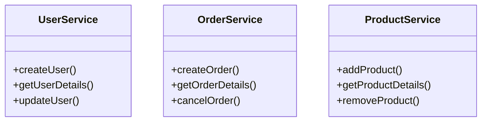
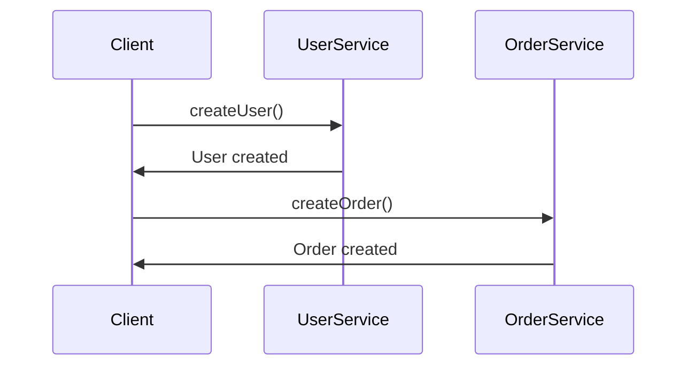
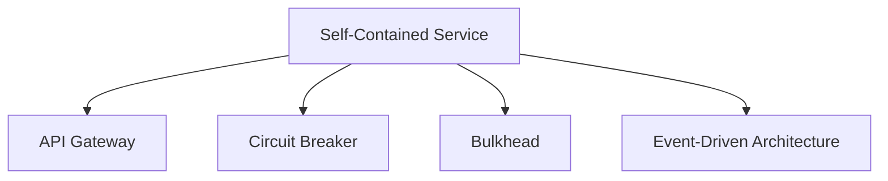

## Definition
The **Self-Contained Service (SCS)** pattern is a microservice design approach where each service is designed to handle synchronous requests independently of other services. It minimizes direct inter-service dependencies and ensures that services can operate and scale independently.

## Intent
The intent of the Self-Contained Service pattern is to build robust and resilient microservices that do not need to wait for other services to respond to handle client requests, ensuring lower latency, higher availability, and improved fault tolerance.

### Also Known As:
- Autonomous Services
- Single Responsibility Services

## Detailed Explanation with Mermaid Diagrams

### Key Features:
- **Independence**: Services can handle requests independently without dependence on other services.
- **Resilience**: Failure in one service does not affect other services.
- **Scalability**: Each service can be scaled independently based on its specific needs.
- **Decoupling**: Reduced dependencies among services.

### Diagrams

#### Example Class Diagram

*Explanation*: Each service (UserService, OrderService, ProductService) operates independently and performs its own data management.

#### Example Sequence Diagram

*Explanation*: The client communicates with each service independently without chaining requests across services.

## Code Examples

### Java & Spring Boot Self-Contained Service Example

**UserService.java**
```java
@RestController
@RequestMapping("/users")
public class UserService {

    @PostMapping
    public ResponseEntity<String> createUser(@RequestBody User user) {
        // Logic to create user
        return ResponseEntity.ok("User created");
    }

    @GetMapping("/{id}")
    public ResponseEntity<User> getUserDetails(@PathVariable Long id) {
        // Logic to get user details
        return ResponseEntity.ok(new User());
    }
}
```

**OrderService.java**
```java
@RestController
@RequestMapping("/orders")
public class OrderService {

    @PostMapping
    public ResponseEntity<String> createOrder(@RequestBody Order order) {
        // Logic to create order
        return ResponseEntity.ok("Order created");
    }

    @GetMapping("/{id}")
    public ResponseEntity<Order> getOrderDetails(@PathVariable Long id) {
        // Logic to get order details
        return ResponseEntity.ok(new Order());
    }
}
```
*Explanation*: Each service operates independently with encapsulated logic.

## Benefits

### Resilience
A failure in one service does not cascade to others.

### Scalability
Each service can scale based on its own resource requirements.

### Decoupling
Services are loosely coupled, making the system more robust and easier to maintain.

## Trade-offs

### Data Duplication
May require some duplication of data across services to maintain independence.

### Increased Complexity
Ensures more autonomous services, potentially making the overall system more complex.

## When to Use
- When the system needs to be highly resilient and services can operate independently.
- For services or functionalities that have little or no interaction.

### Example Use Cases
- **E-commerce Platforms**: Separating user management, orders, and product inventory.
- **Financial Systems**: Independent services for account management and transaction processing.

## When Not to Use
- When frequent and direct inter-service communication is necessary.
- If maintaining data consistency across services in real-time is critical.

### Anti-patterns
- **Tightly Coupled Systems**: Where services are highly dependent on each other increases failure risks and reduces scalability.
- **Chained Services**: Creating a dependency chain that negates the benefits of independence.

## Related Design Patterns
- **API Gateway**: For managing requests between clients and multiple microservices.
- **Circuit Breaker**: For handling failover mechanisms when services fail.
- **Event-Driven Architecture**: For decoupling service communication using events.

### Comparison
- **Self-Contained Service vs. API Gateway**: SCS focuses on service independence; API Gateway on request routing and composition.
- **Self-Contained Service vs. Event-Driven Architecture**: SCS uses synchronous requests independently; Event-Driven mandates asynchronous communication.

## References
- Evans, E. (2003). [Domain-Driven Design: Tackling Complexity in the Heart of Software](https://amzn.to/3zyYxeB). Addison-Wesley.
- Newman, S. (2015). [Building Microservices: Designing Fine-Grained Systems](https://amzn.to/3RYRz96). O'Reilly Media.

## Credits
- **Spring Boot**- A framework for building microservices quickly.
- **Spring Cloud**- For providing tools for distributed systems.

## Open Source Frameworks and Third Party Tools
- **Spring Boot**: https://spring.io/projects/spring-boot
- **Spring Cloud**: https://spring.io/projects/spring-cloud

## Suggested Readings for Further Studies
- *Microservice Architecture* by Irakli Nadareishvili, Ronnie Mitra, Matt McLarty, and Mike Amundsen
- *Building Microservices* by Sam Newman
- *Domain-Driven Design* by Eric Evans

## Grouping Related Patterns with Mermaid Diagrams

### Problem Area: Isolation and Resilience
### Related Patterns:

*Description*: These patterns focus on isolating failures and ensuring resilient microservices.

### Guidance
To tackle isolated resilience:
1. **Use Self-Contained Services to maintain independence**.
2. **Employ API Gateway for managing client requests efficiently**.
3. **Implement Circuit Breaker and Bulkhead patterns to handle failures and ensure services continue to function under load**.
4. **Adopt Event-Driven Architecture to decouple service communications for better isolation**.

By organizing services and adopting relevant patterns, dependencies are minimized, and the overall system becomes more resilient and scalable.

---
