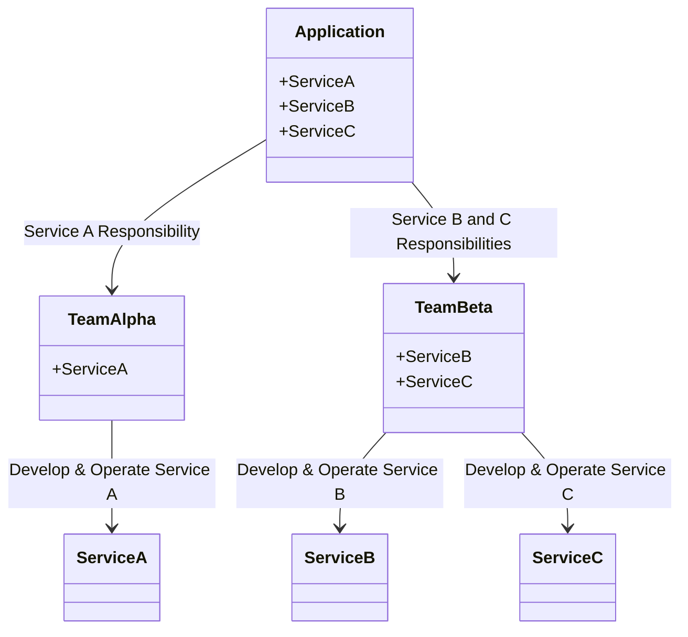
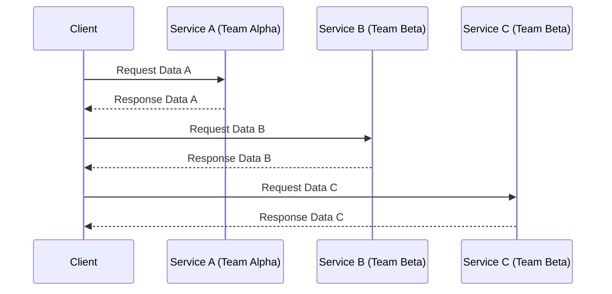
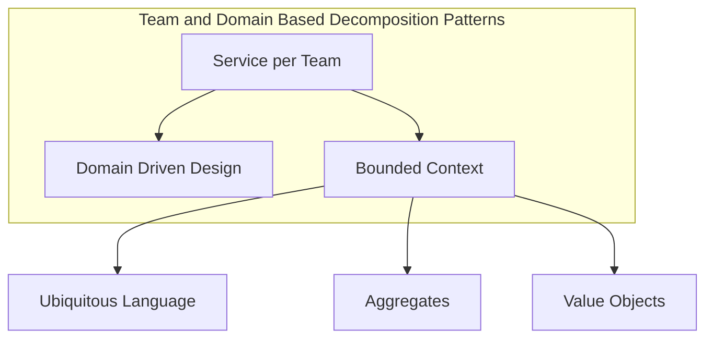

## Service per Team Pattern

### Definition
The **Service per Team** pattern involves decomposing an application into microservices based on the organization’s team structure, ensuring that each team is responsible for one or more services. This approach aligns the architecture with the team's boundaries, promoting autonomy and minimizing inter-team dependencies.

### Intent
The goal of the **Service per Team** pattern is to structure a microservices architecture in a way that maximizes team autonomy, aligns work with team expertise, and enhances ownership and accountability over specific services.

### Also Known As
- **Team-based Service Decomposition**
- **Vertical Team Alignment**

### Detailed Definitions and Explanations

#### Key Features
1. **Team Autonomy:** Each team is responsible for the full lifecycle of their service(s), including development, deployment, and operation.
2. **Clear Boundaries:** Services are clearly delineated based on team responsibilities, which simplifies management and collaboration.
3. **Aligned Expertise:** Teams work on services where they have the most expertise, ensuring high-quality outputs and more efficient problem resolution.

#### Example Class Diagram

Explanation:
- **Application** has three services: **ServiceA**, **ServiceB**, and **ServiceC**.
- **TeamAlpha** is responsible for **ServiceA**.
- **TeamBeta** is responsible for both **ServiceB** and **ServiceC**.

#### Example Sequence Diagram

Explanation:
- The **Client** interacts with **Service A**, **Service B**, and **Service C** independently.
- Each service is managed by the respective responsible team.

### Benefits
- **Enhanced Autonomy:** Teams operate independently without cross-team dependencies, leading to faster decision-making and quicker deployments.
- **Improved Ownership:** Teams have clear ownership of specific services, increasing responsibility and accountability.
- **Alignment with Expertise:** Teams work on services aligned with their domain expertise, promoting high quality and effective problem-solving.

### Trade-offs
- **Potential for Duplication:** Different teams may use similar patterns or utilities, leading to some duplication of efforts.
- **Coordination Overheads:** In scenarios requiring inter-service communication, coordination between different teams might be challenging.

### When to Use
- When the organization has autonomous teams with distinct areas of expertise.
- When quick, independent deployments and operational responsibilities are a priority.
- In large organizations where aligning services with team boundaries simplifies both development and operations.

### Example Use Cases
- Large-scale e-commerce platforms where different teams manage services like user management, order processing, and inventory control.
- Financial institutions where teams are specialized in managing services like accounts, loans, and transactions.

### When Not to Use and Anti-patterns
- **Small Teams or Organizations:** If the organization is small, this pattern may fragment the team and resources too thinly.
- **Low Service Count:** If there are very few services, aligning them strictly with team boundaries might lead to underutilization of team capacities.
- **Excessive Fragmentation:** Over-separating can lead to difficulties in managing the operational complexity and inter-service communication.

### Related Design Patterns
- **Domain-Driven Design (DDD):** Aligns the service boundaries by the business domain, which can be aligned with the team structure in large organizations.
- **Bounded Context:** Helps in defining clear boundaries for services based on domain-driven principles, often overlapped with Service per Team.

### References and Credits
- [Microservices Architecture on AWS](https://aws.amazon.com/microservices/)
- [Domain-Driven Design with Spring Boot](https://spring.io/projects/spring-boot)
- [Spring Cloud Documentation](https://spring.io/projects/spring-cloud)

### Open Source Frameworks and Third-Party Tools
- **Spring Boot:** A lightweight framework that enables you to build stand-alone, production-grade Spring-based applications.
- **Spring Cloud:** Integrates with Spring Boot to provide patterns for distributed systems including config management, service discovery, and circuit breakers.

### Cloud Computing Context (SAAS, PAAS, DAAS)
- **Platform as a Service (PAAS):** Leverage PAAS solutions like AWS Elastic Beanstalk, Microsoft Azure App Service, and Google App Engine to deploy and manage microservices with ease.
- **Software as a Service (SAAS):** Service per Team architecture can effectively align with SAAS solutions where each team manages a vertical slice of the product offering.
- **Database as a Service (DAAS):** Use DAAS to ensure that the data layer manages can be aligned with team responsibilities, such as different teams owning distinct databases.

### Suggest Books for Further Studies
- [Building Microservices: Designing Fine-Grained Systems](https://amzn.to/3RYRz96) by Sam Newman
- [Domain-Driven Design: Tackling Complexity in the Heart of Software](https://amzn.to/3zyYxeB) by Eric Evans
- [Microservices Patterns: With examples in Java](https://amzn.to/4cSXzYV) by Chris Richardson

### Grouping Related Patterns

Explanation:
- **Service per Team:** Focuses on decomposing services based on team boundaries.
- **Domain Driven Design:** Divides services by business domains, enhancing clear ownership and responsibility.
- **Bounded Context:** Defines the clear boundaries within the same domain which can align with the team responsibility in large enterprises.

These related patterns provide a comprehensive strategy to effectively decompose a complex application into manageable, autonomous services based on team responsibilities and domain-driven design principles.

---
