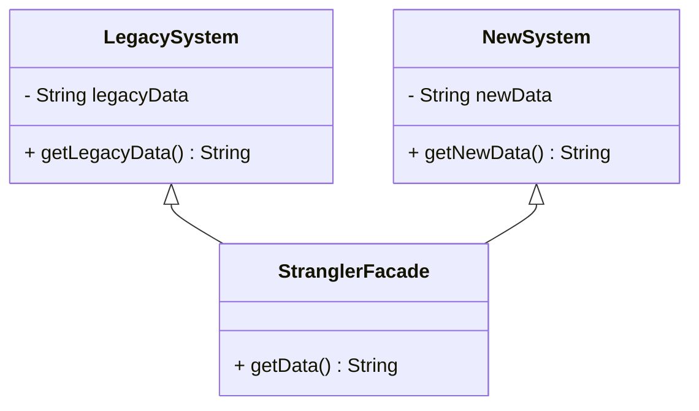
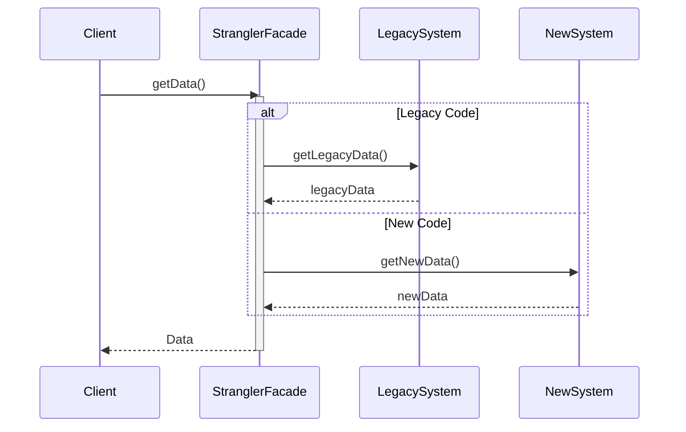

## Definition
The Strangler Application pattern involves gradually refactoring or replacing a legacy system by incrementally developing a new system alongside the old one until the old system can be completely retired. 

## Intent
This pattern aims to incrementally refactor a monolithic or outdated application by developing new functionality alongside the legacy system, ensuring modular development, and eventually decommissioning the old system. The intent is to reduce risks associated with big-bang replacement approaches.

## Also Known As
- Strangler Fig pattern
- Incremental Migration

## Detailed Explanation
The pattern is inspired by the strangler fig tree, which grows around a host tree and eventually replaces it. Similarly, in software architecture, new code and functionality gradually "strangle" the legacy application until all functionality has been moved over.

### Key Features:
- **Gradual Refactoring**: Minimizes risk by incrementally refactoring the legacy system.
- **Parallel Operation**: Allows old and new systems to run simultaneously.
- **Smooth Transition**: Ensures continuous operation with minimal disruption.

## UML Diagrams
### Example Class Diagram


**Explanation:**
- **LegacySystem:** The old application/components.
- **NewSystem:** The newly developed replacement components.
- **StranglerFacade:** Acts as the interface/proxy for both the old and new systems, eventually redirecting all calls to the new system.

### Example Sequence Diagram


**Explanation:**
- The `Client` sends a `getData` request to the `StranglerFacade`.
- `StranglerFacade` decides whether to forward the request to the `LegacySystem` or the `NewSystem`.
- Based on the condition, `StranglerFacade` receives data from one of the systems and returns it to the `Client`.

## Code Example
```java
@SpringBootApplication
public class StranglerApplication {

    public static void main(String[] args) {
        SpringApplication.run(StranglerApplication.class, args);
    }

    @RestController
    class StranglerController {
        private final StranglerFacade facade;

        @Autowired
        public StranglerController(StranglerFacade facade) {
            this.facade = facade;
        }

        @GetMapping("/data")
        public String getData() {
            return facade.getData();
        }
    }

    @Service
    class StranglerFacade {

        @Autowired
        private LegacyService legacyService;
        @Autowired
        private NewService newService;

        public String getData() {
            if(needsNewService()) {
                return newService.getNewData();
            } 
            return legacyService.getLegacyData();
        }

        private boolean needsNewService() {
            // Decision logic 
            return true; // example logic
        }
    }

    @Service
    class LegacyService {
        public String getLegacyData() {
            // Legacy data gathering logic
            return "Legacy Data";
        }
    }

    @Service
    class NewService {
        public String getNewData() {
            // New data gathering logic
            return "New Data";
        }
    }
}
``` 

## Benefits
- **Reduced Risk**: The incremental approach reduces the risk associated with complete system overhauls.
- **Continuous Operation**: Ensures that the system remains operational during the refactoring process.
- **Modular Development**: Allows new features and services to be developed independently.

## Trade-offs
- **Complexity**: Managing two systems simultaneously adds complexity.
- **Inconsistent State**: There can be states where data and features are split between the old and new systems.
- **Performance Overhead**: There might be a slight performance overhead due to the existence of an intermediary facade.

## When to Use
- When transitioning from a monolithic or outdated system to microservices.
- When the legacy system needs to continue operating during the migration.
- When risk mitigation for large-scale system refactoring is essential.

## Example Use Cases
- Instances where a high-traffic e-commerce website needs system updates with minimal downtime.
- Government systems transitioning from old mainframe systems to modern application platforms.
- Enterprises moving legacy internal applications to cloud-native microservices architectures.

## When Not to Use and Anti-Patterns
- **When Not to Use**: Avoid this pattern if the system's existing architecture does not permit incremental changes, or if the legacy system is so flawed that maintaining it during the transition is unfeasible.
- **Anti-Patterns**: Trying to refactor large monolithic chunks at once, leading to "Big Bang" failures.

## Related Design Patterns
- **Facade Pattern**: Provides a simplified interface to a complex subsystem—used here as a proxy between new and old systems.
- **Adapter Pattern**: Helps in the integration of the new system by adapting the old system interfaces into new ones.

## Further Reading and Credits
- [Martin Fowler's Article on Strangler Pattern](https://martinfowler.com/bliki/StranglerFigApplication.html)
- [Microservices Patterns by Chris Richardson](https://www.manning.com/books/microservices-patterns)

## References
1. Layered Architecture for Microservices by Arun Gupta
2. Building Microservices: Designing Fine-Grained Systems by Sam Newman
3. Migrating to Microservices Databases: From Relational Monolith to Distributed Data by Edson Yanaga

## Open Source Frameworks and Tools
- **Spring Boot**: For creating stand-alone, production-grade Spring-based applications.
- **Spring Cloud**: For building microservice-based architectures.
- **Netflix OSS**: Collection of frameworks and tools that Netflix has open-sourced for building cloud-native applications.

## Cloud Computing Context (SAAS, DAAS, PAAS)
- **PAAS (Platform as a Service)**: Use PAAS providers like AWS Elastic Beanstalk or Azure App Services to deploy and manage the new microservices.

## Suggested Books for Further Studies
1. [Microservices Patterns: With examples in Java](https://amzn.to/4cSXzYV) by Chris Richardson
2. [Building Microservices: Designing Fine-Grained Systems](https://amzn.to/3RYRz96) by Sam Newman
3. *Hands-On Microservices with Spring Boot and Spring Cloud* by Magnus Larsson

