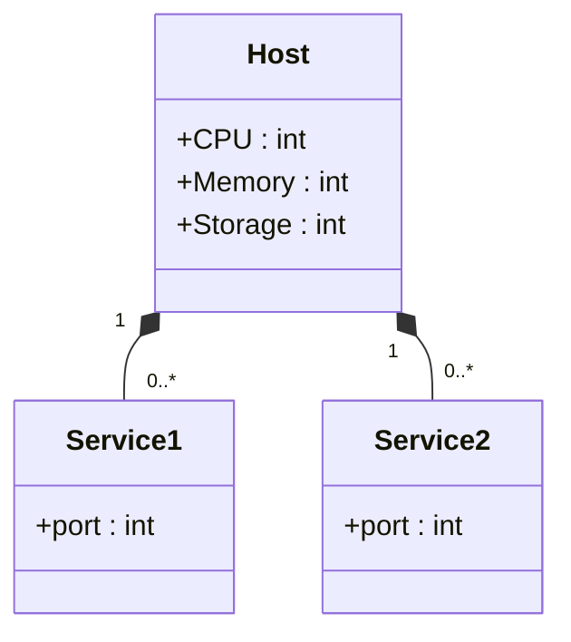
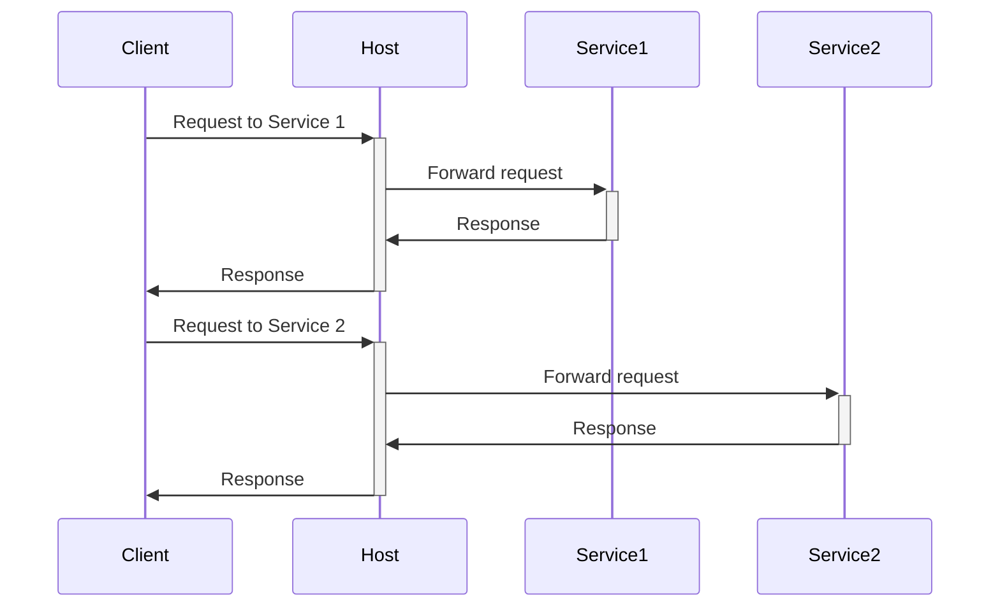
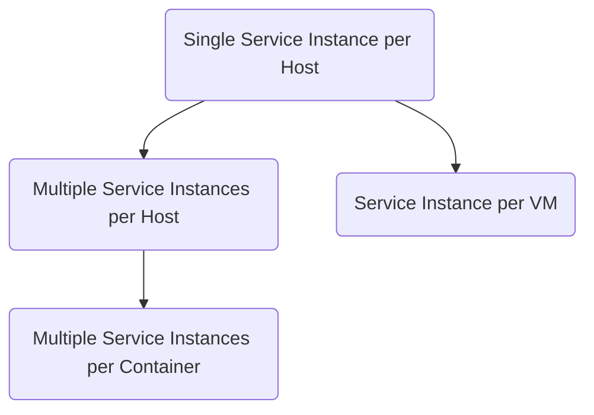

---

title: Multiple Service Instances per Host
linkTitle: Multiple Service Instances per Host
description: "Deploying multiple service instances per host allows efficient resource utilization and management of microservices. Learn its definition, benefits, trade-offs, and examples in Java with Spring Boot and Spring Cloud."
type: docs
date: 2024-08-17
draft: false
meta: 
  date: false
  reading_time: false
authors:
  - fuadefendi
series:
  - Microservices
categories:
  - Deployment Patterns
tags:
  - Multiple Service Instances per Host
  - Resource Utilization
  - Microservices
  - System Architecture
  - Scalability
  - Deployment Management
  - Spring Boot
  - Spring Cloud
canonical: "https://softwarepatternslexicon.com/java-microservices/deployment/multiple-service-instances-per-host"
license: "© 2024 Tokenizer Inc. CC BY-NC-SA 4.0"
---


## Definition 
The *Multiple Service Instances per Host* pattern involves deploying multiple service instances on a single host machine. A host machine can be a physical server or a virtual machine, and multiple containers or application processes are executed on it.

## Intent
The intent behind this pattern is to efficiently utilize resources, simplify deployment, and manage resources more effectively by co-locating services on a single host.

## Also Known As
- Co-located Services
- Service Collocation

## Detailed Definitions and Explanations
This pattern is vital when you need to maximize resource usage and manage multiple service instances with minimal overhead. Instead of deploying each service instance on a separate host, you can bundle them on one host to save costs and simplify management.

## Key Features
- **Resource Efficiency**: Maximizes usage of CPU, memory, and storage.
- **Simplified Management**: Fewer hosts to manage compared to one host per service instance.
- **Cost-Effective**: Reduces infrastructure and operational costs.
- **Improved Performance**: Decreased latency as services are closer on the same host.

## Code Example
### Docker Compose Example
Using Docker Compose to deploy multiple services on a single host.

```yaml
version: '3'

services:
  service1:
    image: my-service1-image
    ports:
      - "8081:8080"

  service2:
    image: my-service2-image
    ports:
      - "8082:8080"
```

### Java Spring Boot Services
#### Service 1
```java
@SpringBootApplication
public class Service1Application {
    public static void main(String[] args) {
        SpringApplication.run(Service1Application.class, args);
    }
}
```

#### Service 2
```java
@SpringBootApplication
public class Service2Application {
    public static void main(String[] args) {
        SpringApplication.run(Service2Application.class, args);
    }
}
```

## Example Class Diagram with Explanation

### Explanation:
This class diagram shows that a single `Host` can have multiple instances of `Service1` and `Service2`.

## Example Sequence Diagram with Explanation


### Explanation:
This sequence diagram illustrates how a `Client` requests services from multiple `Service` instances co-located on a single `Host`.

## Benefits
- **Resource Utilization**: Better use of available resources.
- **Reduced Costs**: Lower infrastructure and maintenance costs.
- **Simplified Network Setup**: Services on the same host communicate faster.

## Trade-offs
- **Resource Competition**: Services might compete for resources on the same host.
- **Management Complexity**: Despite fewer hosts, managing multiple services requires monitoring tools.
- **Security Risks**: Fault isolation might be harder; a compromised service could affect others on the same host.

## When to Use
- When you need to maximize the utilization of server resources.
- To reduce costs for deployment and maintenance.
- For environments where deploying individual hosts for each service is unnecessary.

## Example Use Cases
- DevOps and CI/CD environments to run multiple services for automated testing.
- Local development environments to replicate production setup at low cost.
- Applications with low to moderate resource demands.

## When Not to Use and Anti-patterns
- For services with high resource demand where shared resources might cause latency.
- When strict isolation between services is required.
- Avoid deploying critical services together where a single compromise can take down multiple services.

## Related Design Patterns with Descriptions and Comparisons
- **Single Service Instance per Host**: Deploying a single service per host provides better isolation.
- **Service Instance per VM or Container**: Uses lightweight containers for isolation, balancing between resource usage and security.

## References
1. [Microservices Deployment Patterns](https://microservices.io/patterns)
2. [Docker Compose Documentation](https://docs.docker.com/compose/)

## Credits
- Samuel Luis for resource implications of service collocation.
- Rina Patel for principles of microservices deployments.

## Open Source Frameworks and Tools
- **Docker**: For containerization and deployment.
- **Kubernetes**: To manage large scale deployments of multiple service instances per host.
- **Spring Cloud**: Provides tools to elegantly manage deployments and integrations.

## Cloud Computing
Deploying multiple service instances per host can be effectively managed using cloud service offerings, particularly in PaaS (Platform as a Service) environments.

- **AWS Elastic Beanstalk**: Can run containers managing multiple instances.
- **Google Kubernetes Engine (GKE)**: Using Kubernetes concepts efficiently.

## Books for Further Studies
1. [Designing Data-Intensive Applications](https://amzn.to/4cuX2Na) by Martin Kleppmann
2. "Microservices Patterns" by Chris Richardson
3. "The Art of Scalability" by Martin Abbott and Michael Fisher

## Grouping Related Patterns
### Deployment Management Patterns



### Effective Solutions
To effectively solve resource utilization and deployment issues, consider patterns like Multiple Service Instances per Host and Single Service Instance per Host based on the specific requirements, workload, and isolation needs.

---
