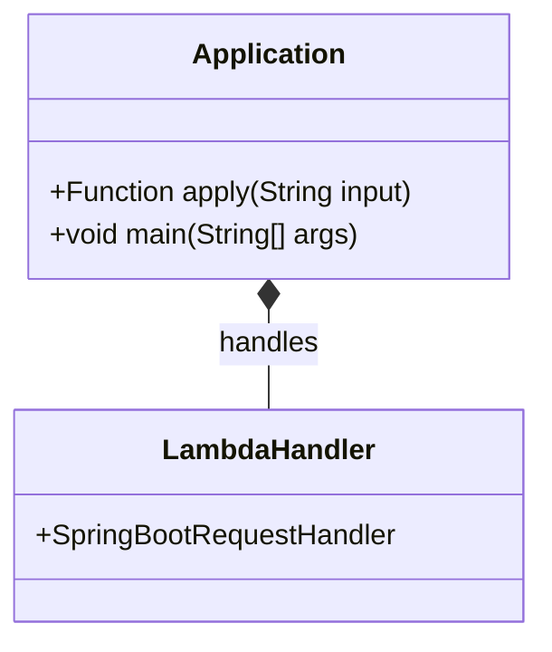
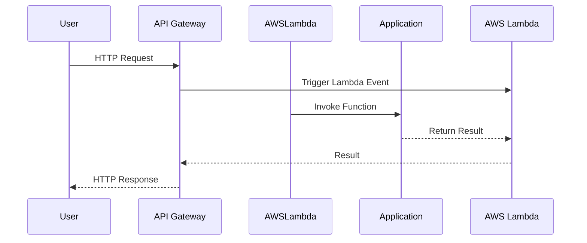
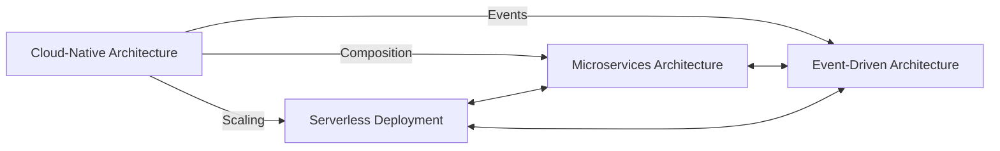

---

title: Serverless Deployment
linkTitle: Serverless Deployment
description: "Learn how to deploy an application's services using a serverless deployment platform, ensuring efficient resource management and cost savings."
type: docs
date: 2024-08-17
draft: false
meta: 
  date: false
  reading_time: false
authors:
  - fuadefendi
series:
  - Microservices
categories:
  - Cloud Development
tags:
  - Serverless
  - Deployment
  - Cloud Computing
  - AWS Lambda
  - Azure Functions
  - Resource Management
  - Cost Efficiency
  - Microservices

canonical: "https://softwarepatternslexicon.com/java-microservices/deployment/serverless-deployment"
license: "© 2024 Tokenizer Inc. CC BY-NC-SA 4.0"
---

## Definition

Serverless deployment is a method whereby applications are executed in a stateless compute service underpinned by ephemeral containers. A serverless deployment platform automatically manages the scaling, monitoring, and management of the infrastructure needed to run these applications.

## Intent

The intent of serverless deployment is to:
- Enable developers to focus on writing code without worrying about the underlying infrastructure.
- Provide automatic scaling to handle varying loads efficiently.
- Achieve cost-effectiveness, as billing is based on actual usage.

## Also Known As

- Function as a Service (FaaS)
- Event-Driven Architecture

## Detailed Definitions and Explanations

Serverless deployment abstracts away the infrastructure layers. Developers define functions and set triggers; the serverless platform manages hardware, virtual machines, and containers where functions run.

### Key Features

- **Automatic Scaling:** Handle Kubernetes-like scale.
- **Cost Efficiency:** Pay only when functions are used.
- **Stateless Processing:** Enables easier scaling and fault tolerance.

### Code Example

Here we will use AWS Lambda with Spring Cloud Functions:

```java
import org.springframework.cloud.function.adapter.aws.SpringBootRequestHandler;

public class AwsLambdaHandler extends SpringBootRequestHandler<String, String> {
}
```

```java
@SpringBootApplication
public class Application implements Function<String, String> {

    @Override
    public String apply(String input) {
        return "Hello, " + input;
    }

    public static void main(String[] args) {
        SpringApplication.run(Application.class, args);
    }
}
```

### Example Class Diagram


* In this diagram, `Application` contains the function to be deployed on AWS Lambda, and `LambdaHandler` is being used to handle requests for AWS Lambda using `SpringBootRequestHandler`.

### Example Sequence Diagram



### Benefits

- **Operational Efficiency:** Reduced need for server management.
- **Cost Reduction:** Pay-as-you-go model.
- **Scalability:** Native horizontal scalability.

### Trade-Offs

- **Cold Start Latency:** Delay when a function is evoked after being idle.
- **Vendor Lock-In:** Dependent on specific cloud providers.

### When to Use

- Application scenarios with irregular or unpredictable load patterns.
- Implementing data transformation flows.
- Lightweight REST API handling.

### Example Use Cases

- **Real-time file processing:**
  Image resizing or video processing.
- **Web APIs:**
  Simple RESTful APIs with well-defined endpoints.

### When Not to Use and Anti-patterns

- **Long-running processes:** Serverless is not cost-effective for workloads that require long compute times.
- **Dependency on specific infrastructure:** Do not use if the workload entails high-performance computing reliant on specific hardware.

### Related Design Patterns

- **Microservices Architecture:** Serverless goes hand in hand with microservices for granular deployments.
- **Event-Driven Architecture:** Complements with event sources triggering serverless functions.

### References

- AWS Lambda Documentation
- Azure Functions Documentation

### Open Source Frameworks

- SpringCloud Functions
- Serverless Framework

### Third-Party Tools

- AWS SAM (Serverless Application Model)
- Azure Functions CLI

### Cloud Computing Models

- SaaS (Software as a Service): Brother or subject deployed atop serverless infrastructures.
- PaaS (Platform as a Service): Some platforms offer managed serverless environments.

### Suggested Books for Further Studies

- *[Designing Data-Intensive Applications](https://amzn.to/4cuX2Na) by Martin Kleppmann*
- *"Building Event-Driven Microservices" by Adam Bellemare*
- *"Serverless Architectures on AWS" by Peter Sbarski*

### Grouping Patterns

#### Problem Area: Cloud-Native Architecture


* Cloud-Native Architecture encompasses scalable, resilient and high-performing solutions like Serverless Deployment, Microservices, and Event-Driven Architecture, complying with modern cloud standards and capabilities.

---

This overall structure encapsulates a concise yet comprehensive guide detailing serverless deployment in a Spring Boot example, adhering to a practical, incremental exposition preferred by developers.
