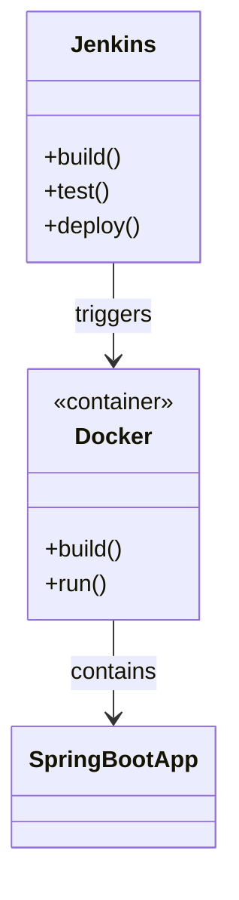
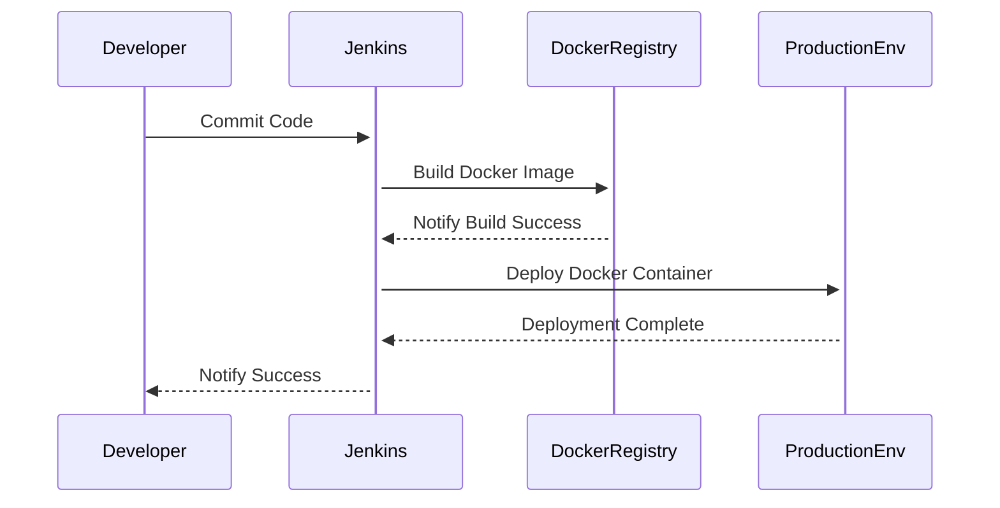
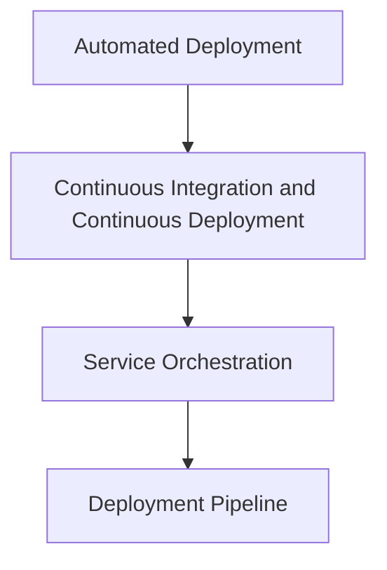

## Definition
A Service Deployment Platform is a highly automated framework designed to deploy an application’s services with consistent service abstractions, facilitating the reliable, repeatable, and efficient delivery of application services.

## Intent
The primary intent of the Service Deployment Platform is to:

- Automate the deployment process.
- Provide abstractions to simplify service deployment.
- Ensure consistent configuration and management.
- Enhance scalability and reliability of services.

## Also Known As
- Automated Deployment Platform
- Continuous Deployment System

## Detailed Explanation
A Service Deployment Platform streamlines the deployment process by offering standardized workflows, eliminating manual intervention, and minimizing the risk of errors. Effective platforms often integrate with various tools and frameworks, offering comprehensive deployment, monitoring, and rollback capabilities.

### Key Features
- **Automated Deployments**: Leveraging CI/CD pipelines for continuous delivery.
- **Service Abstraction**: Simplifying deployment by abstracting service deployment configurations.
- **Scalability**: Supporting horizontal scaling to manage varying loads.
- **Reliability and Fault Tolerance**: Ensuring high uptime with failover mechanisms.

### Code Example
Below is a basic example demonstrating the deployment of a service using Spring Boot and Docker with Jenkins as the deployment automation tool.

```java
// Sample Spring Boot Application
@SpringBootApplication
public class DeployServiceApplication {
    public static void main(String[] args) {
        SpringApplication.run(DeployServiceApplication.class, args);
    }
}
```

### Jenkins Pipeline Script
```groovy
pipeline {
    agent any
    stages {
        stage('Build') {
            steps {
                script {
                    def app = docker.build("my-spring-boot-app")
                }
            }
        }
        stage('Test') {
            steps {
                script {
                    docker.image("my-spring-boot-app").inside {
                        sh 'mvn test'
                    }
                }
            }
        }
        stage('Deploy') {
            steps {
                script {
                    docker.image("my-spring-boot-app").inside {
                        sh 'mvn deploy'
                    }
                }
            }
        }
    }
}
```

## Example Class Diagram (Deployment Infrastructure)



## Example Sequence Diagram (Deployment Process)



## Benefits
- **Automation**: Reduces manual errors and speeds up deployment times.
- **Consistency**: Ensures uniform deployment processes across environments.
- **Scalability**: Automatically adjusts resources to handle load variations.
- **Reliability**: Increases service uptime with robust failover mechanisms.

## Trade-offs
- **Complexity**: Setting up automation frameworks can be complex and time-consuming.
- **Cost**: Initial cost of tools and infrastructure can be high.

## When to Use
- Continuous Integration and Delivery environments.
- Large-scale microservices architectures needing automated deployment.
- Environments requiring quick rollback capabilities.

## Example Use Cases
- Web applications with frequent updates.
- Large enterprise applications with modular service components.
- DevOps maximized environments.

## When Not to Use
- Small projects with infrequent deployment cycles.
- Applications where downtime is not critical and does not justify the complexity.

## Anti-Patterns
- **Manual Deployments**: Increased errors and delays.
- **Inconsistent Configurations**: Leads to deployment failures and service disruptions.
- **Over-engineering**: Adding unnecessary complexity for simple deployment needs.

## Related Design Patterns

### Continuous Integration/Continuous Deployment (CI/CD)
Facilitates integration and deployment through automated workflows.

### Service Orchestration
Orchestrates the deployment and management of services, often built on top of deployment platforms.

### Deployment Pipeline
Focuses on the continuous delivery process from code changes to production deployment.

## References
- "Continuous Delivery" by Jez Humble and David Farley
- "Infrastructure as Code" by Kief Morris
- GitHub: [Spring Boot](https://github.com/spring-projects/spring-boot)
- Docker: [Official Website](https://www.docker.com/)

## Open Source Frameworks
- [Jenkins](https://jenkins.io/)
- [Spring Boot](https://spring.io/projects/spring-boot)
- [Docker](https://www.docker.com/)

## Third-party Tools
- [GitHub Actions](https://github.com/features/actions)
- [CircleCI](https://circleci.com/)
- [Travis CI](https://travis-ci.org/)

## Cloud Computing
### SAAS, PAAS, IAAS:
- Amazon Web Services (AWS)
- Google Cloud Platform (GCP)
- Microsoft Azure

## Suggested Books
- "Continuous Delivery: Reliable Software Releases through Build, Test, and Deployment Automation" by Jez Humble and David Farley
- "Infrastructure as Code: Managing Servers in the Cloud" by Kief Morris

## Grouped Patterns to Solve Deployment Challenges


### Solving Deployment Challenges
To solve deployment challenges effectively:
1. **Automated Deployment**: Implement automated workflows to reduce manual errors.
2. **CI/CD**: Adopt continuous integration and continuous deployment strategies to streamline code delivery.
3. **Service Orchestration**: Manage and optimize service interactions post-deployment.
4. **Deployment Pipeline**: Establish clear, efficient pipelines from development to production.

Use these patterns in conjunction to build a resilient and scalable deployment infrastructure that minimizes downtime and increases productivity.
