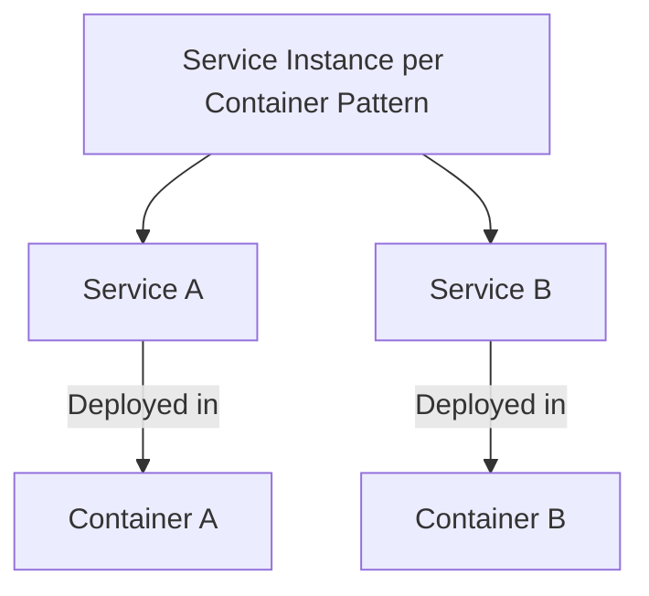
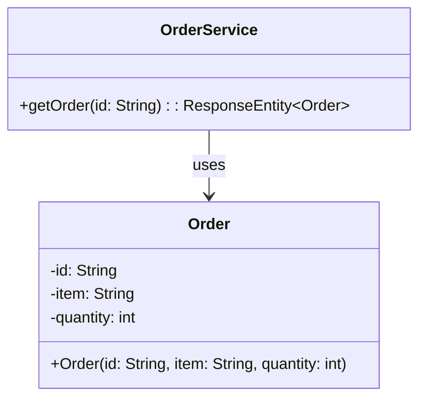
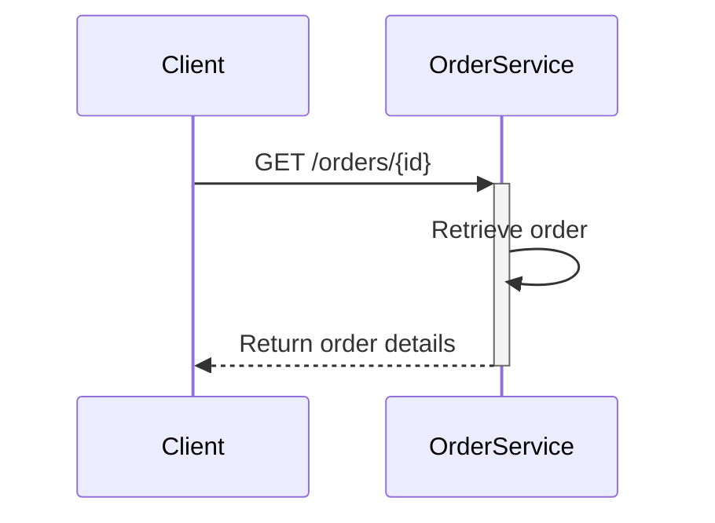

## Service Instance per Container

### Definition
The **Service Instance per Container** pattern involves deploying each service instance in its own container. This approach ensures strong isolation between services, allows for independent service scaling, and improves manageability.

### Intent
To improve deployment efficiency, isolation, resource management, and scaling of microservices in a distributed system by encapsulating each service instance within its own container.

### Also Known As
- Single-Service Container Pattern
- Containerized Microservices

### Detailed Definitions and Explanations

Containers are lightweight, executable units of software in which application code, libraries, and dependencies are packaged together. Docker is a popular containerization tool used to implement this pattern. 



Key Features
- **Isolation:** Each service operates independently in its environment with its file system, network interfaces, and resources.
- **Scalability:** Services can scale independently based on demand.
- **Manageability:** Consistent and repeatable deployment processes.

### Code Examples

To illustrate, let's consider a simple service in a Spring Boot application, `OrderService`.

First, you define the service:
```java
// OrderService.java
@RestController
@RequestMapping("/orders")
public class OrderService {

    @GetMapping("/{id}")
    public ResponseEntity<Order> getOrder(@PathVariable String id) {
        Order order = new Order(id, "item1", 10);
        return ResponseEntity.ok(order);
    }
}
```

Next, create a Dockerfile to containerize the Spring Boot application:

```Dockerfile
FROM openjdk:11-jdk-slim
VOLUME /tmp
COPY target/orderservice.jar orderservice.jar
ENTRYPOINT ["java","-jar","/orderservice.jar"]
```

Then, use `docker-compose` for easy management:
```yaml
version: '3'
services:
  order-service:
    build: .
    ports:
      - "8080:8080"
```

### Example Class Diagram



### Example Sequence Diagram



### Benefits

- **Isolation:** Reduces the risk of one service’s failure propagating to others.
- **Scalability:** Scale individual services as needed.
- **Consistency:** Reproduced easily due to identical runtime environments.

### Trade-offs

- **Resource Overhead:** Running each service in a distinct container may consume more resources.
- **Complexity:** Managing many container instances can become complex.
- **Network Latency:** Containers communicate over a network which can introduce latency.

### When to Use
- When you need strong isolation between services.
- When your services have different scaling requirements.
- When you want to maximize fault isolation and containment.

### Example Use Cases
- Cloud native applications requiring frequent and sophisticated update mechanisms.
- Applications with microservices architecture designed for horizontal scaling.

### When Not to Use and Anti-patterns
- Applications optimized for vertical scaling rather than horizontal.
- Systems without the necessary infrastructure to support container orchestration.

### Related Design Patterns

- **Service Deployment on Virtual Machines:** Deploying each service instance on a separate VM, offering strong isolation but with higher overhead.
- **Service Instance per Host:** Deploy each instance of the service on its own host machine (VM or physical), trading off increased resource consumption for simplicity.

### References and Credits
- Docker documentation: https://docs.docker.com/
- Spring Boot documentation: https://spring.io/projects/spring-boot
- Kubernetes: http://kubernetes.io/

### Open Source Frameworks and Third-Party Tools
- **Docker:** The most popular containerization platform.
- **Kubernetes:** Leading container orchestration platform.

### Cloud Computing, SAAS, DAAS, PAAS
Containerization is often used in conjunction with Platform as a Service (PAAS) offerings such as Google Kubernetes Engine (GKE), Azure Kubernetes Service (AKS), or Amazon Elastic Kubernetes Service (EKS).

### Books for Further Studies
- "Docker: Up & Running" by Karl Matthias and Sean P. Kane.
- "Kubernetes: Up & Running" by Kelsey Hightower, Brendan Burns, and Joe Beda.

By using the Service Instance per Container pattern, you can greatly benefit from containerization in terms of isolation, scalability, and ease of deployment in microservices architectures.
