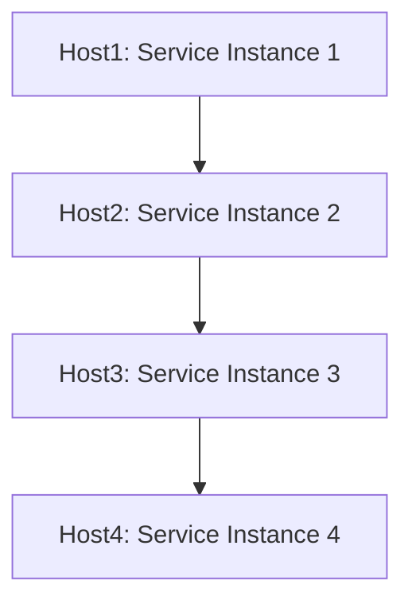
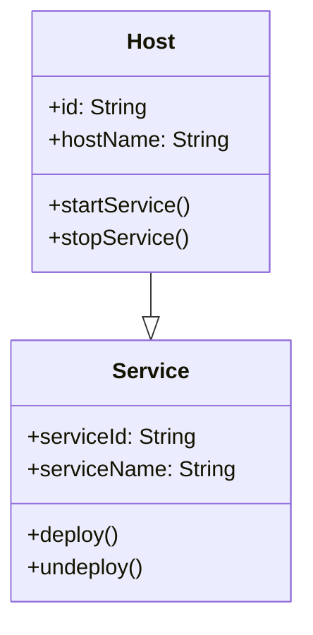
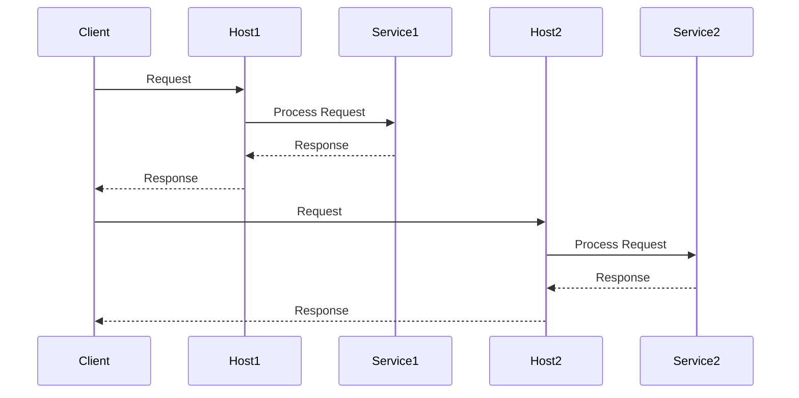

The Service Instance per Host pattern is a microservices deployment strategy where each service instance is deployed on a dedicated host. This host could be a physical machine, a virtual machine (VM), or a container.

## Intent
The primary intent of the Service Instance per Host pattern is to provide isolation between service instances by allocating them to separate hosts. This isolation can lead to better resource management, scalability, and failure isolation at the cost of greater complexity in resource management.

### Also Known As
- Single Service per Host
- Decentralized Deployment

## Detailed Explanation

### Key Features
- **Isolation**: Each service instance is isolated from others, preventing resource contention and conflicts.
- **Scalability**: Services can be scaled independently by adding or removing hosts.
- **Failure Isolation**: Failures in one service do not impact other services.

### Benefits
- **Improved Resource Management**: Each host can be configured with the resources required for the service it runs.
- **Easier Debugging**: With isolated services, identifying and fixing bugs may become easier since there's less risk of interference from other services.
- **Independent Scaling**: Services can be scaled at the instance level without affecting the overall system.

### Trade-offs
- **Increased Resource Utilization**: More resources (e.g., compute, memory) are required to maintain separate hosts for each service.
- **Complex Deployment Management**: More complex orchestration and deployment strategies are needed to manage hosts.
- **Cost**: Running multiple hosts incurs higher costs compared to shared-host deployments.

## Example Deployment Scenarios
The Service Instance per Host pattern can be implemented using various technologies like virtual machines (VMs) or containers.

### Virtual Machines (VMs)
Each microservice runs on a dedicated VM. Services are isolated at the hypervisor level.

```java
// Example: Deploying services using VMs in Spring Boot
// application.yml
server:
  port: 8080

spring:
  application:
    name: service-instance-per-host

// In practical use, these services would be deployed on different VMs using orchestration tools like AWS EC2, Azure VMs, or GCP VMs.
```

### Containers
Each microservice runs in a separate container, orchestrated by container orchestration systems like Kubernetes.

```yaml
apiVersion: v1
kind: Pod
metadata:
  name: service-instance
  labels:
    app: myservice
spec:
  containers:
  - name: myservice
    image: myservice:latest
    ports:
    - containerPort: 8080
```

#### Merimaid Diagram Example


### Example Class Diagram


## Example Sequence Diagram


## When to Use
- When isolation and fault tolerance are critical.
- Use in high-traffic applications that require robust individual service scaling.
- Suitable for environments where resource management and allocation need to be precise.

## Example Use Cases
- Financial systems needing strict isolation between services for security and compliance.
- High-availability systems where each service's uptime and stability are crucial.
- Microservices with varying resource needs and scaling requirements.

## When Not to Use and Anti-Patterns
- When resource usage efficiency is more critical than isolation.
- In small-scale applications with limited resources.
- Avoid over-provisioning hosts leading to resource wastage.

## Related Design Patterns
### Service per Container
Each microservice runs in a separate container, managed by container orchestration tools like Kubernetes, Docker Swarm, etc.
- **Comparison**: Both focus on isolation but Service per Container provides more lightweight solutions using containers instead of full VMs.

### Service per Request
Each request is executed by a new service instance, often used in serverless architectures.
- **Comparison**: More dynamic and on-demand compared to the static isolation in Service Instance per Host.

## References and Credits
- [Microservices Patterns: With examples in Java](https://www.amazon.com/Microservices-Patterns-examples-Chris-Richardson/dp/1617294543)
- [Spring Cloud Documentation](https://spring.io/projects/spring-cloud)
- [Kubernetes Documentation](https://kubernetes.io/docs/home/)

## Open Source Frameworks and Third-Party Tools
- [Spring Boot](https://spring.io/projects/spring-boot)
- [Docker](https://www.docker.com/)
- [Kubernetes](https://kubernetes.io/)
- [Amazon ECS](https://aws.amazon.com/ecs/)
- [Google Kubernetes Engine](https://cloud.google.com/kubernetes-engine)
- [Azure Kubernetes Service](https://azure.microsoft.com/en-in/services/kubernetes-service/)

## Cloud Computing: SAAS, DAAS, PAAS
- **PAAS (Platform as a Service)**: Use platform services like AWS Elastic Beanstalk, Google App Engine for isolated microservices hosting.
- **SAAS (Software as a Service)**: Applications like Salesforce providing multi-tenancy deployment for individual service modules.

### Suggested Books for Further Studies
- [Building Microservices](https://www.oreilly.com/library/view/building-microservices/9781491950340/) by Sam Newman
- [Pro Spring Boot 2](https://www.apress.com/gp/book/9781484229309) by Felipe Gutierrez
- [Cloud Native Java](https://www.oreilly.com/library/view/cloud-native-java/9781449374626/) by Josh Long, Kenny Bastani

By isolating instances using the Service Instance per Host pattern, deployment strategies for microservices can achieve enhanced scalability, failure isolation, and resource management that suit high-demand environments and applications.
