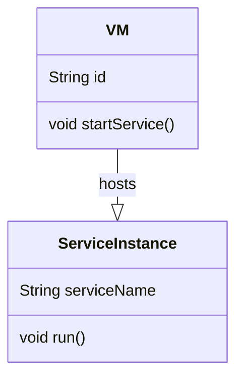
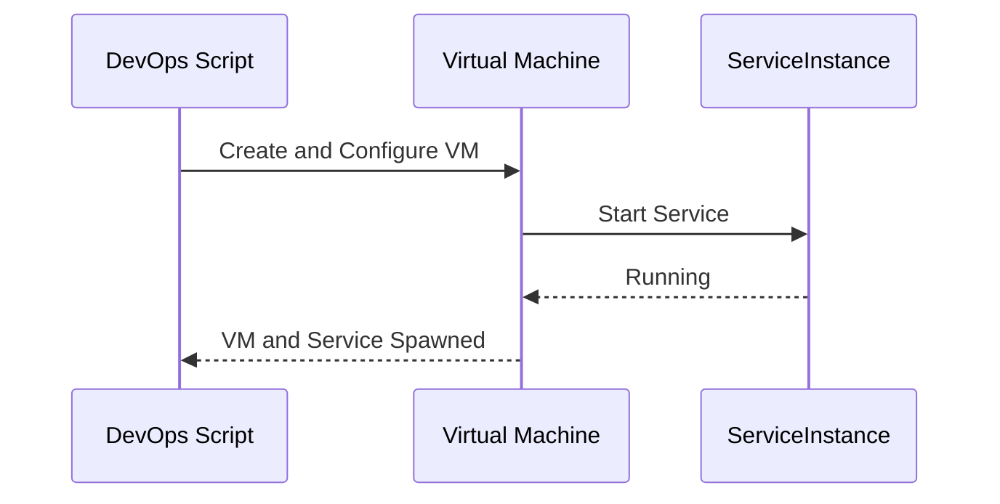
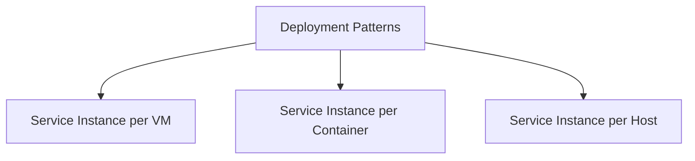

## Service Instance per VM

The **Service Instance per VM** pattern involves deploying each service instance in its own virtual machine (VM), isolating the execution environment and resources of one service from others. This approach allows for independent scaling, improved fault isolation, and better resource allocation.

### Intent
The intent of this pattern is to ensure that each microservice has its dedicated execution environment, which allows for better fault isolation, independent resource scaling, and simplified management of each service.

### Also Known As
- Single Service per VM
- Dedicated VM Service Deployment

### Detailed Definitions and Explanations

### Key Features
- **Isolation**: Each service has its own VM, providing strong fault isolation.
- **Scalability**: Services can be scaled independently based on demand.
- **Resource Allocation**: Precise resource assignment for each service, aiding in avoiding resource contention.
- **Management**: Simplified service deployment and management as each service can be independently monitored and managed.

### Example in Java, Spring Boot, and Spring Cloud

```java
// ExampleService.java
@SpringBootApplication
public class ExampleService {
    public static void main(String[] args) {
        SpringApplication.run(ExampleService.class, args);
    }
}
```

**Deployment Configuration**: 

- Create an AMI (Amazon Machine Image) for the service containing the necessary dependencies and configurations.
- Utilize an automation tool (e.g., Terraform, Ansible) for provisioning VMs and deploying the service.

### Example Class Diagram


**Explanation**: In the above class diagram, a `VM` instance is responsible for starting a `ServiceInstance`. Each `ServiceInstance` belongs to a dedicated `VM`, illustrating the isolation.

### Example Sequence Diagram


**Explanation**: The sequence diagram shows how a VM is created and configured, followed by starting the service on that VM.

### Benefits
- **Fault Isolation**: Failures in one service do not affect others.
- **Security**: Services are sandboxed in their VMs, enhancing security.
- **Scalability**: Services can be scaled out by provisioning more VMs.

### Trade-offs
- **Cost**: Running many VMs can be expensive.
- **Provisioning Time**: Creating and configuring VMs takes time.
- **Resource Utilization**: Potential for under-utilization of VM resources.

### When to Use
- To ensure strong isolation and independence of microservices.
- When services have distinct resource requirements.
- In a cloud environment where VM management is automated.

### Example Use Cases
- A multiclass microservices architecture with stringent fault isolation requirements.
- Financial applications requiring secure and isolated execution environments.

### When Not to Use and Anti-Patterns
- When the cost of VMs outweighs their benefits.
- Avoid using for small-scale applications where overhead might be too high.
- Over-provisioning VMs leading to inefficiency.

### Related Design Patterns
- **Service Instance per Container**: Similar but uses lightweight containers instead of VMs, reducing overhead.
- **Service Instance per Host**: Scaling services with traditional physical hosts, less flexible.

### References and Credits
- [Designing Data-Intensive Applications](https://amzn.to/4cuX2Na) by Martin Kleppmann
- "Microservices Patterns" by Chris Richardson

### Open Source Frameworks / Third-Party Tools
- **Terraform**: Infrastructure as Code tool to provision VMs.
- **Ansible**: Automation tool to configure VMs.
- **AWS EC2**: Cloud virtual machines service.

### Cloud Computing Perspectives
- **IaaS (Infrastructure as a Service)**: Suitable for deploying per-service VM architecture.

### Suggested Books for Further Studies
- "Cloud Native Java" by Josh Long
- "Docker: Up & Running" by Karl Matthias and Sean Kane

### Patterns Grouping Diagram


**Explicit Description of Related Patterns**:
- **Service Instance per Container**: Deploying services in containers instead of full VMs. Containers are more lightweight and start faster, often preferred for microservices.
- **Service Instance per Host**: Utilizing a single physical machine per service. Not as flexible but could be simpler in some legacy contexts.

By adhering to the **Service Instance per VM** pattern, microservices can achieve autonomy in execution, resulting in a robust, fault-isolated, and scalable architecture.

