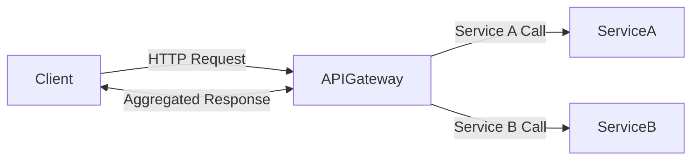
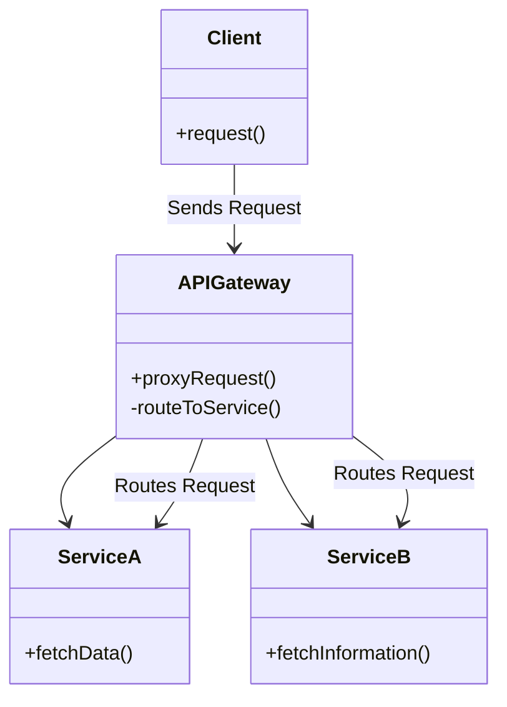
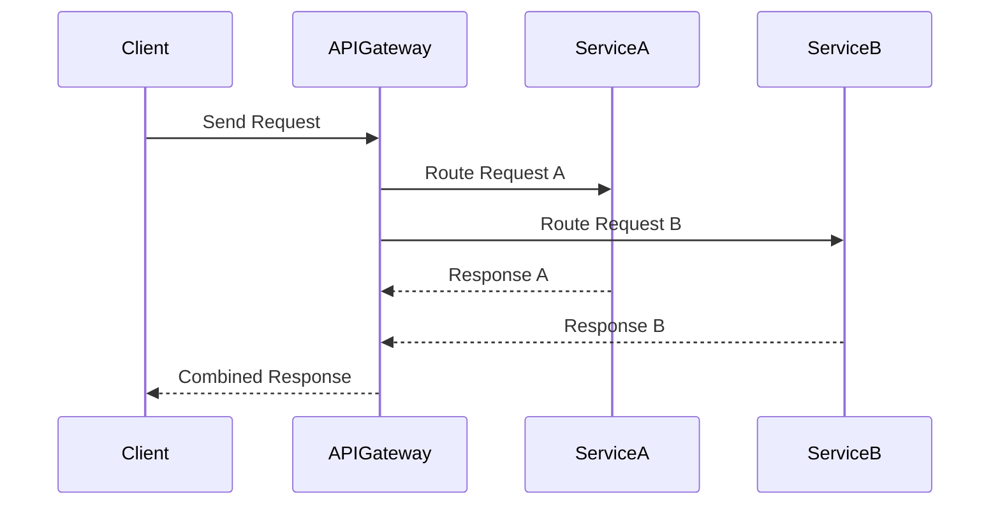

## Definition
API Gateway is a server that acts as an API front-end, receiving API requests, enforcing throttling and security policies, passing requests to the back-end services, and then passing the back-end responses to the clients.

## Intent
The intent of the API Gateway pattern is to provide a single entry point for external clients to interact with various microservices, abstracting the internal services, aggregating results, and enforcing policies systematically.

## Also Known As
- Edge Server
- Single Entry Point

## Detailed Explanation
The API Gateway Pattern helps manage communication between external clients and internal microservices. It simplifies the client interaction by aggregating requests against multiple services into a single request.



In the diagram above, the `APIGateway` acts as a single entry point through which all incoming client requests flow and are subsequently routed to the appropriate microservices (`ServiceA` and `ServiceB`).

## Key Features
- **Unified Interface:** Offers a single API entry point for multiple services.
- **Aggregation:** Combines multiple service calls into a single response.
- **Security:** Enforces policies like authentication and authorization.
- **Load Balancing:** Distributes incoming requests across multiple instances.
- **Log and Monitor:** Centralized logging and monitoring of the requests.

## Code Examples
An example implementation in Java using Spring Boot and Spring Cloud:

```java
@SpringBootApplication
@EnableDiscoveryClient
@EnableZuulProxy
public class ApiGatewayApplication {
    public static void main(String[] args) {
        SpringApplication.run(ApiGatewayApplication.class, args);
    }
}
```

Configure routes in `application.yml`:

```yaml
zuul:
  routes:
    service-a:
      path: /service-a/**
      serviceId: service-a
    service-b:
      path: /service-b/** 
      serviceId: service-b

eureka:
  client:
    serviceUrl:
      defaultZone: http://localhost:8761/eureka/
```

## Example Class Diagram


In this class diagram, `APIGateway` handles requests from the `Client` and routes them to `ServiceA` or `ServiceB`.

## Example Sequence Diagram


In this sequence diagram, the `Client` sends a request to the `APIGateway`, which routes the request to `ServiceA` and `ServiceB`, then returns combined responses back to the `Client`.

## Benefits
- **Simplified Client:** Reduces the complexity on client-side for calling multiple services.
- **Security Management:** Enforces consistent security policies.
- **Centralized Logging and Monitoring:** Simplified and centralized.
- **Load Balancing:** Distributes load evenly.

## Trade-offs
- **Single Point of Failure:** The gateway itself can become a bottleneck.
- **Increased Latency:** Routing and aggregating responses add extra overhead.
- **Complexity:** Adds an additional layer in the architecture.

## When to Use
- When you have multiple services and you wish to provide a simplified API to consumers.
- When there’s a need for centralized access control and monitoring.
- When you need to aggregate data from multiple services.

## Example Use Cases
- E-commerce platforms providing a single API endpoint for their various services (product, order, payment).
- Backend services for mobile applications where multiple service calls need to be minimized.

## When Not to Use and Anti-patterns
- In a simple microservice architecture where only a few services are present.
- Avoid overloading the gateway with too many responsibilities that could lead to performance bottlenecks.

## Related Design Patterns
- **Service Mesh**: Focuses on service-to-service communication and functionality at the network layer.
- **Backend for Frontend (BFF)**: Provides a separate API for each frontend application.

### Comparisons
- **API Gateway vs. Service Mesh**: While both patterns manage communication, the API Gateway pattern is more consumer-focused, whereas the Service Mesh handles service-to-service communication, load balancing, and failure recovery.

## References
- [Building Microservices: Designing Fine-Grained Systems](https://amzn.to/3RYRz96) by Sam Newman
- "Microservices Patterns" by Chris Richardson

## Credits
- Spring Boot and Spring Cloud for implementing microservices architecture.
- Netflix for Zuul, an edge service that provides API Gateway functionality.

## Open Source Frameworks and Tools
- **Netflix Zuul**: API Gateway for routing traffic.
- **Spring Cloud Gateway**: An open-source framework providing API Gateway.

## Cloud Computing Contexts
- **SAAS**: Service-centric APIs powered by an API Gateway for abstraction.
- **PAAS**: Platform services that provide gateways for different microservices.
- **DAAS**: Data-centric microservices using API Gateways to manage requests.

## Suggest Books for Further Studies
- "Microservices with Spring Boot and Spring Cloud" by Magnus Larsson.
- [Designing Data-Intensive Applications](https://amzn.to/4cuX2Na) by Martin Kleppmann.

