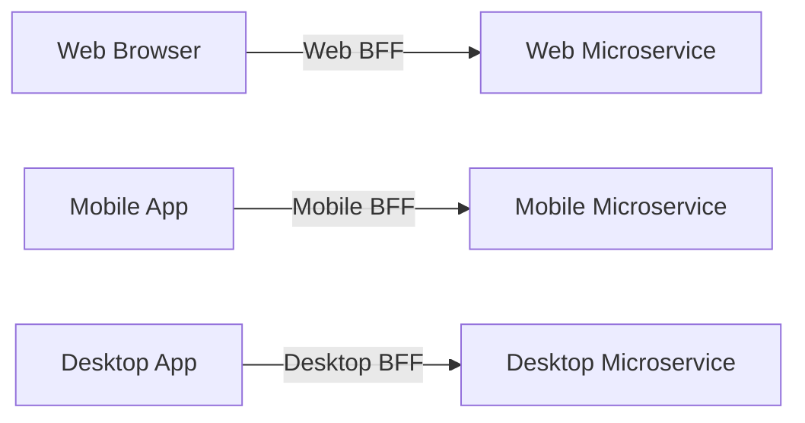
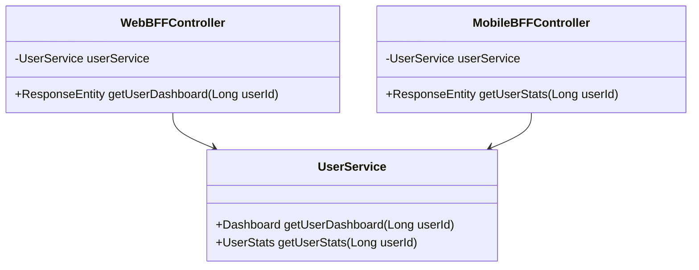
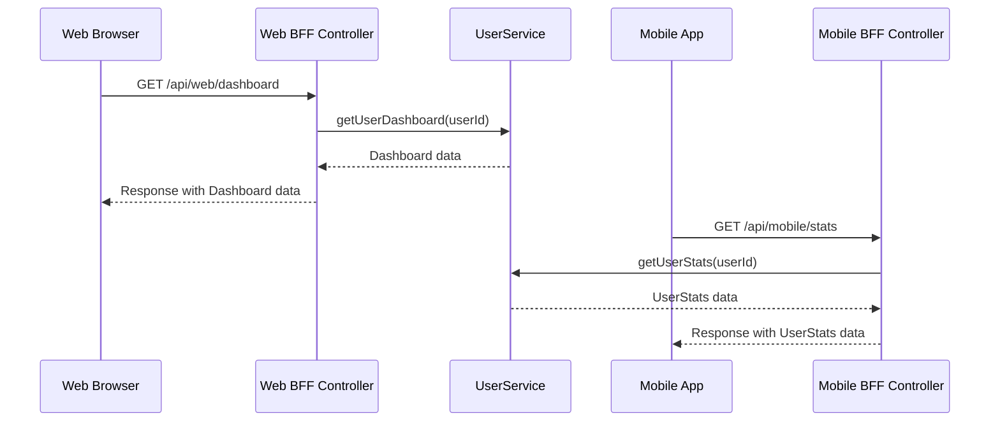

## Definition
The Backend for Front-End (BFF) pattern involves creating separate API gateways tailored for each specific client type or user interface, facilitating efficient and optimized communication between the external clients and the microservices.

## Intent
The primary intent of the BFF pattern is to provide a unique API suited for the needs of different clients. For example, a web application and a mobile application may have vastly different requirements and presenting a tailor-made API helps cater to those needs efficiently.

## Also Known As
- BFF Pattern

## Detailed Definition and Explanation
Using the BFF pattern, for every type of client (web, mobile, desktop), you create a specific API gateway. Each API gateway gathers, aggregates, and processes the information required by its client from the microservices.



### Key Features
- **Client-specific APIs**: Tailored APIs for each client type.
- **Improved performance**: Minimizes unnecessary data fetching and processing.
- **Simplified client logic**: Shifts complex data processing and aggregation to the server-side.

## Code Examples

Here is an example structure using Java with Spring Boot and Spring Cloud frameworks.

### Spring Boot Application Setup
1. **Web BFF Controller**
```java
@RestController
@RequestMapping("/api/web")
public class WebBFFController {
    
    private final UserService userService;

    public WebBFFController(UserService userService) {
        this.userService = userService;
    }

    @GetMapping("/dashboard")
    public ResponseEntity<Dashboard> getUserDashboard(@RequestParam Long userId) {
        Dashboard dashboard = userService.getUserDashboard(userId);
        return ResponseEntity.ok(dashboard);
    }
}
```

2. **Mobile BFF Controller**
```java
@RestController
@RequestMapping("/api/mobile")
public class MobileBFFController {
    
    private final UserService userService;

    public MobileBFFController(UserService userService) {
        this.userService = userService;
    }

    @GetMapping("/stats")
    public ResponseEntity<UserStats> getUserStats(@RequestParam Long userId) {
        UserStats stats = userService.getUserStats(userId);
        return ResponseEntity.ok(stats);
    }
}
```

3. **Microservices Example**

```java
@Service
public class UserService {
    
    public Dashboard getUserDashboard(Long userId) {
        // Logic to fetch and aggregate dashboard data
        return new Dashboard();
    }
    
    public UserStats getUserStats(Long userId) {
        // Logic to fetch and aggregate user stats
        return new UserStats();
    }
}
```

### Example Class Diagram

**Explanation**: The diagram shows the relationships between the Web and Mobile BFF controllers and the centralized `UserService` from which they fetch data.

### Example Sequence Diagram

**Explanation**: The sequence diagram depicts the interaction flow from clients to their respective BFF controllers and fetching data from the underlying service.

## Benefits
- **Client-specific optimization** for better performance and usability.
- **Simplification of client code** by moving complex logic to BFF.
- **Decouples clients and services** enabling independent changes.

## Trade-Offs
- **Increased complexity** in developing and maintaining multiple BFFs.
- **(Potential risk of inconsistency)** if shared logic between BFFs is maintained poorly.

## When to Use
- When different clients have distinct requirements and need specific optimizations.
- In scenarios where you want to offload complex data fetching and processing logic from the clients.

## Example Use Cases
- An e-commerce platform requiring different APIs for web and mobile apps.
- SaaS platforms providing tailored interfaces for different client applications.

## When Not to Use and Anti-Patterns
- When all clients have similar requirements and there is little to no benefit in creating separate APIs.
- Anti-pattern: Using BFF for a single client type, leading to unnecessary overhead.

## Related Design Patterns
- **API Gateway Pattern**: While both use API gateways, BFF is client-focused whereas API Gateway usually combines multiple microservices into a single entry point.
- **Aggregator Pattern**: Combines data from multiple services into one response, useful in scenarios where data presentation differs vastly between clients.

## References and Credits
- [Spring Documentation](https://spring.io/projects/spring-boot)
- [Microservices Patterns by Chris Richardson](https://www.manning.com/books/microservices-patterns)
- [Microsoft Cloud Design Patterns](https://docs.microsoft.com/azure/architecture/patterns/)
  
## Open Source Frameworks and Third Party Tools
- **Netflix Zuul**: For routing and filtering.
- **Spring Cloud Gateway**: Provides a way to route to services based on various criteria.

## Cloud Computing, SaaS, PaaS, DaaS
For cloud-based implementations, BFFs can be deployed on AWS Lambda, Azure Functions, or Google Cloud Functions, ensuring scalability and availability.

## Suggest Books for Further Studies
- *"Building Microservices"* by Sam Newman
- *"Cloud Native Java"* by Josh Long and Kenny Bastani
- *[Designing Data-Intensive Applications](https://amzn.to/4cuX2Na)* by Martin Kleppmann
