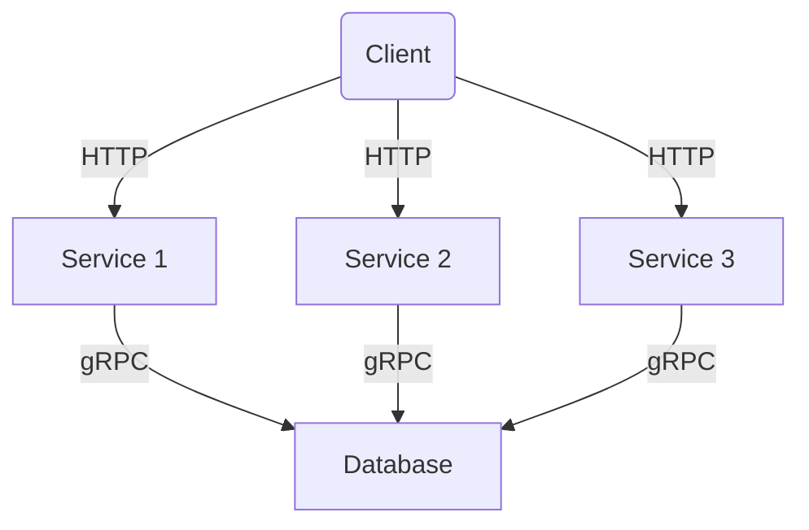
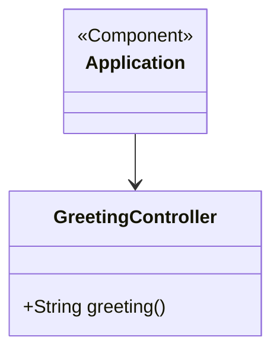
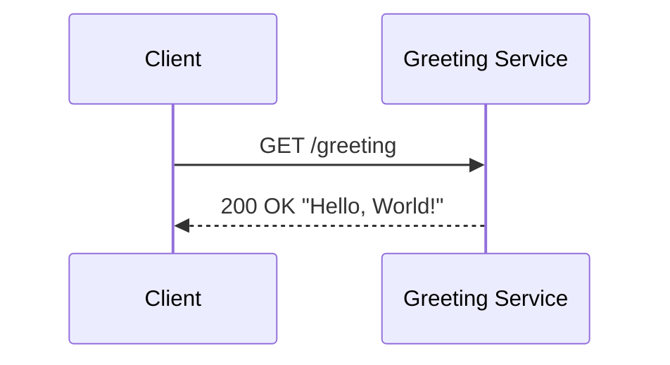
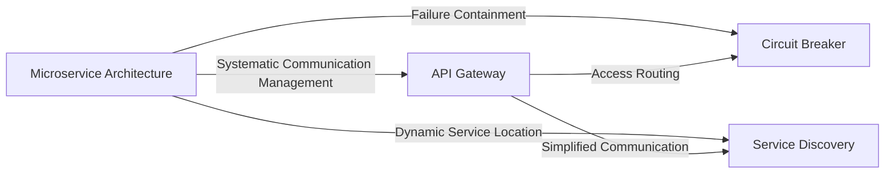

## Microservice Architecture

### Definition
The Microservice Architecture pattern is a software architectural style that structures an application as a collection of loosely coupled, independently deployable services. These services are fine-grained, and the protocols are lightweight.

### Intent
The intent of the Microservice Architecture pattern is to enable large and complex applications to be managed, developed, and scaled by breaking the application into smaller, manageable services. Each service can be developed, deployed, and scaled independently.

### Also Known As
- MSA (Microservices Architecture)
- Micro-services

### Detailed Definitions and Explanations
Microservice Architecture promotes designing an application as a suite of small services, each running its own process and communicating with the least coupling, usually over a network using HTTP/REST or messaging protocols.



#### Key Features
- **Independently Deployable**: Each microservice can be built, deployed, and scaled independently.
- **Decentralized Data Management**: Each service manages its own database.
- **Technological Diversity**: Each service can be written in a different programming language or use different technologies.
- **Isolated Failures**: A failure in one service does not affect others.

#### Code Examples
**Example of a simple microservice using Spring Boot:**

`Application.java`
```java
import org.springframework.boot.SpringApplication;
import org.springframework.boot.autoconfigure.SpringBootApplication;
  
@SpringBootApplication
public class Application {
    public static void main(String[] args) {
        SpringApplication.run(Application.class, args);
    }
}
```

`GreetingController.java`
```java
import org.springframework.web.bind.annotation.GetMapping;
import org.springframework.web.bind.annotation.RestController;

@RestController
public class GreetingController {
   
    @GetMapping("/greeting")
    public String greeting() {
        return "Hello, World!";
    }
}
```

#### Example Class Diagrams with Explanation


**Explanation:**
- `Application` class starts the Spring Boot application.
- `GreetingController` handles a REST endpoint `/greeting`.

#### Example Sequence Diagrams with Explanation


**Explanation:**
- The integration sequence in which the client sends a GET request to the greeting service and receives a "Hello, World!" response.

### Benefits
- **Scalability**: Services can be scaled independently based on their demands.
- **Resilience**: An application's failures are isolated to individual services.
- **Ease of Deployment**: Smaller codebases are easier to manage and deploy.
- **Flexibility in Technology Stack**: Different services can use different technologies best suited for the use case.

### Trade-offs
- **Complexity Management**: Increased complexity in managing inter-service communications.
- **Data Consistency**: Distributed data management can lead to consistency challenges.
- **Operational Overheads**: More services mean more running parts to manage and monitor.
- **Developer Onboarding**: Understanding the architecture and interdependencies may be hard for new developers.

### When to Use
- When building complex, large-scale applications.
- When you need to scale different parts of the application independently.
- If you have teams specialized in different domains requiring isolated development environments.

### Example Use Cases
- Large e-commerce platforms
- Banking systems with numerous independent service modules
- Streaming platforms like Netflix
- Microservices based SaaS products

### When Not to Use
- For small applications where overhead outweighs benefits.
- When the team lacks experience in deploying and managing microservices.
- In environments where DevOps practices are not well established.

### Anti-patterns
- **Service Chassis**: Overloading a single service with too many responsibilities.
- **Tightly Coupled Services**: Interdependence that undermines the purpose of microservices.
- **Data Sharing**: Directly sharing database schemas across different microservices.

### Related Design Patterns
- **Service Discovery**: Finding microservices dynamically.
- **API Gateway**: Centralized entry point for managing external access to microservices.
- **Circuit Breaker**: Handling fault-tolerance by stopping failures from propagating.

#### Diagram of Related Patterns



**Guidance**: 
- Implement system management using an **API Gateway** that serves as a single point of entry for all consumer requests.
- Utilize a **Circuit Breaker** pattern to handle failures gracefully, preventing cascading errors and isolating faults.
- Apply **Service Discovery** for automatic detection of services, making the system more adaptive and reducing the need for hard-coded service locations.

### References and Credits
- Check out Martin Fowler's articles on [Microservices](https://martinfowler.com/microservices/).
- Books: 
  - [Building Microservices: Designing Fine-Grained Systems](https://amzn.to/3RYRz96) by Sam Newman
  - "Microservices Patterns" by Chris Richardson

### Open Source Frameworks and Tools
- **Spring Boot** for developing microservices.
- **Spring Cloud** for handling distributed systems concerns.
- **Netflix OSS** components like Eureka (Service Discovery), Hystrix (Circuit Breaker).

### Cloud Computing
Microservices can be effectively deployed on cloud platforms offering PAAS, such as:

- **AWS ECS/EKS**: Amazon Web Services' container services for microservice deployment.
- **Google Cloud Run/Kubernetes Engine**: For running stateless containers and microservice orchestration.
- **Azure AKS**: Azure's Kubernetes service, suitable for deploying microservice architecture.

### Further Studies
Read the classic [Designing Data-Intensive Applications](https://amzn.to/4cuX2Na) by Martin Kleppmann, focusing on the design and architecture of scalable, distributed systems trusting similar principles.

---

This comprehensive overview includes all the necessary elements regarding Microservice Architecture, its benefits, trade-offs, and integration with technologies, which lays the foundation for further learning and deployments in your software projects.
