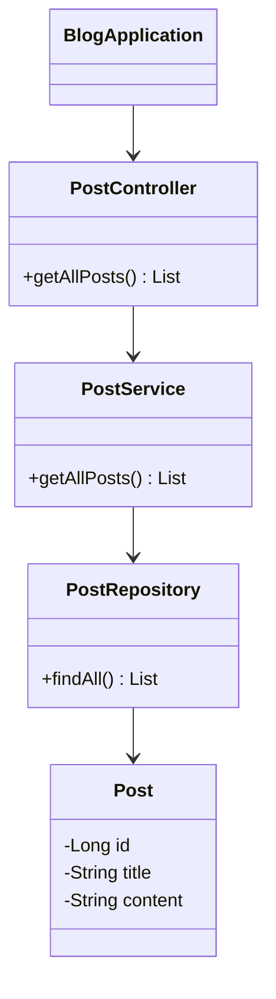
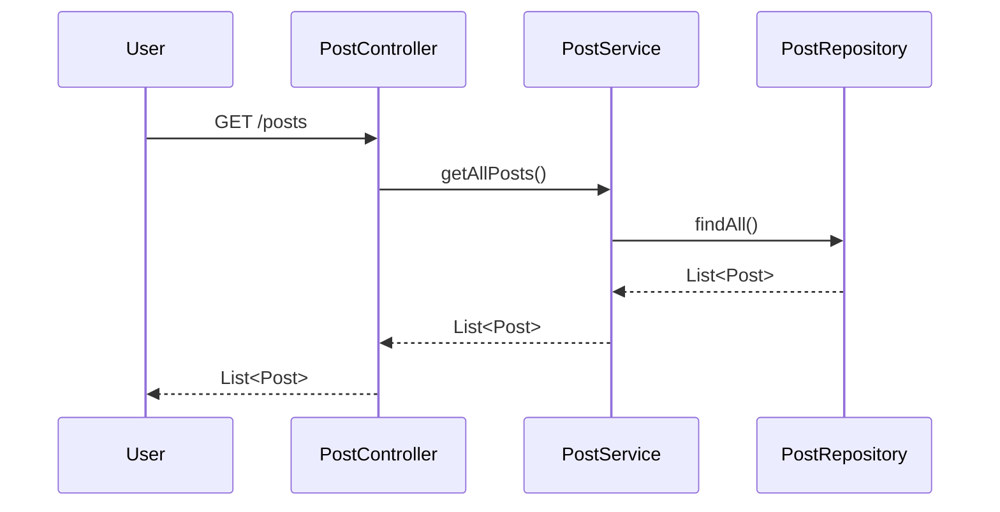

## Definition

Monolithic Architecture is a design pattern where an application is built and deployed as a single cohesive unit. All aspects of the application—UI, backend logic, data access layers, etc.—are part of one interconnected codebase.

## Intent

The intent of the Monolithic Architecture pattern is to simplify application development and deployment by keeping everything within a single codebase. It aims to streamline development by reducing the overhead of managing different components and services separately.

## Also Known As

- Single-tier Architecture
- Macro-architecture

## Detailed Explanation

In Monolithic Architecture, all functionalities lie within one unit, running as a single process. It's easy to build and deploy but becomes cumbersome as the application grows in size and complexity.

### Key Features

- **Single Deployable Unit**: The entire application is built and deployed together.
- **Tightly Coupled Components**: All modules/functions within the application are closely interdependent.
- **Simplified Development**: Ease of development due to a single codebase.
- **Single Technology Stack**: Often uses one consistent technology stack.

### Code Example

A simple monolithic application in Spring Boot for a blog could look like:

```java
@SpringBootApplication
public class BlogApplication {
    public static void main(String[] args) {
        SpringApplication.run(BlogApplication.class, args);
    }
}

@RestController
@RequestMapping("/posts")
class PostController {
    @Autowired
    private PostService postService;

    @GetMapping
    public List<Post> getAllPosts() {
        return postService.getAllPosts();
    }
}

@Service
class PostService {
    @Autowired
    private PostRepository postRepository;

    public List<Post> getAllPosts() {
        return postRepository.findAll();
    }
}

@Entity
class Post {
    @Id
    @GeneratedValue(strategy=GenerationType.AUTO)
    private Long id;
    private String title;
    private String content;
    // getters and setters
}

@Repository
interface PostRepository extends JpaRepository<Post, Long> { }
```

### Example Class Diagram



### Example Sequence Diagram



## Benefits

- **Simplified Deployment**: Deploying the application is straightforward.
- **Unified System**: Ideal for small applications not expected to grow significantly.
- **Performance**: Direct function calls within the same process are generally faster than inter-process communication.
- **Development Simplicity**: Centralized management makes debugging and troubleshooting easier.

## Trade-Offs

- **Scalability**: Limited ability to scale specific parts of the application.
- **Maintainability**: Large codebases become difficult to maintain and understand.
- **Flexibility**: Inflexible to adopt new technologies for individual components.
- **Deployment Risk**: Deployment becomes challenging due to the risk of the entire system failing on an update.

## When to Use

- Small to mid-sized applications with limited scalability requirements.
- Teams with limited expertise in distributed systems.
- Applications expected to see minimal changes and iterations.

## Example Use Cases

- Internal tools for data manipulation.
- Simple Content Management Systems (CMS).
- Early stages of startups where the primary goal is rapid deployment.

## When Not to Use and Anti-Patterns

- Do not use for applications with high scalability and reliability demands.
- Not suitable for highly modular and often-changing components.
- Avoid using monolithic architecture when frequent and independent component updates are required.

## Related Design Patterns

- **Microservices Architecture**: An alternative design that breaks down the application into smaller, loosely coupled services.
- **Service-Oriented Architecture (SOA)**: A method that structures enterprise systems into reusable and interoperable services.
- **Layered Architecture**: Modularizes the code by grouping functionalities into distinct layers.

## References and Credits

- Sam Newman, "Building Microservices"
- Martin Fowler, [Patterns of Enterprise Application Architecture](https://amzn.to/4cGutvM)
- Spring Boot Official Documentation

## Open Source Frameworks

- **Spring Boot**: Rapid application development framework for Java.
- **Dropwizard**: Java framework for developing RESTful microservices.

---

By carefully studying Monolithic Architecture, developers can better understand when to choose this pattern, its potential benefits, and limitations.
