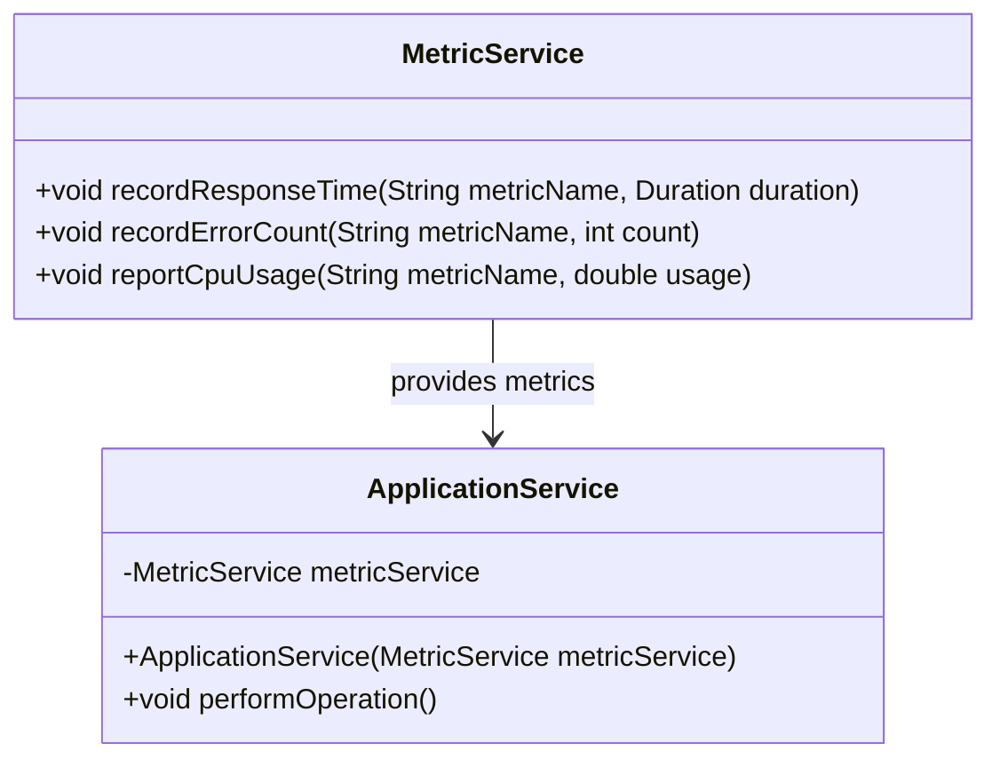
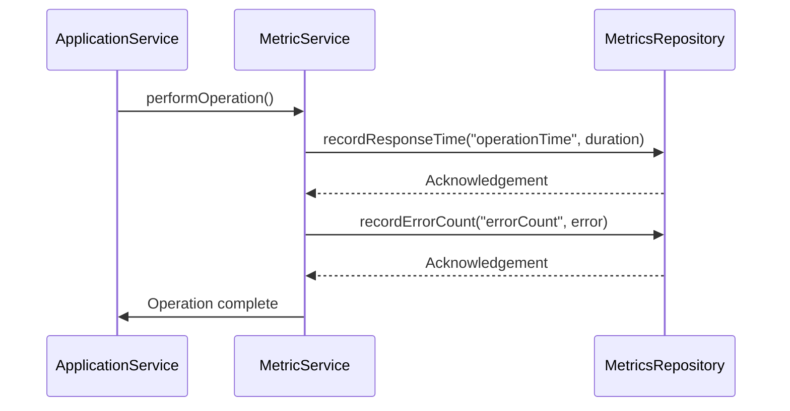
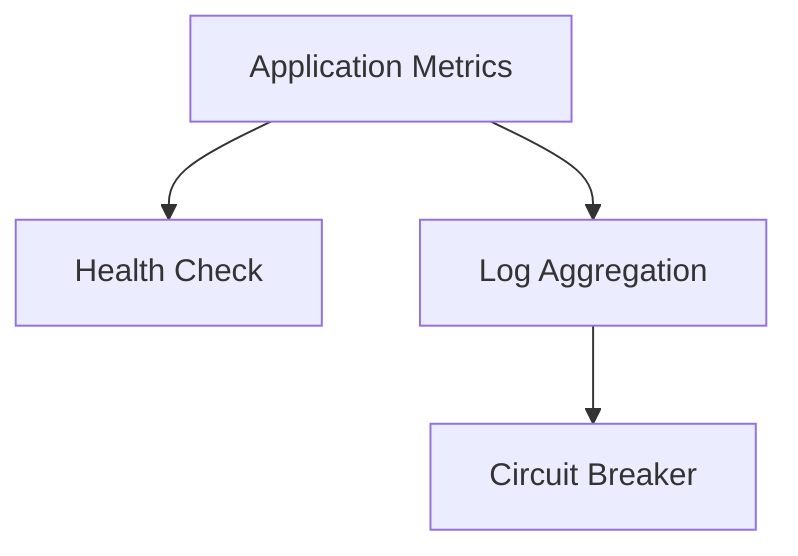

## Definition
The Application Metrics pattern involves instrumenting service code to gather key statistics and metrics about its operations, performance, and usage. This information helps in understanding the application's behavior, identifying bottlenecks, and troubleshooting operational issues.

## Intent
- To monitor the performance and health of services.
- To collect key metrics like response times, error rates, CPU usage, etc.
- To identify and diagnose problems before they impact users.
- To perform capacity planning and optimize resources.

## Also Known As
- Service Metrics
- Telemetry

## Detailed Definitions and Explanations

Application Metrics allow you to gather insights into your application by integrating monitoring and logging tools. This data can be used to ensure high availability and performance of your services.

### Example Class Diagram


- `MetricService`: An interface to interact with the metrics functionalities.
- `ApplicationService`: The main service which performs business logic and interacts with `MetricService`.

### Example Sequence Diagram


- **ApplicationService** performs operations and records metrics through **MetricService**.
- **MetricService** stores or reports metrics to a **MetricsRepository**.

### Key Features
- **Instrument Code:** Embed calls to a metrics library within the service code.
- **Collect Metrics:** Gather various performance-related metrics.
- **Report Metrics:** Send metrics to a repository or monitoring system for visualization and analysis.
- **Alerts:** Trigger alerts based on thresholds.

### Code Examples

**Step 1: Add Dependencies**
Include dependencies for metrics export in `pom.xml`.

```xml
<dependency>
    <groupId>io.micrometer</groupId>
    <artifactId>micrometer-core</artifactId>
</dependency>
<dependency>
    <groupId>io.micrometer</groupId>
    <artifactId>micrometer-registry-prometheus</artifactId>
</dependency>
```

**Step 2: Configure Metrics in Spring Boot**
Add configuration to collect and expose metrics.

```java
import io.micrometer.core.instrument.MeterRegistry;
import io.micrometer.core.instrument.Timer;
import org.springframework.beans.factory.annotation.Autowired;
import org.springframework.stereotype.Service;

@Service
public class MetricService {
    
    @Autowired
    private MeterRegistry meterRegistry;

    public void recordResponseTime(String metricName, Duration duration) {
        Timer timer = meterRegistry.timer(metricName);
        timer.record(duration);
    }

    public void recordErrorCount(String metricName, int count) {
        meterRegistry.counter(metricName).increment(count);
    }
    
    public void reportCpuUsage(String metricName, double usage) {
        meterRegistry.gauge(metricName, usage);
    }
}
```

**Step 3: Use Metrics in Application Service**
Integrate metrics collection in the service.

```java
import org.springframework.beans.factory.annotation.Autowired;
import org.springframework.stereotype.Service;

@Service
public class ApplicationService {

    @Autowired
    private MetricService metricService;

    public void performOperation() {
        long startTime = System.currentTimeMillis();
        try {
            // Perform some operation
            // ...
        } catch (Exception e) {
            metricService.recordErrorCount("errorCount", 1);
        } finally {
            long duration = System.currentTimeMillis() - startTime;
            metricService.recordResponseTime("operationTime", Duration.ofMillis(duration));
        }
    }
}
```

## Benefits
- **Proactive Monitoring:** Address issues before they affect users.
- **Optimized Performance:** Identify bottlenecks and optimize performance.
- **Resource Management:** Better capacity planning and resource utilization.
- **Improved Reliability:** Foster a culture of reliability and resilience.

## Trade-offs
- **Overhead:** Metrics collection can introduce some overhead in terms of performance.
- **Complexity:** Adding instrumentation code can make the codebase more complex.
- **Costs:** Additional costs for monitoring tools and storage for metrics data.

## When to Use
- When you need to monitor and optimize performance.
- When early detection of issues is critical.
- In environments where scalability and resource utilization are important.

## Example Use Cases
- E-commerce platforms tracking transaction times.
- Financial institutions monitoring transaction integrity and performance.
- Streaming services analyzing performance metrics for different regions.

## When Not to Use and Anti-Patterns
- If performance overheard becomes too significant.
- When the added complexity of instrumentation outweighs its benefits.
- Avoid dumping excessive metrics without meaningful patterns leading to metrics overflow.

## Related Design Patterns
- **Health Check:** Complementary pattern to ensure services are available and responding as expected. 
- **Log Aggregation:** Collecting and analyzing log data alongside metrics.
- **Circuit Breaker:** Metrics can inform when to open circuit breakers in response to faults.

## References and Books for Further Studies
- [Building Microservices: Designing Fine-Grained Systems](https://amzn.to/3RYRz96) by Sam Newman
- "Site Reliability Engineering: How Google Runs Production Systems" by Niall Richard Murphy

## Tools and Open Source Frameworks
- **Prometheus:** Monitoring system and time-series database.
- **Grafana:** Analytics and monitoring platform for dashboards.
- **Micrometer:** Application metrics facade used by Spring to integrate with various backends.

## Cloud Computing
- **AWS CloudWatch:** Monitoring and management service offering by AWS.
- **Google Cloud Monitoring:** Monitoring tool offered by GCP.
- **Azure Monitor:** Comprehensive monitoring and diagnostic tool from Azure.


> Note: Application Metrics pattern often works in tandem with Health Checks and Log Aggregation to support Circuit Breakers in ensuring robust microservices.

- **Health Check:** Ensures services are operational.
- **Log Aggregation:** Prepares data for further insight.
- **Circuit Breaker:** Prevents cascading failures using metrics data.

By understanding these patterns and how to apply them together, you'll be better equipped to implement robust monitoring and operational strategies in microservices architectures.

---
