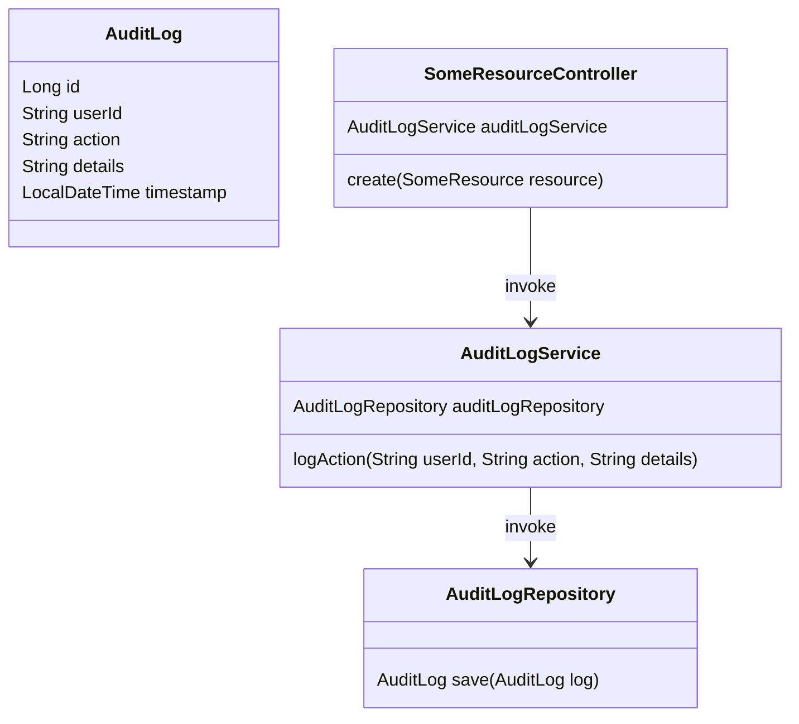
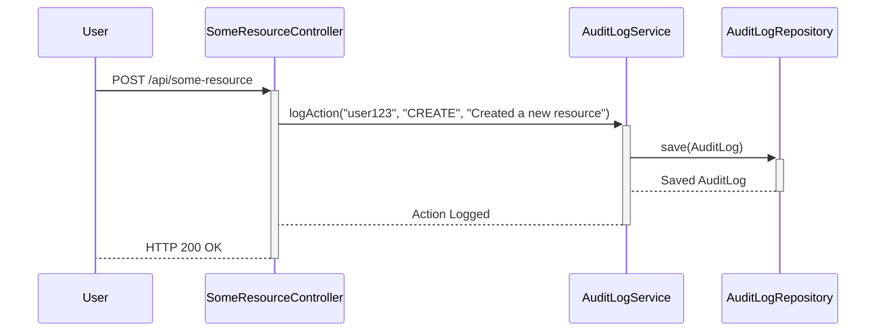

## Audit Logging

Audit logging is a process where user activities and application events are recorded persistently in an audit trail. This allows for tracking changes during runtime and serves as a basis for understanding application behavior and troubleshooting problems.

### Intent

The intent of audit logging is to:
1. Record user activity and system operations for security and compliance.
2. Provide a history of events to understand past behavior.
3. Assist in troubleshooting and debugging issues by tracing the sequence of activities.
4. Track configuration changes and data alterations.

### Also Known As

- Event Logging
- Activity Logging
- Transaction Logging

### Detailed Explanation

In microservices, audit logs are critical for observing and governing the system. Each microservice may log its activities independently, enabling decentralized and resilient logging.

#### Key Features

1. **Persistence**: Store logs in a reliable and durable storage medium.
2. **Scalability**: Support a high volume of logs without affecting normal operations.
3. **Searchability**: Enable efficient searching and filtering of logs.
4. **Traceability**: Maintain a clear sequence of user actions and system events.

### Code Examples

#### Example in Java with Spring Boot and Spring Data JPA

```java
@Entity
public class AuditLog {
    @Id
    @GeneratedValue(strategy = GenerationType.IDENTITY)
    private Long id;
    private String userId;
    private String action;
    private String details;
    private LocalDateTime timestamp;

    // Getters and Setters
}

@Repository
public interface AuditLogRepository extends JpaRepository<AuditLog, Long> {}

@Service
public class AuditLogService {

    @Autowired
    private AuditLogRepository auditLogRepository;

    public void logAction(String userId, String action, String details) {
        AuditLog auditLog = new AuditLog();
        auditLog.setUserId(userId);
        auditLog.setAction(action);
        auditLog.setDetails(details);
        auditLog.setTimestamp(LocalDateTime.now());
        auditLogRepository.save(auditLog);
    }
}
```

#### Logging an Event

```java
@RestController
@RequestMapping("/api/some-resource")
public class SomeResourceController {

    @Autowired
    private AuditLogService auditLogService;

    @PostMapping
    public ResponseEntity<SomeResource> create(@RequestBody SomeResource resource) {
        // Some creation logic
        auditLogService.logAction("user123", "CREATE", "Created a new resource");
        return ResponseEntity.ok(resource);
    }
}
```

### Example Class Diagram



### Example Sequence Diagram



### Benefits

1. **Enhanced Security**: Track and identify malicious activities or breaches.
2. **Compliance**: Meet regulatory requirements that demand logging.
3. **Debugging and Troubleshooting**: Diagnose and resolve issues effectively.
4. **Behavior Analysis**: Understand user behavior and system performance.

### Trade-offs

1. **Storage Costs**: Requires substantial storage to persist logs.
2. **Performance Overhead**: May introduce latency if not implemented efficiently.
3. **Complexity**: Adds complexity to manage different log data streams.

### When to Use

- When compliance and regulations necessitate detailed logging.
- To enhance security by monitoring activities.
- To assist in root-cause analysis and debugging.

### Example Use Cases

- **Financial Applications**: Maintain a detailed log of transactions.
- **Healthcare Systems**: Record access to patient data for compliance.
- **E-commerce**: Log user actions such as orders, cancellations, and returns.

### When Not to Use

- In highly constrained environments with minimal storage and processing power.
- When the overhead of logging outweighs its benefits for lightweight or low-risk applications.

### Anti-patterns

- **Log Overload**: Excessively logging every minor event can overwhelm storage and degrade performance.
- **Non-Searchable Logs**: Unindexed logs that are hard to query and analyze.

### Related Design Patterns

#### Distributed Tracing

While audit logging keeps track of specific user actions or events, distributed tracing provides a broader view of the application's flow across services.

#### Metrics Collection

Metrics focus on quantified data (e.g., request count, latency), whereas audit logs capture the specifics of operations for behavioral analysis.

### References and Further Reading

- **Books**:
  - [Designing Data-Intensive Applications](https://amzn.to/4cuX2Na) by Martin Kleppmann
  - [Building Microservices: Designing Fine-Grained Systems](https://amzn.to/3RYRz96) by Sam Newman
- **Open Source Tools**:
  - Elasticsearch, Logstash, and Kibana (ELK Stack)
  - Graylog
  - Splunk
- **Cloud Platforms**:
  - AWS CloudWatch
  - Azure Monitor
  - Google Cloud Logging

### Conclusion

Audit logging is essential for capturing user and system activities, contributing to security, compliance, and system understanding. Use audit logs wisely to balance between thorough observability and system efficiency.

