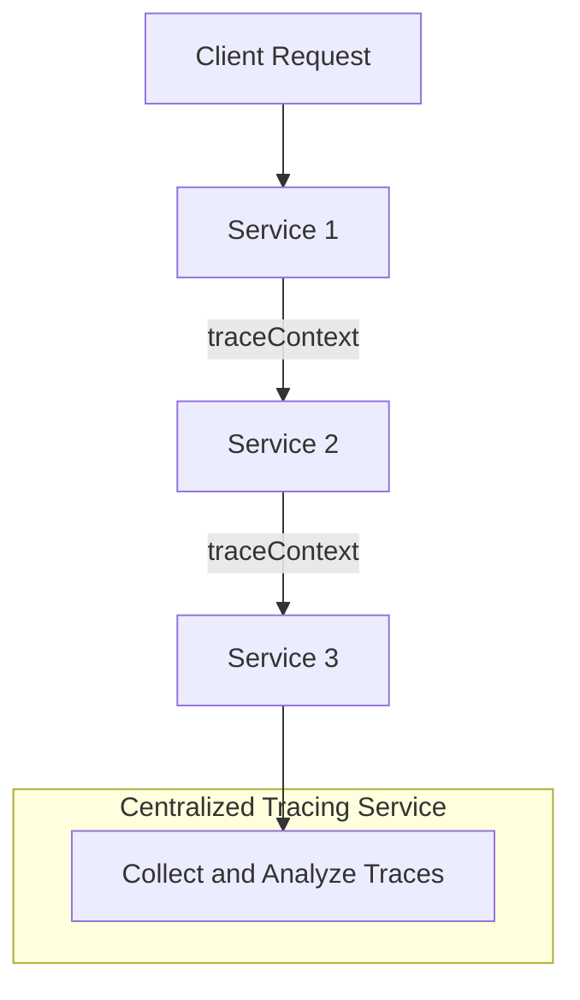
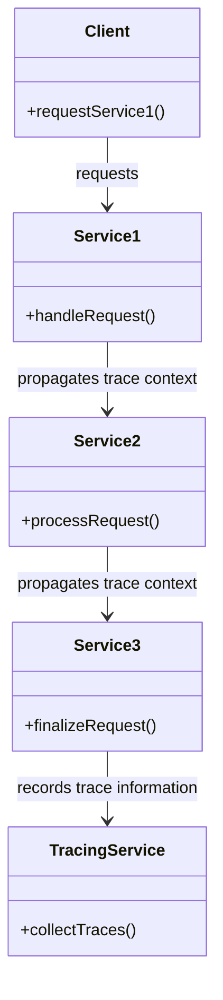
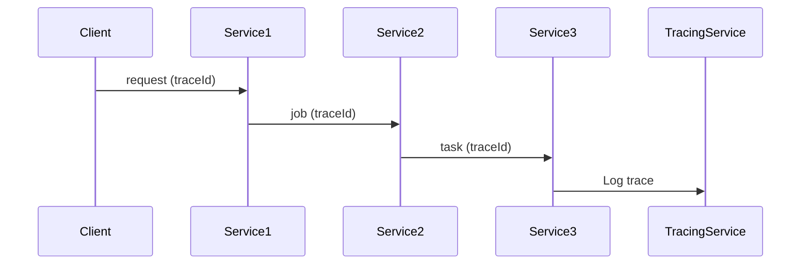
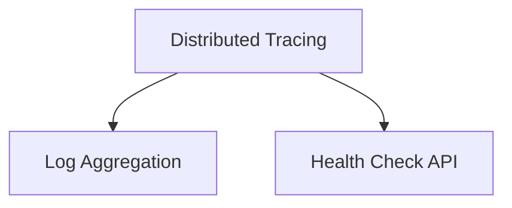

## Distributed Tracing

### Definition
Distributed Tracing is a software design pattern that enables understanding the flow of documents and transactions within a microservices architecture by tracing requests as they propagate through various services. This involves assigning a unique identifier to each external request and passing this unique identifier between services. Services record pertinent information such as start time, end time, success, or error status in a centralized service.

### Intent
The primary goal of Distributed Tracing is to provide a comprehensive overview and granular visibility into how requests propagate through distributed systems. This aids in application performance monitoring, debugging, and troubleshooting by enabling detailed analysis of the interaction between services.

### Also Known As
- Request Tracing
- End-to-End Tracing

### Detailed Definition and Explanation
Distributed Tracing involves propagating a trace context containing a unique identifier and possibly additional information through all components that handle a particular request. Each service along the request path records tracing data, which is eventually collected and centralized for analysis.

Here is a due Mermaid diagram illustrating how Distributed Tracing works:



Key features include:
- **Unique Identifier:** Each request is tagged with a unique ID.
- **Context Propagation:** The unique ID is propagated in the context across multiple services.
- **Information Logging:** Each service logs relevant trace information to a centralized system.

### Code Example
#### Dependencies

To implement distributed tracing, we can leverage tools such as Spring Cloud Sleuth for breadcrumbs and Zipkin for long-term storage and analysis.

```xml
<!-- pom.xml -->
<dependencies>
    <dependency>
            <groupId>org.springframework.cloud</groupId>
            <artifactId>spring-cloud-starter-sleuth</artifactId>
    </dependency>
    <dependency>
            <groupId>org.springframework.cloud</groupId>
            <artifactId>spring-cloud-starter-zipkin</artifactId>
    </dependency>
</dependencies>
```

#### Configuration

```java
// application.yml
spring:
  zipkin:
    base-url: http://localhost:9411
  sleuth:
    sampler:
      probability: 1.0
```

### Example Class Diagram
Mermaid class diagram representing a simplistic interaction:



### Example Sequence Diagram
A diagram illustrating the sequence of a traced request:



### Benefits
- **Enhanced Observability:** Provides holistic insights into the application’s services and workflows.
- **Effective Troubleshooting:** Simplifies identifying performance bottlenecks and failure points.
- **Root Cause Analysis:** Facilitates swift diagnosis of issues.
- **End-to-End Latency Measurement:** Measures the request latency across the system accurately.

### Trade-offs
- **Performance Overhead:** Additional computational overhead due to capturing and transmitting trace data.
- **Increased Complexity:** Requires setting up a comprehensive tracing infrastructure.
- **Data Privacy Concerns:** Sensitive information may be captured inadvertently.

### When to Use
- **Microservices Architectures:** Ideal for applications utilizing microservices to understand inter-service communications.
- **Critical Systems:** Systems where performance and reliability are non-negotiable.

### Example Use Cases
- **E-commerce:** To monitor and debug various microservices handling user transactions.
- **Financial Systems:** To ensure flawless interaction between disparate financial services handling transactions.

### When Not to Use and Anti-patterns
- **Single Monolithic Systems:** Tracing is less impactful on monolithic architectures.
- **Insufficient Resources:** Avoid if you cannot allocate adequate resources for tracing.

### Related Design Patterns
- **Logging Correlation:** Correlates logs from multiple services using unique identifiers.
- **Event Sourcing:** Records state changes as an immutable sequence of events.

### References
- [Distributed tracing - Spring Cloud Sleuth](https://spring.io/projects/spring-cloud-sleuth)
- [OpenTracing documentation](https://opentracing.io/docs/overview/what-is-tracing/)
  
### Open Source Frameworks
- **Spring Cloud Sleuth:** Distributed tracing for Spring Cloud apps via logs, async & rx.
- **Jaeger:** End-to-end distributed tracing.
- **Zipkin:** Distributed tracing system.

### Third-party Tools
- **New Relic:** Performance monitoring and observability.
- **Datadog:** Application performance monitoring and observability.
- **Elastic APM:** Real-time performance monitoring.

### Cloud Computing Considerations
HR Cloud distribute_trace(Cloud Computing, SAAS, DAAS, PAAS)
  - **SaaS:** Ensure observability of SaaS products; Salesforce example.
  - **PaaS:** Monitoring platforms themselves, like AWS Lambda traces.

### Books for Further Studies
- "Distributed Systems Observability: A Guide to Building Robust Systems" by Cindy Sridharan
- "Kubernetes Patterns: Reusable Elements for Designing Cloud-Native Applications" by Bilgin Ibryam and Roland Huß
- [Designing Data-Intensive Applications](https://amzn.to/4cuX2Na) by Martin Kleppmann

### Problem-Specific Pattern Groupings
For implementing effective observability, consider the following patterns together:

* **Distributed Tracing:**
* **Log Aggregation:** Centralize logs across all services.
* **Health Check API:** Verify components' uptime.



Distributed tracing combined with aggregated logs and health checks enhances system observability, enabling proactive monitoring, issue resolution, and deeper insight into system health.

---

Use this structure to further enhance and define other microservice design patterns, ensuring effective logging, tracing, troubleshooting, and system management.
