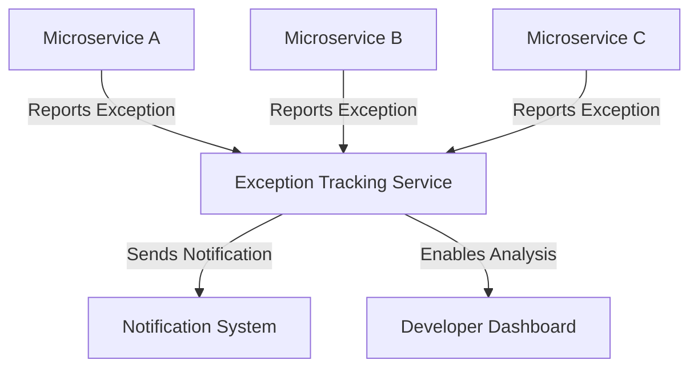
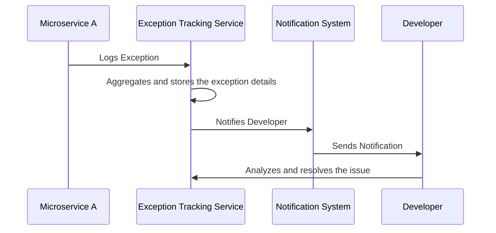
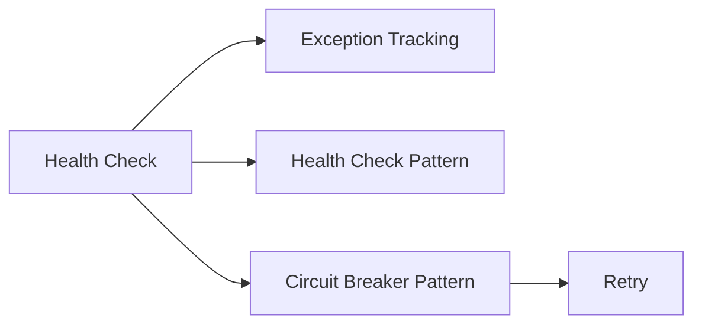

## Introduction

The Exception Tracking Pattern centralizes the reporting and monitoring of exceptions across an application, typically in a microservices architecture. This pattern aggregates exceptions in a centralized exception tracking service, enabling efficient tracking, analysis, and notification to developers.

## Key Features

1. **Centralized Exception Logs**: Consolidate all exceptions in a single service for easy monitoring.
2. **Notification Mechanisms**: Set up alerts and notifications for critical exceptions.
3. **Aggregated Reports**: Provide summarised reports and insights about frequent or critical failures.
4. **Contextual Information**: Capture detailed contextual information to facilitate debugging.
5. **Historical Analysis**: Analyze historical data to identify trends and prevent recurring issues.

## Intent

To handle, log, and monitor exceptions in a microservices architecture across various services systematically, thereby helping in troubleshooting and improving system reliability.

## Also Known As

- Centralized Logging
- Exception Aggregation

## Detailed Explanation

Mermaid Diagram of Exception Tracking Architecture:



### How it works:
1. **Microservices**: These components will report exceptions to the centralized exception tracking service.
2. **Exception Tracking Service**: This service aggregates, logs, and analyzes exceptions across various microservices.
3. **Notification System**: Notifies developers about critical exceptions.
4. **Developer Dashboard**: Visualizes aggregated data and provides insights for troubleshooting.

## Example Code with Java, Spring Boot, and Spring Cloud

### Dependency Configuration (Gradle)
```groovy
dependencies {
    implementation 'org.springframework.boot:spring-boot-starter-aop'
    implementation 'org.springframework.boot:spring-boot-starter-actuator'
    implementation 'org.springframework.boot:spring-boot-starter-amqp'
    // Include necessary dependencies for logging frameworks, such as Logback or Log4j
}
```

### Exception Tracking Service
#### Exception Service Implementation
```java
@RestController
public class ExceptionController {
    
    private final ExceptionTrackingService trackingService;
    
    @Autowired
    public ExceptionController(ExceptionTrackingService trackingService) {
        this.trackingService = trackingService;
    }
    
    @PostMapping("/report-exception")
    public ResponseEntity<String> reportException(@RequestBody ExceptionReport exceptionReport) {
        trackingService.log(exceptionReport);
        return ResponseEntity.ok("Exception reported");
    }
}
```

#### Exception Tracking Service Interface
```java
public interface ExceptionTrackingService {
    void log(ExceptionReport exceptionReport);
}
```

#### Service Implementation using Logback
```java
@Service
public class LogbackExceptionTrackingService implements ExceptionTrackingService {
    
    private static final Logger logger = LoggerFactory.getLogger(LogbackExceptionTrackingService.class);
    
    @Override
    public void log(ExceptionReport exceptionReport) {
        logger.error("Exception reported: ", exceptionReport);
    }
}
```

### Reporting Exceptions from Microservices
```java
@RestController
public class SampleServiceController {

    private final RestTemplate restTemplate;

    @Autowired
    public SampleServiceController(RestTemplate restTemplate) {
        this.restTemplate = restTemplate;
    }

    @GetMapping("/sample-endpoint")
    public ResponseEntity<String> sampleEndpoint() {
        try {
            // Some code that may throw an exception
        } catch (Exception e) {
            ExceptionReport report = new ExceptionReport(e);
            restTemplate.postForEntity("http://exception-tracking-service/report-exception", report, String.class);
        }
        return ResponseEntity.ok("Success");
    }
}
```

## Example Sequence Diagram


## Benefits

1. **Improved Troubleshooting**: Centralized logging simplifies troubleshooting.
2. **Proactive Monitoring**: Notifications alert developers of issues in real time.
3. **Data Aggregation**: Historical data helps in identifying trends and recurring issues.
4. **Scalability**: Supports logging from multiple sources in a scalable manner.

## Trade-offs

1. **Performance Overhead**: Additional logging could introduce performance overhead.
2. **Single Point of Failure**: If the exception service goes down, exception reporting is impacted.
3. **Storage Costs**: Large volume of logs can increase storage costs.

## When to Use

- In microservices architectures where multiple services may be independently failing.
- When you need a centralized view of application health and failures.
- To proactively monitor and track failures for faster resolution.

## Example Use Cases

1. **E-commerce Platforms**: Tracking issues across different microservices like payment, shipping, etc.
2. **SAAS Applications**: Monitoring user service interactions and detecting errors.
3. **Banking Applications**: Ensuring financial transaction reliability by logging and resolving issues.

## When Not to Use

- In simple applications where alternative exception logging strategies suffice.
- When performance overhead of centralized logging outweighs its benefits.

## Anti-patterns

1. **Over-logging**: Logging excessive information can lead to high storage and performance costs.
2. **Ignoring Privacy Concerns**: Redact sensitive data in exception information.

## Related Design Patterns

- **Circuit Breaker**: For preventing cascading failures by monitoring and managing failure responses.
- **Retry Pattern**: Complementary pattern that retries operations on failure.
- **Health Check Pattern**: For ensuring services are running optimally by periodic checks.

## References and Credits

- [Spring Boot Documentation](https://docs.spring.io/spring-boot/docs/current/reference/htmlsingle/)
- [Spring Cloud Documentation](https://spring.io/projects/spring-cloud)
- [Logback](http://logback.qos.ch/)
- [Exception Tracking in Microservices](https://martinfowler.com/articles/microservice-trade-offs.html#monitoring)

## Open Source Frameworks and Tools

- ELK Stack (Elasticsearch, Logstash, Kibana)
- Sentry
- Prometheus with Alertmanager

## Cloud Computing Contexts

- **SaaS**: Ensure service reliability by monitoring exceptions.
- **PaaS**: Platform services could centralize exception tracking for hosted applications.
- **DaaS**: Similar tracking for data-related services to ensure data integrity.

## Suggested Books for Further Studies

- "Microservices Patterns" by Chris Richardson
- [Building Microservices: Designing Fine-Grained Systems](https://amzn.to/3RYRz96) by Sam Newman
- "Spring Microservices in Action" by John Carnell

## Problem Area: Error Management

### Related Patterns for Error Management



1. **Health Check Pattern**: Ensures services are operational by periodic check-ups.
2. **Circuit Breaker Pattern**: Helps prevent cascading failures in case of system faults.
3. **Retry Pattern**: Complements exception tracking by retrying operations on transient failures.

Solving the Problem:

- **Step 1**: Implement Health Checks
- **Step 2**: Set up Exception Tracking
- **Step 3**: Utilize Circuit Breaker for resilience
- **Step 4**: Apply Retry Pattern to manage transient errors

By combining these patterns, you can build a robust system for managing and resolving errors in microservices.


