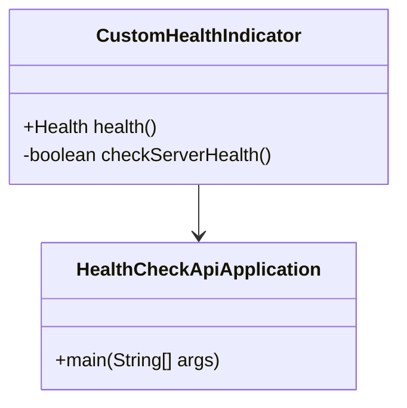
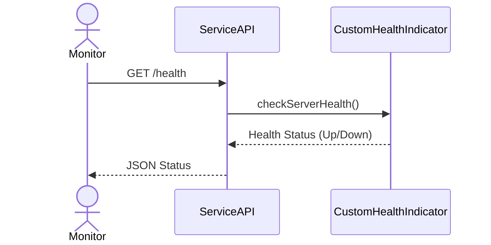

## Definition
The Health Check API is a service API endpoint that explicitly returns the health status of a service. This API is used to report whether a service is operational and able to function correctly. It provides critical information that can aid in monitoring system health, troubleshooting issues, and triggering alerts when necessary.

## Intent
The primary intent of the Health Check API is to enable proactive monitoring and management of microservice applications to ensure they are functioning as expected. This API helps detect failures quickly and allows automated systems to respond appropriately.

Also Known As:
- Health Endpoint
- Service Health Check
- Application Health Check
- Readiness Check
- Liveness Check

## Detailed Definitions & Explanations

### Key Features
- **Simple HTTP Endpoint**: Generally, it exposes an HTTP endpoint (e.g., `/health`) that can be pinged or queried by monitoring tools.
- **Health Indicators**: It checks various health indicators of the service such as database connectivity, disk space, memory usage, and other dependencies.
- **Status Reporting**: Returns status information typically in the form of JSON or plain text.
- **Liveness and Readiness Checks**: Supports different types of checks to determine if the service is alive and ready to handle requests.

### Code Example

Here is a basic example using Spring Boot's Actuator:

```java
// Add the dependency in your pom.xml
<dependency>
    <groupId>org.springframework.boot</groupId>
    <artifactId>spring-boot-starter-actuator</artifactId>
</dependency>

// Main Application
@SpringBootApplication
public class HealthCheckApiApplication {
    public static void main(String[] args) {
        SpringApplication.run(HealthCheckApiApplication.class, args);
    }
}

// Health Indicator
@Component
public class CustomHealthIndicator implements HealthIndicator {
    @Override
    public Health health() {
        // Custom health check logic
        boolean serverUp = checkServerHealth();
        if (serverUp) {
            return Health.up().withDetail("Server", "Up and Running").build();
        }
        return Health.down().withDetail("Server", "Down and Out").build();
    }

    private boolean checkServerHealth() {
        // Logic to check server's health
        return true; // Placeholder
    }
}
```

### Example Class Diagram



Explanation:
- `HealthCheckApiApplication`: Main Spring Boot application to run the microservice.
- `CustomHealthIndicator`: Custom health check indicator that implements `HealthIndicator` to indicate health status.

### Example Sequence Diagram



Explanation:
1. The monitoring tool sends a GET request to the `/health` endpoint.
2. The service invokes the `CustomHealthIndicator` to check the health status.
3. The `CustomHealthIndicator` performs necessary checks and returns the health status.
4. The service returns a JSON response containing the health status to the monitoring tool.

### Benefits
- **Early Detection**: Detect issues proactively before they impact users.
- **Automated Monitoring**: Easily integrate with existing monitoring solutions.
- **Improved Reliability**: Ensure services are operational and can handle requests effectively.

### Trade-offs
- **Overhead**: Adds minimal overhead to the service performance due to frequent health checks.
- **False Alarms**: Incorrect health indicator implementations might lead to false positives or negatives.

### When to Use
- **Microservices**: Essential for distributed systems and microservice architectures.
- **Critical Applications**: Applications requiring constant uptime and reliability.
- **Continuous Monitoring**: When frequent checking of service health is necessary.

### Example Use Cases
- Monitoring the health of an e-commerce application.
- Detecting and responding to outages in real-time data processing systems.
- Tracking the status of critical banking applications.

### When Not to Use and Anti-patterns
- Applications with simple, single-point failure systems.
- Non-critical systems where frequent health checks are unnecessary.
- Smothering real issues with overly aggressive health indicators leading to false alarms.

### Related Design Patterns and Comparisons
- **Circuit Breaker Pattern**: Complements health checks by preventing failed services from being called.
- **Bulkhead Pattern**: Isolates different microservices to contain failures, where health checks provide status information.
- **Service Discovery Pattern**: Often registers services dynamically with their health status for better management and routing.

### References, Credits, Open Source Frameworks, and Tools
- **Spring Boot Actuator**: Provides many endpoints for monitoring and management, including health checks.
- **Netflix OSS Hystrix**: Offers circuit breaker functionality along with health checks.
- **Prometheus**: Open-source monitoring and alerting toolkit with support for Kubernetes.
- **Grafana**: Visualizes monitoring metrics for health status.

### Cloud Computing Integration
- **AWS CloudWatch**: Integrate health checks with CloudWatch for monitoring.
- **Google Cloud Operations**: Use with Google Cloud for enhanced observability tools.
- **Azure Monitor**: Incorporates health checks for applications running on Azure.

### Further Reading
- **Books**:
  - [Building Microservices: Designing Fine-Grained Systems](https://amzn.to/3RYRz96) by Sam Newman
  - "Microservices Patterns" by Chris Richardson
  - "Spring Microservices in Action" by John Carnell

By implementing a robust Health Check API, you ensure proactive monitoring, increased reliability, and improved fault tolerance of your microservice-based applications.
