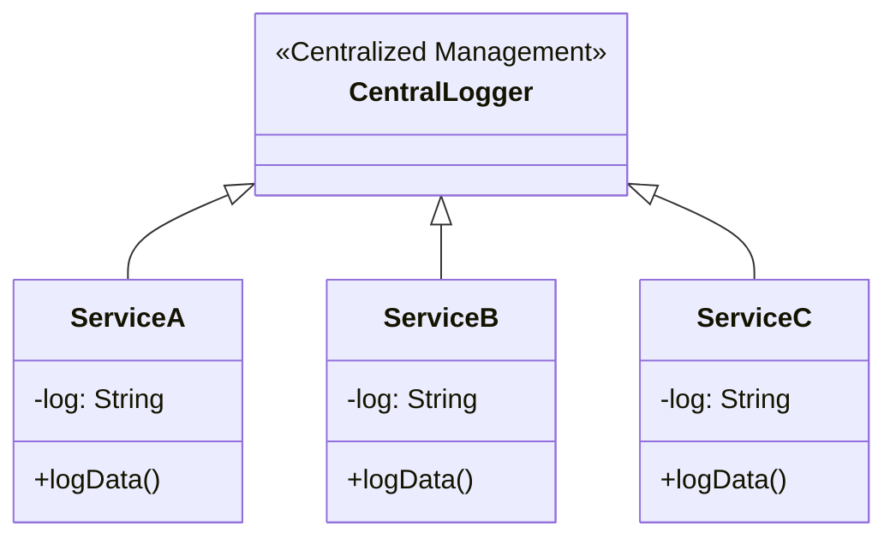
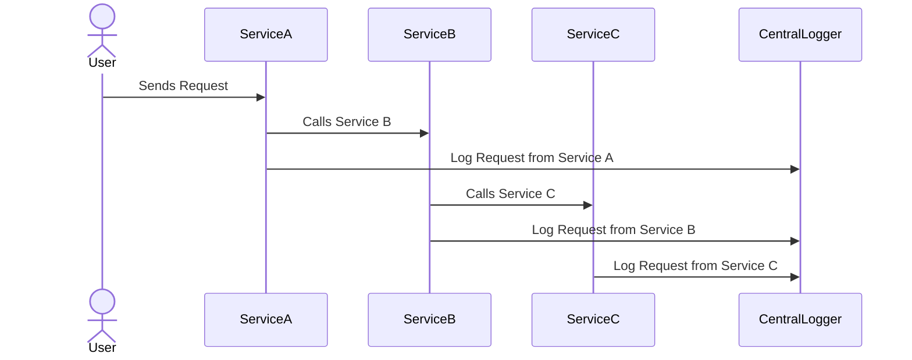

## Definition

Log Aggregation is a pattern used in microservices architecture to collect and consolidate logs from various services into a centralized system. This helps in effectively understanding application behavior, tracing issues, and troubleshooting problems.

## Intent

The primary goal of Log Aggregation is to ensure that logs from multiple microservices can be collected, stored, and analyzed in a unified manner.

## Also Known As

- Centralized Logging
- Log Consolidation

## Detailed Explanation

In microservices architecture, each service generates logs which can be vital for monitoring, debugging, and analysis. However, these logs are often dispersed across different services and locations, making it challenging to gather and analyze them collectively. The Log Aggregation pattern addresses this issue by aggregating logs in a centralized log management system.

### Key Features
- **Centralized Log Collection:** All logs are sent to a central repository.
- **Log Storage:** Efficient storage of logs for duration required by business and regulatory needs.
- **Search and Query:** Advanced search capabilities to filter and find specific log entries.
- **Index and Analyze:** Indexing for quick data retrieval and tools for log analysis.

### Code Example

Here's an example using Java, Spring Boot, and the ELK (Elasticsearch, Logstash, Kibana) stack for Log Aggregation.

**dependency in `pom.xml`:**
```xml
<dependency>
    <groupId>org.springframework.boot</groupId>
    <artifactId>spring-boot-starter-logging</artifactId>
</dependency>
<dependency>
    <groupId>net.logstash.logback</groupId>
    <artifactId>logstash-logback-encoder</artifactId>
    <version>6.6</version>
</dependency>
```

**Spring Boot application configuration in `application.properties`:**
```properties
logging.level.root=INFO
logging.level.org.springframework=INFO
logging.file.name=application.log
logging.file.path=./logs
```

**Logstash configuration (`logstash.conf`):**
```
input {
  file {
    path => "/path/to/application/logs/*.log"
    start_position => "beginning"
  }
}

output {
  elasticsearch {
    hosts => ["localhost:9200"]
    index => "application-logs-%{+YYYY.MM.dd}"
  }
  stdout { codec => rubydebug }
}
```

**class diagram example:**


**sequence diagram example:**


## Benefits
- **Visibility:** Enhanced visibility into the system across different services.
- **Troubleshooting:** Simplifies the process of identifying and resolving issues.
- **Analytics:** Centralized logs enable comprehensive analysis and usage of advanced tools.
- **Compliance:** Helps in meeting regulatory requirements related to log retention and analysis.

## Trade-offs
- **Complexity:** Implementation can add complexity to the system.
- **Latency:** Potential latency issues due to network overhead in collecting logs centrally.
- **Cost:** Storage and management of large volumes of log data can be costly.

## When to Use
- When dealing with multiple microservices generating substantial log data.
- When there's a need for consolidated log analysis.
- When complying with regulatory requirements for log retention and availability.

## Example Use Cases
- Monitoring and debugging microservices applications.
- Analyzing log data to detect anomalies or security incidents.
- Auditing system activity and user behavior.

## When Not to Use
- For small applications where logs from a single source suffice.
- When real-time analysis isn't required or logs are minimal.

## Anti-Patterns
- **Ignoring Security:** Failing to secure the centralized log repository.
- **Data Overload:** Indiscriminately logging everything without proper filtering.
- **Neglecting Performance:** Overlooking the performance implications of logging operations.

## Related Design Patterns
- **Distributed Tracing:** Used to trace requests through various microservice components.
- **Health Check:** Monitoring the health status of each microservice.

## References
- **ELK Stack Documentation:** [Elastic.co](https://www.elastic.co/what-is/elk-stack)
- **Spring Boot Logging:** [Spring.io](https://spring.io/guides/gs/logging/)

## Credits
- [Spring.io Guides](https://spring.io/guides)
- [Elastic.co Guides](https://www.elastic.co/guide/index.html)

## Open Source Frameworks
- **ELK Stack**
- **Graylog**

## Third-Party Tools
- **Splunk**
- **Loggly**

## Cloud Computing
- **AWS CloudWatch Logs**
- **Azure Log Analytics**
- **Google Stackdriver**

## Further Studies
- **"Distributed Systems Observability" by Cindy Sridharan**
- **"The Art of Monitoring" by James Turnbull**
- **"Effective Logging: What Every Developer Must Know About Logging" by Alexander Tarlinder**
