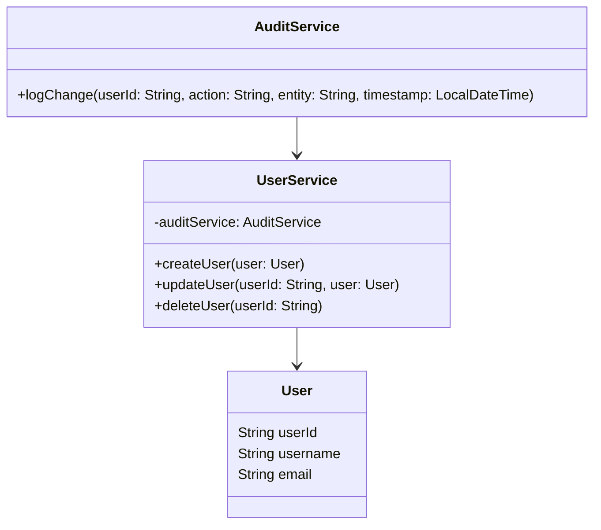
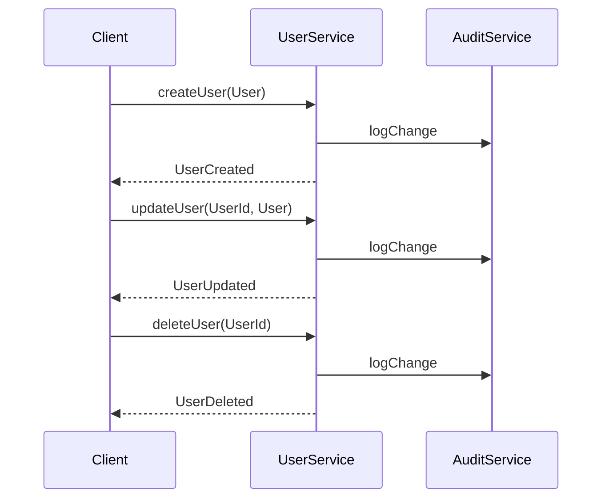
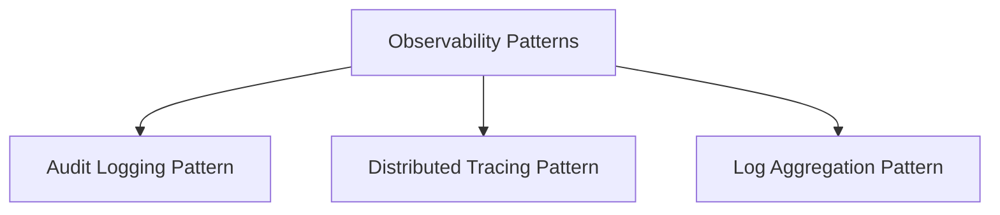

## Definition

The Audit Logging Pattern involves keeping a detailed record of all changes and significant interactions within a system. These logs provide insight into application behavior and allow for better monitoring, fault detection, and compliance with regulations.

## Intent

The primary intent of the Audit Logging Pattern is to capture a comprehensive log of actions and changes within the system to support:

- Troubleshooting and diagnostics
- Security and compliance audits
- System behavior analysis
- Change tracking and impact assessments

## Also Known As

- Change Logging
- Change Auditing

## Detailed Definitions and Explanations

### Key Features

- **Traceability:** Provides a detailed record of all system activities and changes.
- **Diagnostics Support:** Assists in troubleshooting by providing context for the actions that led to issues.
- **Compliance:** Meets regulatory requirements for data retention and traceability.
- **Security Monitoring:** Detects unauthorized access and usage patterns.

### Example Class Diagrams



### Example Sequence Diagram



### Code Examples

#### Spring Boot Java Implementation

```java
package com.example.auditlog.service;

import org.springframework.stereotype.Service;

import java.time.LocalDateTime;

@Service
public class AuditService {

    public void logChange(String userId, String action, String entity, LocalDateTime timestamp) {
        // Here you can connect to the database and save the audit record
        System.out.printf("Audit log - User: %s, Action: %s, Entity: %s, Timestamp: %s%n",
                          userId, action, entity, timestamp);
    }
}

@Service
public class UserService {

    private final AuditService auditService;

    public UserService(AuditService auditService) {
        this.auditService = auditService;
    }

    public void createUser(User user) {
        // Business logic to create the user
        auditService.logChange(user.getUserId(), "CREATE", "User", LocalDateTime.now());
    }

    public void updateUser(String userId, User user) {
        // Business logic to update the user
        auditService.logChange(userId, "UPDATE", "User", LocalDateTime.now());
    }

    public void deleteUser(String userId) {
        // Business logic to delete the user
        auditService.logChange(userId, "DELETE", "User", LocalDateTime.now());
    }
}

public class User {
    private String userId;
    private String username;
    private String email;

    // Getters and Setters
}
```

## Benefits

1. **Improved Diagnostics:** Detailed logs provide crucial context for troubleshooting and understanding system behavior.
2. **Security:** Monitoring logs for unusual activities helps identify potential security breaches.
3. **Compliance:** Helps meet regulatory requirements by retaining detailed action logs.
4. **Change Tracking:** Provides a clear record of changes and their impact on the system.

## Trade-offs

1. **Performance Impact:** Logging every action can introduce a performance overhead.
2. **Storage Requirements:** Audit logs can consume significant storage, particularly in high-activity systems.
3. **Privacy Concerns:** Sensitive information in logs must be managed carefully to avoid unintended exposure.

## When to Use

- When you need to track changes and interactions within the application.
- For systems requiring regulatory compliance and traceability.
- When enhanced troubleshooting and diagnostics capabilities are needed.
- In environments where security and unauthorized access tracking are critical.

## Example Use Cases

- Financial applications tracking transactions and actions for compliance.
- E-commerce platforms tracking user activities and changes to orders.
- Healthcare systems monitoring access to patient records.

## When Not to Use

- In real-time embedded systems where performance overhead is critical.
- When minimal audit requirements are present and storage resources are limited.
- If handling sensitive data without adequate security for log storage.

## Anti-patterns

- **Overlogging:** Logging excessive information that clogs the system and makes finding relevant information difficult.
- **Sensitive Data Exposure:** Logging sensitive data without sufficient security controls.

## Related Design Patterns

### Distributed Tracing Pattern
Captures the full lifespan of user requests across various microservices, crucial for distributed architectures.

---

### Log Aggregation Pattern
Aggregates logs from multiple services into a centralized logging system for easier analysis.

---

## References

- [Spring Boot Docs](https://docs.spring.io/spring-boot/docs/current/reference/html/features.html#features.logging)
- [Spring Cloud Sleuth](https://spring.io/projects/spring-cloud-sleuth)
- [Effective Logging & Monitoring](http://example.com/effective-logging-and-monitoring)

## Credits

- Open Source Frameworks: Spring Boot, Spring Cloud Sleuth
- Third-party Tools: ELK Stack (Elasticsearch, Logstash, Kibana), Splunk

## Cloud Computing SAAS, PAAS, DAAS

- **SaaS:** Datadog, Splunk Cloud for logs management.
- **PaaS:** AWS CloudWatch, Google Stackdriver for logging and monitoring.
- **DaaS:** Snowflake with audit logging capabilities.

## Books for Further Studies

- **"Effective Logging and Monitoring" by Cynthia Hammer**
- **"Microservices Patterns" by Chris Richardson**
- **"Spring Microservices in Action" by John Carnell**

### Related Patterns Group

#### Observability Patterns


- **Audit Logging Pattern:** Tracks changes and interactions within the system.
- **Distributed Tracing Pattern:** Monitors request flows across microservices.
- **Log Aggregation Pattern:** Aggregates logs into a central system for analysis.

By using these observability patterns, you've implemented a robust monitoring solution that ensures system reliability and aids in effective diagnostics.
