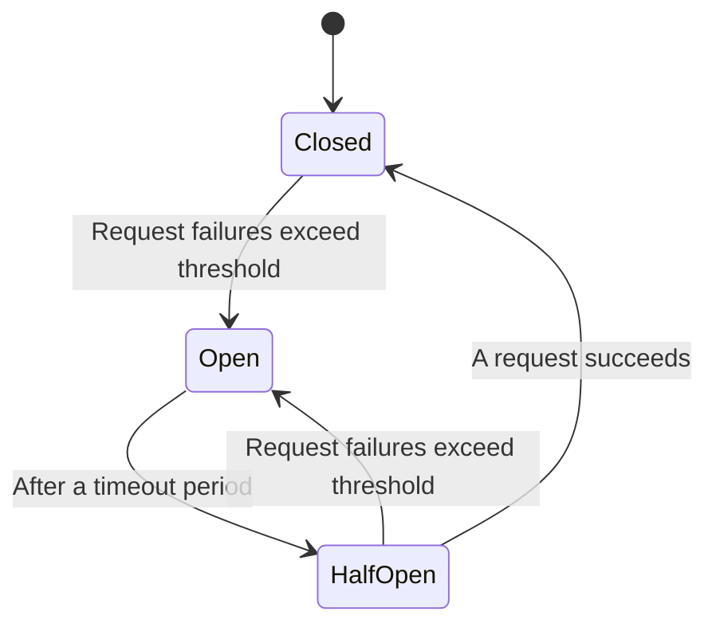
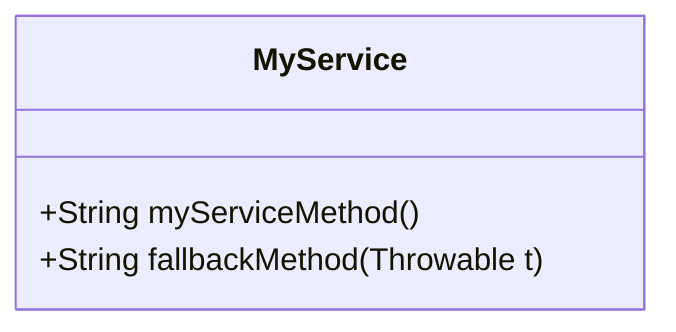
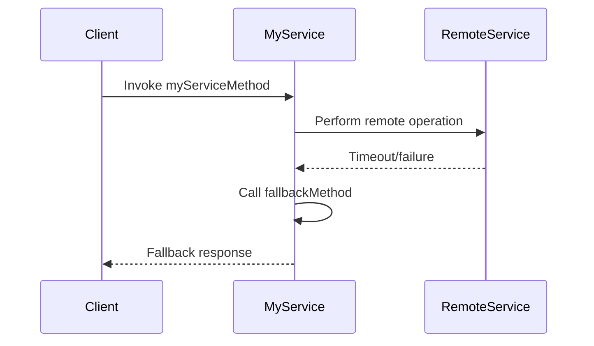
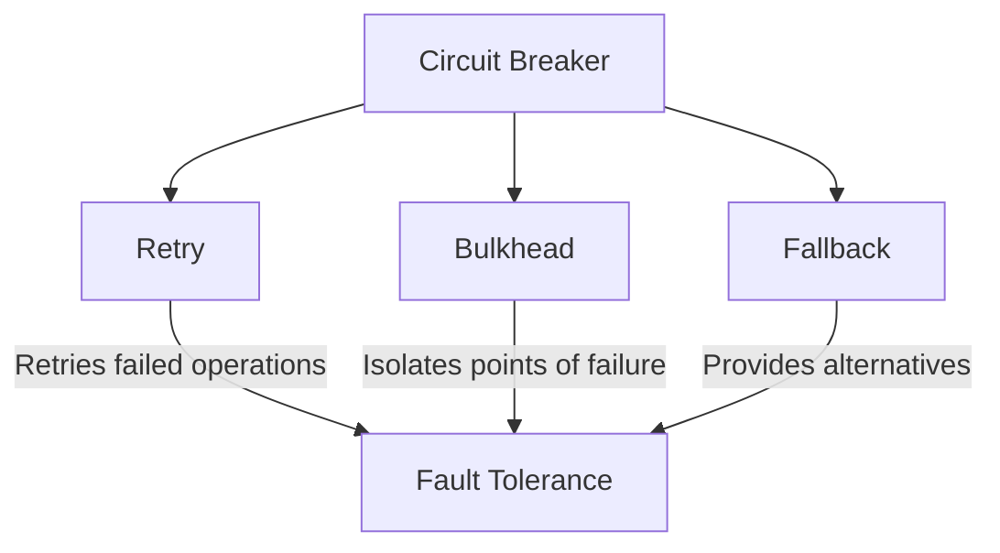

## Definition

The Circuit Breaker Pattern is a fault tolerance mechanism used to prevent a network or service failure from cascading by immediately failing operations that exceed a certain failure threshold. 

## Intent

The primary intent of the Circuit Breaker pattern is to protect applications from being overwhelmed and to provide fallback behavior by failing fast rather than waiting for long-running operations to complete if they are likely to time out.

## Also Known As

- Circuit Breaker Pattern

## Detailed Definitions and Explanations

The Circuit Breaker pattern has three states: 
1. **Closed**: Requests flow as usual.
2. **Open**: Requests are immediately failed.
3. **Half-Open**: A few requests are allowed to check if the system has recovered.

### Circuit Breaker State Transitions



## Key Features

- **Fault Tolerance**: Prevents potentially cascading failures.
- **Fast Failure**: Immediately fails calls to unavailable services.
- **Recovery**: Provides mechanisms for automatic recovery once the underlying service begins to respond correctly.

## Code Examples

### Example in Java using Spring Boot and Spring Cloud

Add dependencies in `pom.xml`:
```xml
<dependency>
    <groupId>org.springframework.cloud</groupId>
    <artifactId>spring-cloud-starter-circuitbreaker-resilience4j</artifactId>
</dependency>
```

Configure Circuit Breaker in application.properties:
```properties
resilience4j.circuitbreaker.instances.nameofTheCircuitBreaker.registerHealthIndicator=true
resilience4j.circuitbreaker.instances.nameofTheCircuitBreaker.slidingWindowSize=100
resilience4j.circuitbreaker.instances.nameofTheCircuitBreaker.permittedNumberOfCallsInHalfOpenState=10
resilience4j.circuitbreaker.instances.nameofTheCircuitBreaker.failureRateThreshold=50
resilience4j.circuitbreaker.instances.nameofTheCircuitBreaker.waitIntervalFunctionInOpenState=5000
```

Define a Service class:
```java
import org.springframework.stereotype.Service;
import io.github.resilience4j.circuitbreaker.annotation.CircuitBreaker;

@Service
public class MyService {

    @CircuitBreaker(name = "nameofTheCircuitBreaker", fallbackMethod = "fallbackMethod")
    public String myServiceMethod() {
        // potentially failing operation
        return "Success";
    }

    private String fallbackMethod(Throwable t) {
        return "Fallback response";
    }
}
```

### Example Class Diagram



#### Explanation:
- `MyService` class uses a method annotated with `@CircuitBreaker` which, upon failure, will call the `fallbackMethod`.

### Example Sequence Diagram 



#### Explanation:
- The Client calls `myServiceMethod`, which attempts to perform a remote operation.
- If the remote operation timeouts or fails, `myServiceMethod` invokes the `fallbackMethod` and returns a fallback response to the Client.

## Benefits

- **Promotes Service Reliability**: Prevents cascading failures.
- **Provides Fast Failure**: Reduces latency by failing fast.
- **Automatic Recovery**: Enables automatic reconnection and recovery.

## Trade-offs

- **Complexity**: Increased complexity in managing states and transitions.
- **Potential Overhead**: Configuring, tuning, and maintaining the thresholds and timeouts.

## When to Use

- To protect services from cascading failures.
- When you need fast failure and fallback mechanisms.
- In distributed systems where network partitions or remote service failures are common.

## Example Use Cases

- APIs consuming external services
- Microservices communication over networks
- Systems with variable load and likelihood of failure

## When Not to Use and Anti-patterns

- **Overusing Circuit Breakers**: Introducing too many circuit breakers may lead to convoluted state management.
- **Ignoring root causes**: Using circuit breakers should not ignore addressing the underlying causes of frequent failures.

## Related Design Patterns with Descriptions and Comparisons

- **Retry Pattern**: Complements the Circuit Breaker by retrying failed operations after certain intervals.
- **Bulkhead Pattern**: Isolates failures within different parts of the system to prevent cascading.

## Open Source Frameworks

- **Resilience4j**: A popular fault tolerance library compatible with Spring Boot for implementing the Circuit Breaker pattern.
- **Hystrix**: A former Netflix OSS project that provides similar functionality (now in maintenance mode).

## Cloud Computing Integration

- **SAAS (Software as a Service)**: Enhance compatibility and resilience in consuming third-party APIs.
- **PAAS (Platform as a Service)**: Use Circuit Breakers for service-to-service interactions on PAAS platforms.
- **IAAS (Infrastructure as a Service)**: Manage resilience for services deployed on various IaaS platforms.

## Suggested Books for Further Studies

- [Designing Data-Intensive Applications](https://amzn.to/4cuX2Na) by Martin Kleppmann
- [Building Microservices: Designing Fine-Grained Systems](https://amzn.to/3RYRz96) by Sam Newman
- “Release It!” by Michael T. Nygard

## Grouped Patterns

### Grouping: Fault Tolerance Patterns



#### Explanation:
- **Circuit Breaker**: Prevents cascading failures.
- **Retry Pattern**: Complements Circuit Breaker by retrying failed operations.
- **Bulkhead Pattern**: Isolates parts of the system to localize and contain failure.
- **Fallback Pattern**: Provides alternative methods in case of failure.
  
Together, these patterns provide a comprehensive strategy for fault tolerance in distributed systems.

---

This structured approach and comprehensive detail ensure a well-rounded understanding of the Circuit Breaker pattern and related fault-tolerance design patterns in microservices.
