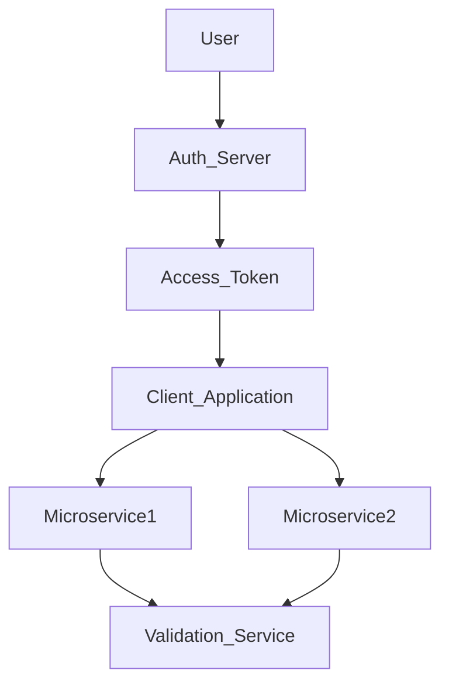
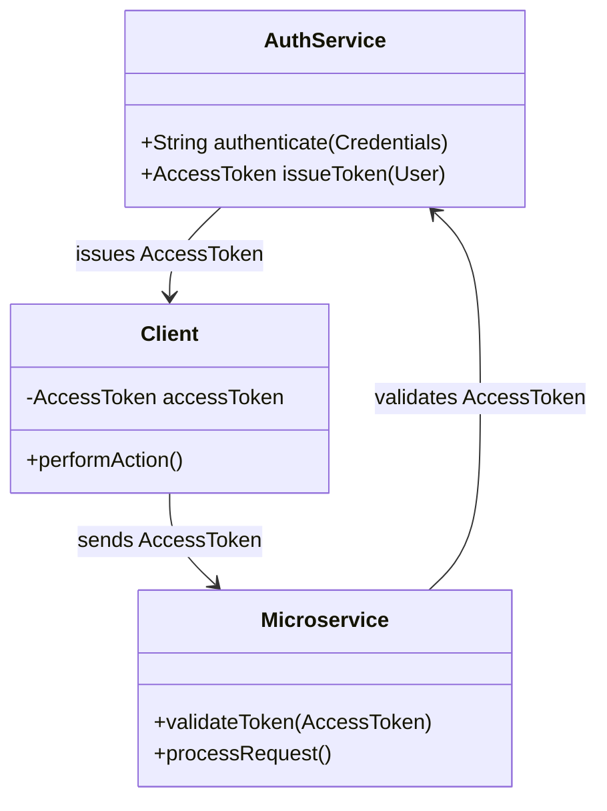
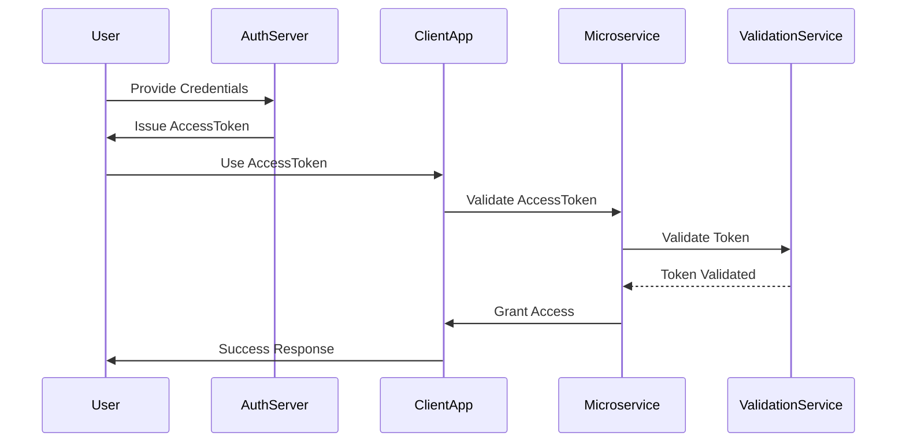

## Definition

An **Access Token** is a security token that contains information about a user and their authentication status. It is used to validate the identity of the requestor and grant access to resources across different services in a microservices architecture.

## Intent

The intent of an Access Token is to securely communicate the identity of the requestor to multiple services handling the request without repeatedly authenticating the user.

## Also Known As

- Authentication Token
- Bearer Token

## Detailed Definitions and Explanations with Mermaid Diagrams

- **How it works**: An Access Token is issued by an authentication service (e.g., Auth Server) after successful user authentication. This token is then used by the client application to communicate with back-end services, which validate the token's authenticity and grant or deny access accordingly.



## Key Features

- **Secure**: Encodes essential user information using encryption, maintaining confidentiality.
- **Efficient**: Avoids repetitive authentication across microservices.
- **Time-bound**: Typically has an expiration time to minimize misuse.
- **Stateless**: Reduces server load by not needing to store session state server-side.

## Code Example

Java code integrating Access Token using Spring Boot and Spring Security:

```java
@Configuration
@EnableWebSecurity
public class SecurityConfig extends WebSecurityConfigurerAdapter {

    @Override
    protected void configure(HttpSecurity http) throws Exception {
        http.oauth2ResourceServer()
            .jwt();
    }
}

@RestController
public class ResourceController {

    @GetMapping("/resource")
    public String securedResource(Principal principal) {
        return "Hello, " + principal.getName();
    }
}
```

## Example Class Diagram with Explanation



- **AuthService**: Issues the `AccessToken` after successful authentication.
- **Client**: Uses the `AccessToken` to perform actions.
- **Microservice**: Validates the token and processes requests.

## Example Sequence Diagram with Explanation



- **Step-by-Step Explanation**:
    1. User provides credentials to the Auth Server.
    2. Auth Server issues an Access Token to the user.
    3. User uses the Access Token to interact with ClientApp.
    4. ClientApp sends the token to Microservice for validation.
    5. Microservice validates the token with Validation Service.
    6. Validation Service confirms token validity.
    7. Microservice grants access to ClientApp.
    8. ClientApp responds to the user.

## Benefits

- **Security**: Only authorized users can access resources.
- **Efficiency**: Reduces repeated authentication overhead.
- **Scalability**: Stateless tokens enable horizontal scalability.
- **Interoperability**: Tokens can be used across various services.

## Trade-Offs

- **Token Expiry**: Expiry can lead to inconvenience if tokens need frequent renewal.
- **Token Security**: Stolen tokens could potentially be used for unauthorized access.
- **Complexity**: Implementing secure token validation mechanisms adds some complexity.

## When to Use

- When you have multiple microservices that need to validate user identity.
- When you want to avoid repeated user authentication.
- When you need stateless authentication mechanisms.

## Example Use Cases

- **APIs**: Secured API endpoints where user identity must be confirmed.
- **Distributed Systems**: When multiple services need to recognize the identity of the requestor.
- **Single-Page Applications**: Client-side applications utilizing API calls.

## When Not to Use and Anti-Patterns

- When simpler session-based authentication is sufficient.
- Avoid excessively long token validity periods.
- Do not store sensitive user information in the token itself.

## Related Design Patterns with Descriptions and Comparisons

- **OAuth 2.0**: A framework for token-based authorization. Helps clients access user resources without passwords.
- **JWT (JSON Web Token)**: A compact, URL-safe means of representing claims between two parties. It's commonly used for secure API token authorization.

## References, Credits

- [Spring Security Official Documentation](https://spring.io/guides/topicals/spring-security-architecture/)

## Open Source Frameworks, Third-Party Tools

- **Keycloak**: Open-source identity and access management by Red Hat.
- **Okta**: Cloud-based identity management service.
- **Auth0**: Cloud platform for authentication and authorization.

## Cloud Computing, SAAS, DAAS, PAAS

- **AWS Cognito**: User authentication and Identity management from AWS.
- **Google Identity Platform**: Secure, multi-platform authentication.

## Suggested Books for Further Studies

- "Spring Security in Action" by Laurentiu Spilca
- "OAuth 2 in Action" by Justin Richer and Antonio Sanso


This structured article includes a full overview of Access Tokens, including technical details such as code examples, diagrams, use cases, and additional considerations. It’s well-suited for a technical audience familiar with microservices, Spring Boot, and Spring Security.
