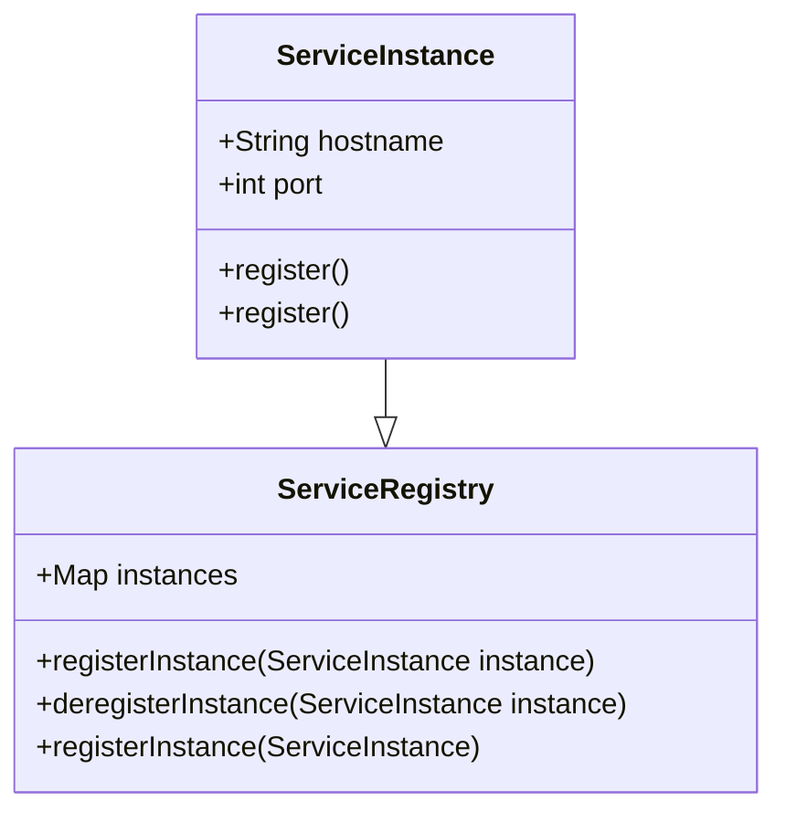
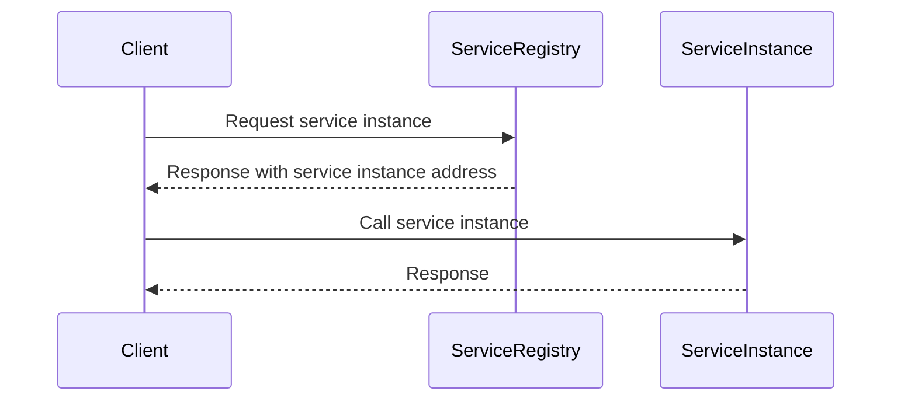
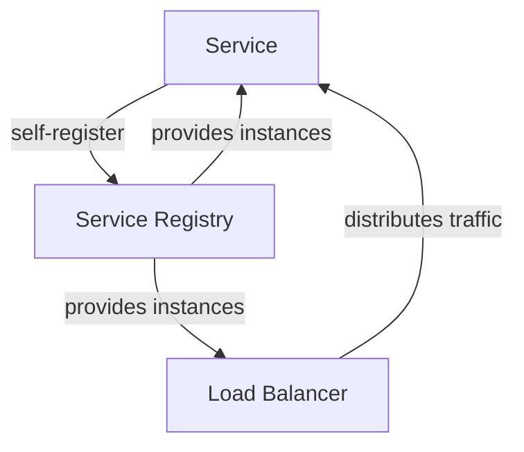

## 3rd Party Registration

### Definition
3rd Party Registration is a pattern where a third-party service registers itself with a service registry.

### Intent
To enable service instances to register themselves with a central service registry, making them available to be discovered by other services.

### Also Known As
- Service Registry Registration
- Self-Registration

### Detailed Definition and Explanations
In microservices architecture, each service instance must be discoverable by other services. This enables interservice communication and collaboration. The 3rd Party Registration pattern allows a service to register its existence, network location, and other metadata with a service registry like Consul, Zookeeper, or Eureka.

### Key Features
- **Automated registration:** Services register automatically upon initialization.
- **Decentralization:** Service instances handle their own registration and removal.
- **Health checks:** Ensure that only healthy instances appear in the registry.

### Code Example

#### Spring Boot Setup with Eureka
```java
// pom.xml Dependencies
<dependency>
    <groupId>org.springframework.cloud</groupId>
    <artifactId>spring-cloud-starter-netflix-eureka-client</artifactId>
</dependency>

// Application class
@SpringBootApplication
@EnableEurekaClient
public class Application {
    public static void main(String[] args) {
        SpringApplication.run(Application.class, args);
    }
}

// application.yml configuration
eureka:
  client:
    register-with-eureka: true
    fetch-registry: true
  instance:
    hostname: ${HOSTNAME}
```

### Example Class Diagram


### Explanation
The `ServiceInstance` class has a `register()` method to register itself with the `ServiceRegistry` which holds a map of all registered service instances.

### Benefits
- **Decentralized management:** Empowers services to manage their own presence in the registry.
- **Dynamic scaling:** Automatically accommodate new instances without manual intervention.

### Trade-Offs
- **Complexity:** Additional setup for initial registration logic in services.
- **Dependency:** Service registry becomes a single point of failure if not managed properly.

### When to Use
- When services need to be dynamically discovered by other services.
- In environments where services can scale dynamically, like Kubernetes or cloud platforms.

### Example Use Cases
- Microservices infrastructures where services need to discover each other.
- Scenarios requiring automated and scalable service management.

### When Not to Use and Anti-Patterns
- Do not use if services will never need dynamic discovery or if they have static endpoints.
- Antipattern: Static lists of service endpoints hardcoded into service configurations.

### Related Design Patterns
- **Service Discovery:** How clients discover network locations of registered services.
- **Self-Registration:** Where service instances self-register with the registry.

## Service Discovery

### Definition
Service Discovery is a pattern that allows clients to find the network location of service instances dynamically.

### Intent
To enable clients to locate service instances by querying a service registry, facilitating smooth interservice communication.

### Also Known As
- Service Lookup
- Dynamic Service Resolution

### Detailed Definition and Explanations
As the number of service instances changes due to scaling, updates, or failures, clients need a reliable way to find the active instances. Service Discovery allows them to query a service registry, ensuring they always have the current network location of available services.

### Key Features
- **Dynamic resolution:** Clients can find the current network location of a service instance.
- **Load balancing:** Integrates with client-side load-balancing mechanisms to distribute loads.

### Code Example

#### Spring Boot Client with Eureka
```java
// pom.xml Dependencies
<dependency>
    <groupId>org.springframework.cloud</groupId>
    <artifactId>spring-cloud-starter-netflix-eureka-client</artifactId>
</dependency>

// Application class
@SpringBootApplication
@EnableEurekaClient
public class ClientApplication {
    public static void main(String[] args) {
        SpringApplication.run(ClientApplication.class, args);
    }
}

// Rest Client Example
@RestController
@RequestMapping("/client")
public class ClientController {
    @Autowired
    private RestTemplate restTemplate;
    
    @GetMapping("/callService")
    public String callService() {
        return restTemplate.getForObject("http://SERVICE-NAME/endpoint", String.class);
    }
}

// Configuration file
@Bean
@LoadBalanced
public RestTemplate restTemplate() {
    return new RestTemplate();
}
```

### Example Sequence Diagram


### Explanation
The diagram above shows the client querying the service registry to get a service's network address and then calling the service instance directly.

### Benefits
- **Flexibility:** Supports dynamic environment changes without reconfiguring clients.
- **Scalability:** More resilient to scale and changes in the services landscape.

### Trade-Offs
- **Registry dependency:** Consistent network performance relies on the availability and performance of the service registry.
- **Increased latency:** Extra step of querying the registry can introduce slight delays.

### When to Use
- For RPC-based service calls where service instances change dynamically.
- In environments requiring auto-scaling and robust service communication.

### Example Use Cases
- Discovery of microservices by clients in a cloud platform.
- Scenarios requiring dynamic coloring of services for deployment strategies.

### When Not to Use and Anti-Patterns
- In monolithic applications where all services are co-located.
- Antipattern: Directly hardcoding the URIs of services in clients.

### Related Design Patterns
- **3rd Party Registration:** Ensures services are available in the registry to be discovered.
- **API Gateway:** Routes and load balances requests among instances using service discovery.

## Grouping Patterns Solving Service Discovery


### Description
Grouping related patterns such as 3rd Party Registration and Service Discovery resolve issues of service availability and interservice communication in a microservices architecture. Service instances register themselves, and clients perform service discovery efficiently using a robust load balancing mechanism.

### Books for Further Reading
- [Microservices Patterns: With examples in Java](https://amzn.to/4cSXzYV) by Chris Richardson
- "Spring Microservices in Action" by John Carnell
- [Designing Data-Intensive Applications](https://amzn.to/4cuX2Na) by Martin Kleppmann

### References and Credits
- Spring Cloud documentation
- Netflix OSS documentation
- Consul.io
- Apache Zookeeper documentation

---

This text should serve as a comprehensive overview of the 3rd Party Registration and Service Discovery patterns in microservices, especially focusing on Java, Spring Boot, and Spring Cloud. For further exploration, consult the suggested books and documentation.
