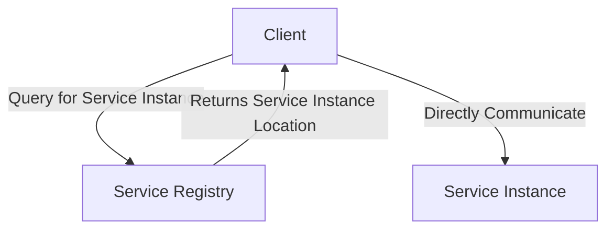
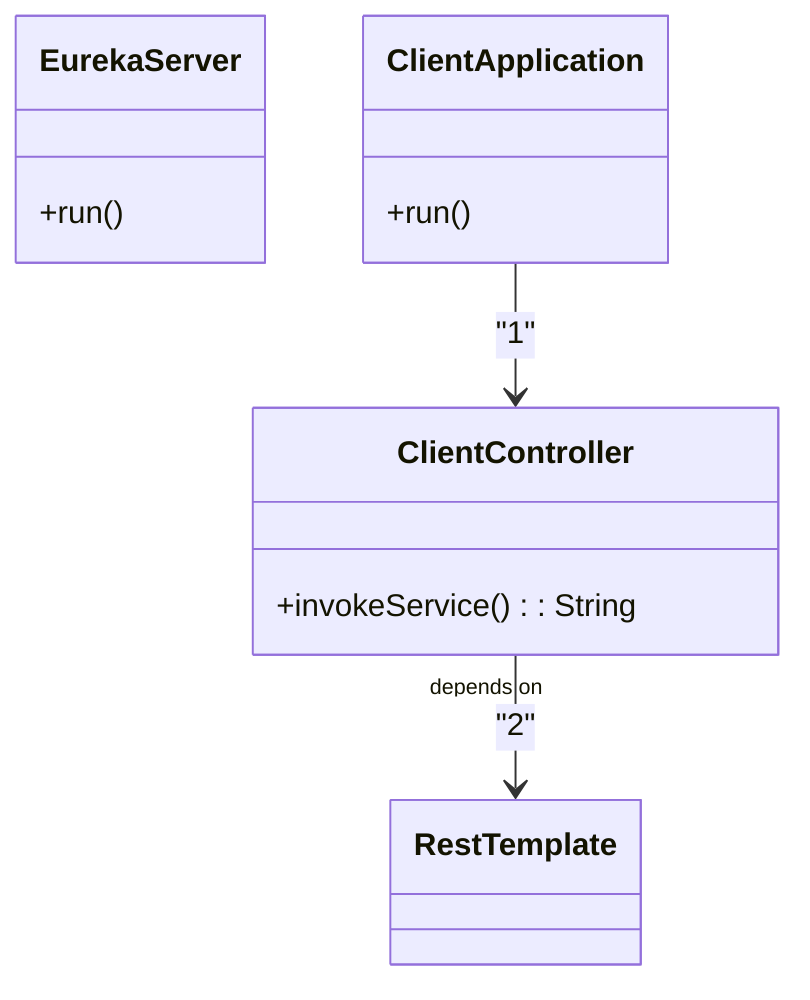
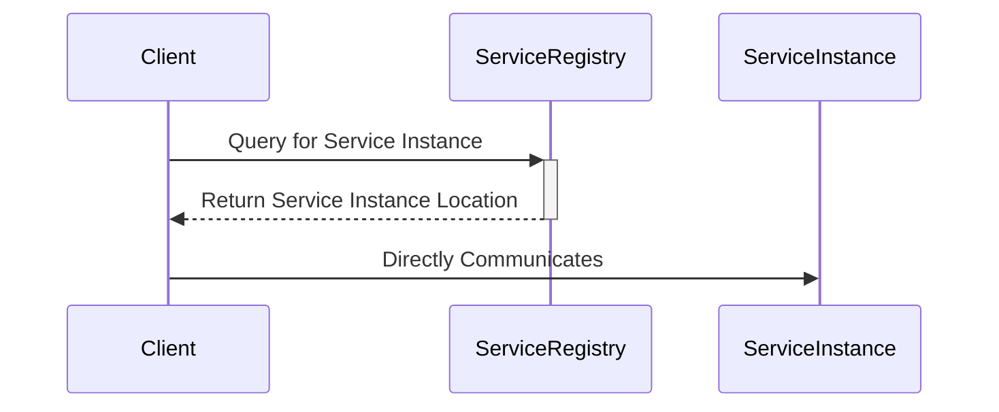
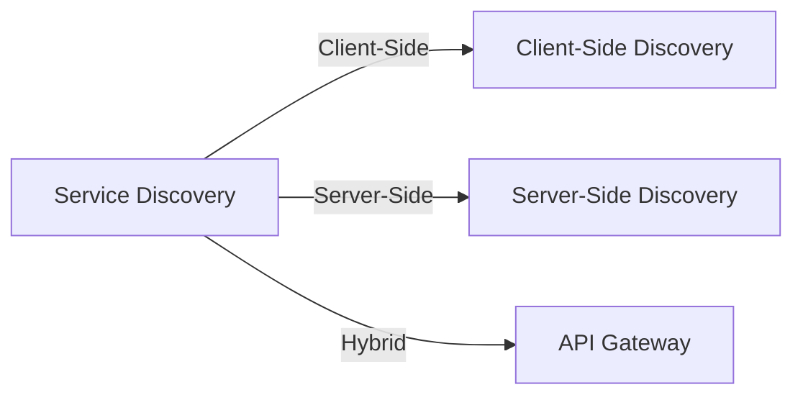

## Definition
The Client-Side Discovery pattern addresses how a client locates the network address of a service instance. Instead of hard-coding the location of service instances, the client queries a service registry to discover their locations dynamically.

## Intent
To allow clients to discover and communicate with instances of a service dynamically at runtime, enabling robustness and flexibility in microservice architectures.

## Also Known As
- Service Discovery
- Dynamic Service Location

## Detailed Explanation

In the context of microservices, it's critical for clients to dynamically discover service instances rather than rely on static configurations, due to the dynamic and often ephemeral nature of service instances in microservice deployments.

When using the Client-Side Discovery pattern, the client queries a service registry, which holds the network locations (e.g., IP and port) of service instances. The client uses this information to communicate directly with the selected service instance.




### Key Features
- **Dynamic Service Location**: Clients query live data about service instances, avoiding stale or incorrect configuration.
- **Direct Communication with Services**: Clients directly contact the service instances.
- **Service Registry**: Centralized store for service instance locations. Examples include Eureka, Consul, and Zookeeper.

## Code Examples

### Example using Spring Cloud with Eureka

1. Setting up Eureka Server:
```java
@SpringBootApplication
@EnableEurekaServer
public class EurekaServerApplication {
    public static void main(String[] args) {
        SpringApplication.run(EurekaServerApplication.class, args);
    }
}
```

2. Configuring Client Application:
```java
@SpringBootApplication
@EnableDiscoveryClient
public class ClientApplication {
    public static void main(String[] args) {
        SpringApplication.run(ClientApplication.class, args);
    }
}

@RestController
public class ClientController {
    
    @Autowired
    private RestTemplate restTemplate;

    @GetMapping("/invoke-service")
    public String invokeService() {
        String serviceUrl = "http://SERVICE-NAME/endpoint"; // SERVICE-NAME is dynamically resolved by Eureka
        return restTemplate.getForObject(serviceUrl, String.class);
    }
}

@Configuration
public class Config {
    
    @Bean
    public RestTemplate restTemplate() {
        return new RestTemplate();
    }
}
```

## Class Diagram Explanation

Mermaid Class Diagram:


Explanation:
1. The `ClientApplication` calls the `ClientController`.
2. The `ClientController` uses `RestTemplate` to dynamically discover and communicate with service instances.

## Sequence Diagram Explanation

Mermaid Sequence Diagram:


Explanation:
1. The client queries the `ServiceRegistry` for the location of a `ServiceInstance`.
2. The `ServiceRegistry` returns the location of the `ServiceInstance` to the client.
3. The client then directly communicates with the `ServiceInstance`.

## Benefits
- **Dynamic Service Discovery**: Adaptability to changing environments and scaling without reconfiguration.
- **Direct Contact**: Reduced latency as clients directly communicate with service instances without intermediaries.
- **Resilience**: Enhanced fault tolerance due to the decentralized nature with no single point of failure.

## Trade-offs
- **Client Complexity**: Clients must handle service discovery logic.
- **Service Registry Dependency**: The client is tightly coupled with the service registry.
- **Registry Overhead**: Risk of creating a performance bottleneck or single point of failure.

## When to Use
- When service instances are frequently created, terminated, or moved.
- In dynamic and elastic environments, like cloud-native applications.
- When you need clients to have reduced latency and direct communication with services.

## Example Use Cases
- An e-commerce application with multiple microservices for user management, catalog, orders, etc.
- Microservices-based Payment Gateway where various payment services can be added or removed dynamically.

## When Not to Use and Anti-Patterns
- **Static Microservices**: When the microservice architecture does not frequently change or scale.
- **Complex Clients**: Situations where adding service discovery logic complicates client applications unnecessarily.

## Related Design Patterns

### Server-Side Discovery
Unlike client-side discovery, here, service instances inform the registry of their existence, and clients query a server-sided dispatcher (or load balancer) instead of querying the service registry directly.

### Circuit Breaker
Used along with Service Discovery for fault tolerance to improve the resilience of communication between client and service.

### API Gateway
Works well with service discovery to aid routing requests from clients to appropriate services.

## References and Credits
- *Microservices Patterns* by Chris Richardson
- Spring Cloud documentation
- Netflix OSS documentation

## Open Source Frameworks and Third-Party Tools
- Eureka (Netflix)
- Consul (HashiCorp)
- Apache Zookeeper

## Cloud Computing Services
- AWS Service Discovery
- Azure Service Fabric
- Google Cloud Endpoints

## Suggested Books for Further Study
- *Building Microservices* by Sam Newman
- [Designing Data-Intensive Applications](https://amzn.to/4cuX2Na) by Martin Kleppmann

## Patterns Group

Mermaid Patterns Group Diagram:


Explanation:
- Service Discovery can be broken down into three main approaches: Client-Side Discovery, Server-Side Discovery, and Hybrid approaches like API Gateway solutions.
- **Client-Side Discovery** focuses on clients querying the registry.
- **Server-Side Discovery** involves an intermediary orchestrator or load balancer.
- **API Gateway**, often used for its proxy capabilities, combines advantages of both approaches.

By understanding and effectively utilizing these patterns, you can solve common challenges related to service discovery in microservices architectures.

