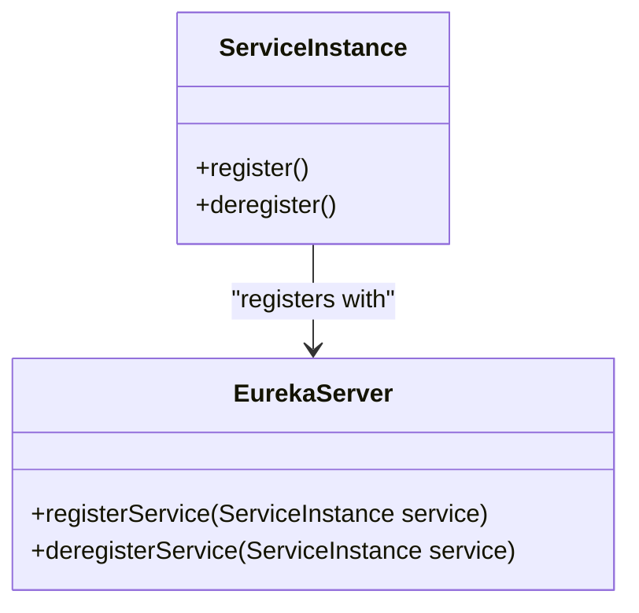
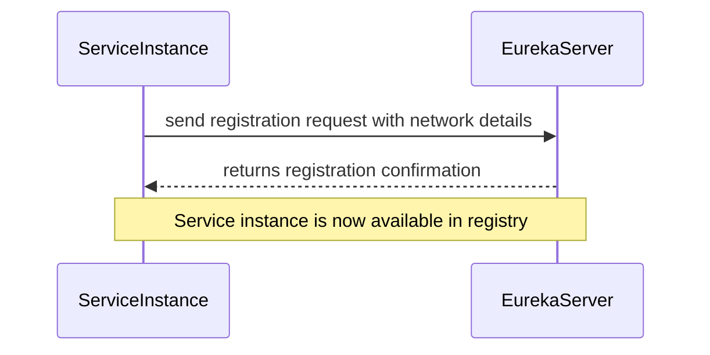
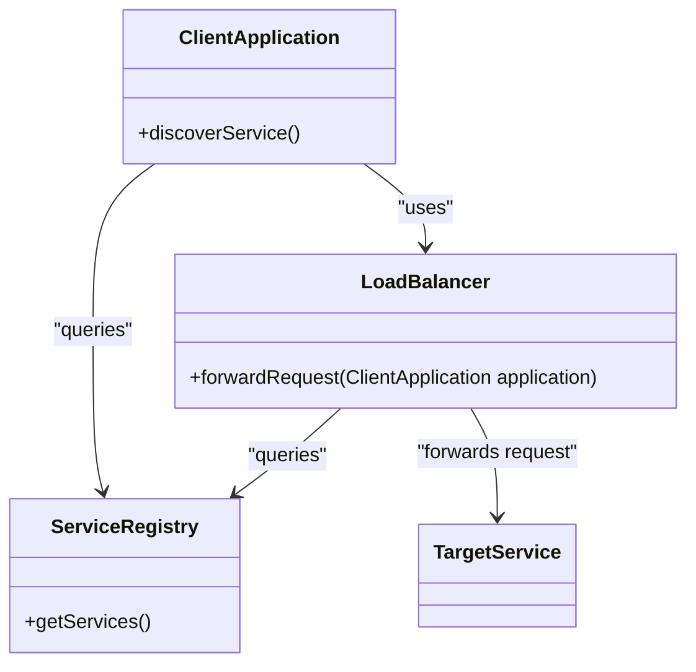
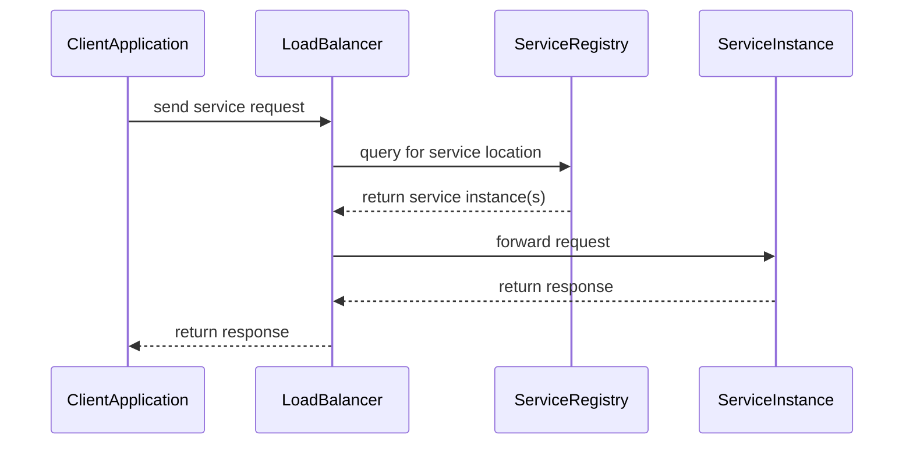
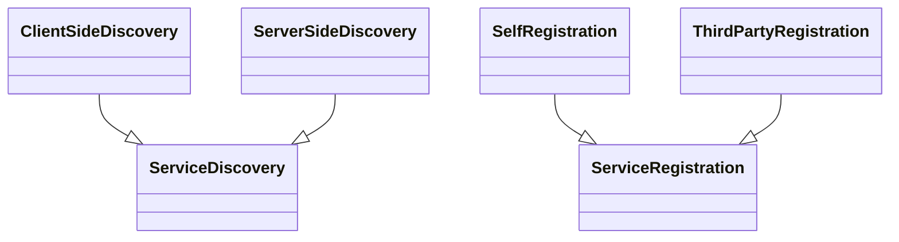

## Self Registration and Service Discovery Patterns

### Self Registration

**Definition:** In the Self Registration pattern, a service instance registers itself with the service registry upon startup and deregisters itself upon shutdown.

**Intent:** The pattern aims to dynamically track active service instances and facilitate service discovery in a microservices architecture.

**Also Known As:** Dynamic Service Registry

**Detailed Explanation:**
In a microservices architecture, services often need to discover each other dynamically. By using a service registry that keeps track of all available services, we can solve this problem. The service instance registers itself with the service registry, providing its network location, such as its hostname and port.

#### Key Features:
- Simplifies service management
- Facilitates dynamic scaling
- Reduces administrative overhead

#### Example in Java using Spring Boot and Spring Cloud

```java
// Dependencies: spring-cloud-starter-netflix-eureka-server and spring-cloud-starter-netflix-eureka-client

// Eureka Server - Application.java
@SpringBootApplication
@EnableEurekaServer
public class EurekaServerApplication {
    public static void main(String[] args) {
        SpringApplication.run(EurekaServerApplication.class, args);
    }
}

// Eureka Client - BookServiceApplication.java
@SpringBootApplication
@EnableEurekaClient
public class BookServiceApplication {
    public static void main(String[] args) {
        SpringApplication.run(BookServiceApplication.class, args);
    }
}

// application.properties (Client)
eureka.client.service-url.default-zone=http://localhost:8761/eureka/
```

#### Class Diagram



#### Sequence Diagram



#### Benefits:
- High availability and fault tolerance
- Simplified service configuration and deployment

#### Trade-offs:
- Requires a reliable service registry
- Potential single point of failure unless registry is also fault-tolerant

#### When to Use:
- When it is essential to handle dynamic scaling and failover
- In distributed systems where services must discover each other

#### Example Use Cases:
- Ecommerce platforms that have services like inventory, orders, and payments
- Distributed data processing systems

#### When Not to Use:
- When the overhead of maintaining a service registry is not justified
- In monolithic systems or small applications

#### Anti-patterns:
- Static configuration of services which reduces flexibility
- Hardcoding service addresses

### Service Discovery

**Definition:** The Service Discovery pattern enables clients to find the network location of a service instance dynamically instead of hardcoding URLs.

**Intent:** To decouple the client from the service locations, allowing services to move or scale dynamically without breaking the client.

**Also Known As:** Dynamic Service Location

**Detailed Explanation:**
Service Discovery can be implemented in two main ways: client-side discovery and server-side discovery. With client-side discovery, the client queries the service registry directly to obtain network locations and choose a service instance to send requests. Alternatively, in server-side discovery, the client sends requests to a load balancer or application gateway which queries the service registry and forwards requests to the appropriate service instance.

#### Key Features:
- Enhanced resilience and scalability
- Flexible service deployment

#### Example in Java using Spring Boot and Spring Cloud

```java
// Dependencies: same as above

// RestTemplate Configuration with Service Discovery - ApplicationConfig.java
@Configuration
public class ApplicationConfig {

    @Bean
    @LoadBalanced
    public RestTemplate restTemplate() {
        return new RestTemplate();
    }
}

// Using the RestTemplate to call service by logical name
@RestController
public class BookController {

    @Autowired
    private RestTemplate restTemplate;

    @GetMapping("/books")
    public String getBooks() {
        return restTemplate.getForObject("http://book-service/books", String.class);
    }
}
```

#### Class Diagram



#### Sequence Diagram



#### Benefits:
- Better scalability and resilience
- Simplified client configuration

#### Trade-offs:
- Added complexity with service registry
- Potential delay due to service lookup

#### When to Use:
- In distributed systems with multiple instances of services
- When the location of services can change due to scaling or failover

#### Example Use Cases:
- Continuous integration/continuous deployment (CI/CD) pipelines
- Multi-tier web applications with many backend services

#### When Not to Use:
- In monolithic applications where services are in a single deployment
- When static service URLs suffice

#### Anti-patterns:
- Ignoring the health of instances when discovering services
- Not caching service discovery results leading to performance issues

### Related Patterns

#### Group Diagram



#### Descriptions and Comparisons:

- **Client-Side Discovery:** Clients directly query the service registry for available instances. Suitable for environments where the client can handle variations in service instances.
- **Server-Side Discovery:** Clients send requests to a load balancer that queries the service registry. Ideal for hiding service registry details from clients and offloading service instance selection.
- **Self Registration:** Services register themselves with the service registry. Simplifies configuration but requires lifecycle management.
- **Third Party Registration:** A separate service handles registration and deregistration of services. Good for environments where services cannot manage their own lifecycle.

### References and Credits

- "Microservices Patterns" by Chris Richardson
- Spring Framework Documentation
- Netflix Eureka Documentation
- Open Source Frameworks: Spring Boot, Spring Cloud

### Further Reading

- Richardson, Chris. "Microservices Patterns: With examples in Java." Manning Publications, 2018.
- Fowler, Martin. "Patterns of Enterprise Application Architecture." Addison-Wesley, 2002.

### Open Source Frameworks and Tools

- **Spring Cloud:** Provides tools for developers to quickly build cloud-native apps.
- **Netflix Eureka:** A REST-based service registry for resilient mid-tier load balancing and failover.
- **Consul:** A service mesh solution providing service discovery, configuration, and segmentation functionality.

### Cloud Computing

- **SaaS:** Utilizing cloud services for handling and automating various aspects such as lifecycle of microservices.
- **PaaS:** Leveraging platform services for deploying and managing services more efficiently, such as AWS Elastic Beanstalk.
- **IaaS:** Infrastructure services that provide the raw compute, storage, and network resources to support service deployments.

By following these structured patterns and employing the correct tools and frameworks, you can create a resilient and scalable microservices architecture that is well-suited for modern cloud-native applications.
