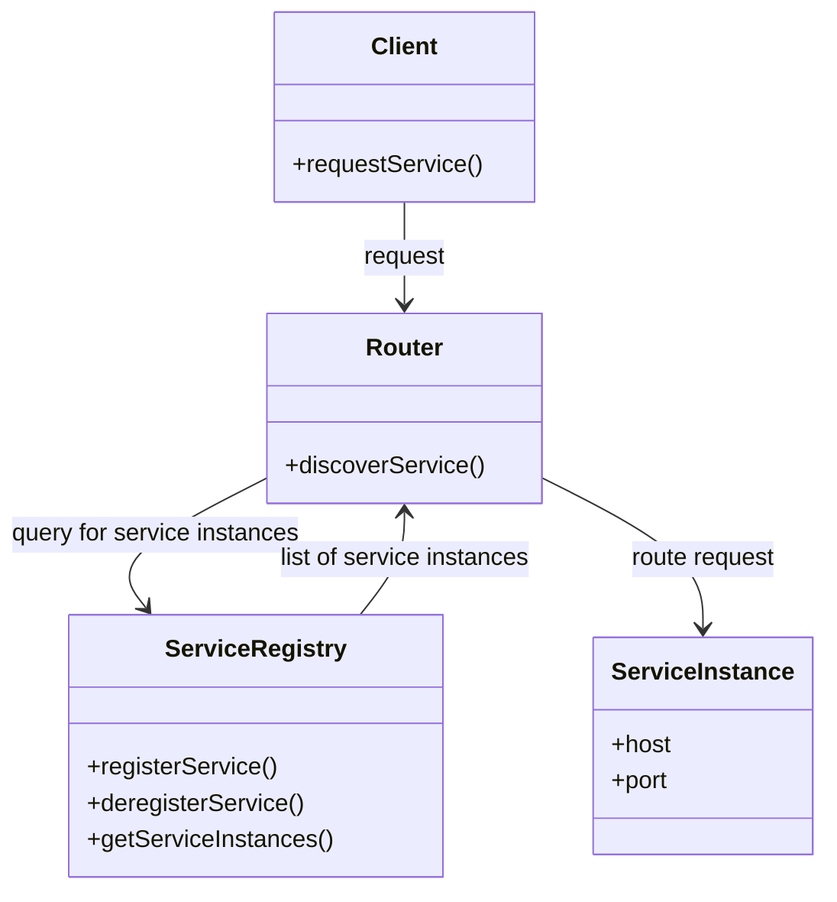
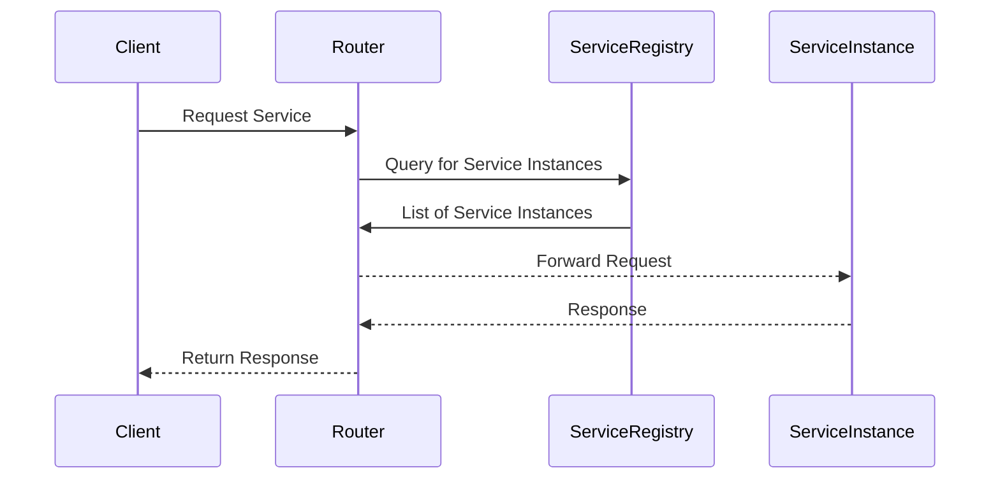

## Definition

Server-Side Discovery is a design pattern where the responsibility of discovering the network location of service instances is offloaded from the client to a server, often referred to as the router or service registry. This pattern helps in efficiently managing and locating microservice instances in a distributed architecture.

## Intent

The intent behind Server-Side Discovery is to centralize the service discovery process, thus simplifying client configurations and improving load balancing and fault tolerance by leveraging a service registry. 

## Also Known As

- Service Lookup
- Router-Based Discovery

## Detailed Definition and Explanation

Server-Side Discovery involves a dedicated server (router) querying a service registry (a database of service instances) to determine the address of the microservices. The router acts as an intermediary, directing client requests to one of the service instances registered in the service registry. 

### Key Features

- Centralized service discovery.
- Simplifies client configuration.
- Supports dynamic scaling and service management.
- Often works in conjunction with load balancers.

### Class Diagram Example

### Explanation

- **Client**: Makes a request to the router for a specific service.
- **Router**: Consults the service registry to discover the location of the requested service.
- **Service Registry**: Maintains a list of available service instances.
- **Service Instance**: Instances of the service that the client wants to interact with.

### Sequence Diagram Example

### Explanation

1. The **Client** sends a request to the **Router**.
2. The **Router** queries the **Service Registry** for available service instances.
3. The **Service Registry** returns a list of service instances.
4. The **Router** forwards the client request to one of the available **Service Instances**.
5. The **Service Instance** processes the request and sends back a response to the **Router**.
6. The **Router** returns the response to the **Client**.

## Benefits

- **Simplicity**: Offloads the discovery logic from clients.
- **Centralized Configuration**: Changes in service instances are handled centrally.
- **Dynamic Scalability**: Easily scales by adding/removing service instances dynamically.
- **Load Balancing**: Improves load distribution among service instances.

## Trade-Offs

- **Single Point of Failure**: Since the router and service registry are critical components, they can become a single point of failure if not managed correctly.
- **Latency**: Additional network hops can introduce latency.
- **Complexity**: Introduces an additional layer of complexity in the architecture.

## When to Use

- When dynamic discovery of service instances is needed.
- Environments with frequently changing service endpoints.
- Requirement for centralized configuration and management.

## Example Use Cases

- Large-scale distributed systems.
- Cloud-native applications with dynamic scalability.
- Microservices-based architectures requiring efficient service discovery.

## When Not to Use and Anti-Patterns

- Simple systems with static and few service instances.
- Direct client-to-service interaction is feasible and load is manageable.

## Related Design Patterns

- **Client-Side Discovery**: Clients are responsible for querying the service registry and selecting an appropriate service instance. 
  - **Comparison**: In contrast to Server-Side Discovery, Client-Side Discovery involves clients directly interacting with the service registry, making them aware of the network locations of services.

## References

- N/A

## Credits

- N/A

## Open Source Frameworks and Third-Party Tools

- **Spring Cloud Netflix**: Provides Server-Side Discovery implementation via Eureka.
- **Consul**: Service discovery and configuration tool.
- **Etcd**: A distributed key-value store that can be used for service discovery.

## Cloud Computing, SAAS, DAAS, PAAS

- **Kubernetes**: Orchestrates service discovery as part of its container management platform.
- **Amazon ECS/Fargate**: Provides built-in service discovery features.
  
## Further Studies

- [Microservices Patterns: With examples in Java](https://amzn.to/4cSXzYV) by Chris Richardson.
- [Building Microservices: Designing Fine-Grained Systems](https://amzn.to/3RYRz96) by Sam Newman.
- "Cloud Native Java" by Josh Long and Kenny Bastani.
