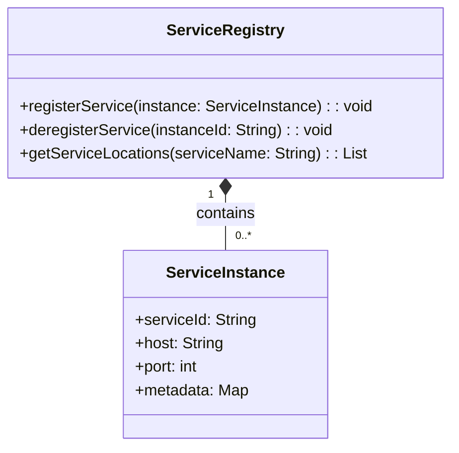
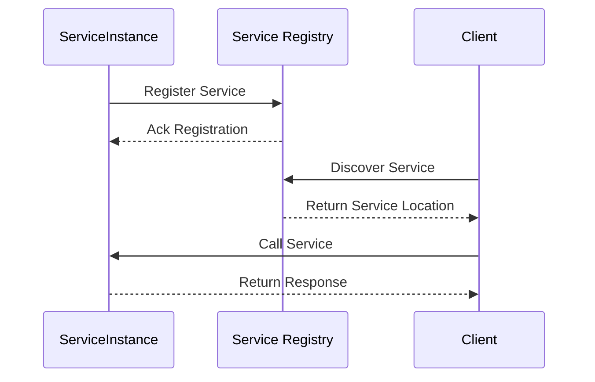

## Introduction
Service Registry and Service Discovery are core patterns in microservices architecture that help manage dynamic service instances and facilitate their communication. These patterns ensure that microservices can dynamically discover the network location of other microservices, promoting flexibility and scalability.

### Service Registry

**Definition**
A Service Registry is a database of service instance locations. It maintains a list of available services by storing their network locations and other metainformation.

**Intent**
The purpose of a Service Registry is to provide a central place for service instances to register their network locations, and for clients to discover the locations of these service instances.

**Key Features**
- **Centralized Metadata Storage:** Central repository for storing service instances.
- **Health Monitoring:** Fixtures to keep track of the health status of registered services.
- **Dynamic Updates:** Real-time updates of service instances.

Let's understand the flow with a **Class and Sequence Diagrams**.

**Class Diagram of Service Registry**


Here, `ServiceRegistry` stores multiple instances of `ServiceInstance`.

**Service Registry Class Example in Java:**

```java
public class ServiceRegistry {

    private Map<String, List<ServiceInstance>> registry = new ConcurrentHashMap<>();

    public void registerService(ServiceInstance instance) {
        registry.computeIfAbsent(instance.getServiceId(), k -> new ArrayList<>()).add(instance);
    }

    public void deregisterService(String instanceId) {
        registry.values().forEach(instances -> instances.removeIf(instance -> instance.getServiceId().equals(instanceId)));
    }

    public List<ServiceInstance> getServiceLocations(String serviceName) {
        return registry.getOrDefault(serviceName, Collections.emptyList());
    }
}

public class ServiceInstance {
    private final String serviceId;
    private final String host;
    private final int port;
    private final Map<String, String> metadata;

    // Constructor, Getters, Setters
}
```

**Sequence Diagram for Service Registration and Discovery**



### Service Discovery

**Definition**
Service Discovery is the process through which a client of a microservice dynamically determines the network location of instances of other services.

**Intent**
To enable service-based applications to dynamically query the location and instances of other microservices, ensuring continuous and fault-tolerant operations.

**Key Features**
- **Dynamic Retrieval:** Real-time dynamic retrieval of service instances.
- **Fault Tolerance:** Built-in mechanisms to handle changes in the availability of services.
- **Load Balancing:** Distribute requests effectively across multiple service instances.

**Example Scenario**
Here, implemented using `Eureka` from Spring Cloud:

**Java Code Example for Eureka Client Configuration:**

1. **Service Registry Configuration in `pom.xml`**

```xml
<dependency>
    <groupId>org.springframework.cloud</groupId>
    <artifactId>spring-cloud-starter-netflix-eureka-server</artifactId>
</dependency>
```

2. **Eureka Server Main Class:**

```java
@EnableEurekaServer
@SpringBootApplication
public class EurekaServerApplication {
    public static void main(String[] args) {
        SpringApplication.run(EurekaServerApplication.class, args);
    }
}
```

3. **Service Registration Client in `application.yml`**

```yaml
spring:
  application:
    name: service-client

eureka:
  client:
    serviceUrl:
      defaultZone: http://localhost:8761/eureka/
  instance:
    instance-id: ${spring.application.name}:${spring.application.instance_id:${random.value}}
    hostname: localhost
```
Deployed services use Eureka clients to register themselves.

**Benefits**
- **Easy Scalability**: Dynamic management of service instances.
- **Fault Tolerance**: Handle availability and failures effectively.
- **Flexible Routing**: Supports routing strategies for shown service depths.

**Trade-offs**
- **Complexity**: Additional complexity in managing and configuring registries.
- **Dependency on Network**: Further load and network calls might affect performance indirectly.

**When to use**
- **Dynamic Environments**: Where instances can scale in and out.
- **Microservices**: When microservices need to communicate dynamically.

**Example Use Cases**
- **Large-scale Microservices**: Ensuring that new instances are automatically discovered.

**When Not to Use**
- **Small Static Systems**: Too complex for small or static infrastructures.
- **Homogeneous Networking**: Direct, static addressing suffices.

**Anti-patterns**
- **Hard-coded URLs**: Avoid hard-coding URLs in client configuration.
- **No Health Check**: Failing to monitor and evict non-healthy services.

## Related Design Patterns
- **Load Balancer**: Manages traffic efficiently across instances.
- **Circuit Breaker**: Enables resilience through encapsulating service calls.

**Credits**

- **Open Source Frameworks**: Eureka, Consul, ZooKeeper
- **Third-Party Tools**: Netflix OSS, Spring Cloud
- **Cloud Platforms**: AWS, Azure, GCP

## References

1. Spring Cloud documentation
2. Netflix Eureka documentation
3. [Building Microservices: Designing Fine-Grained Systems](https://amzn.to/3RYRz96) by Sam Newman

## Further Reading
- "Microservices Patterns" by Chris Richardson
- [Designing Data-Intensive Applications](https://amzn.to/4cuX2Na) by Martin Kleppmann

