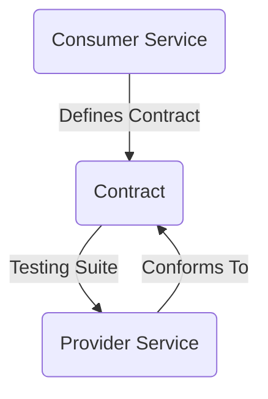
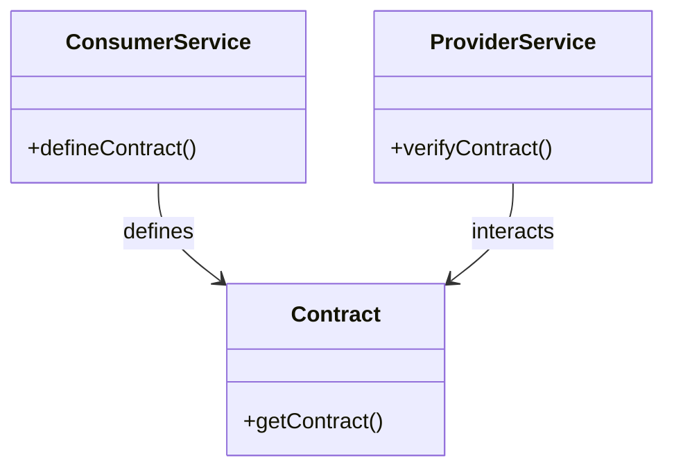
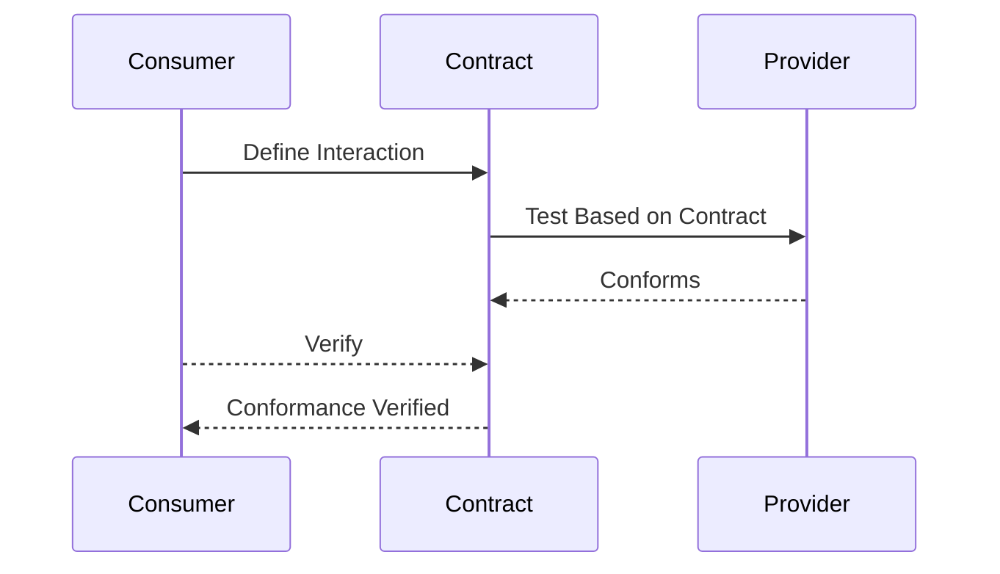

## Consumer-Driven Contract Test

### Definition
Consumer-Driven Contract Testing (CDCT) is an approach within microservice architecture where the consumer of a service dictates the expected behaviors and data structures that the service should satisfy. The consumer writes a test suite which defines the contract, and this contract is then used to test the provider service to ensure it meets expectations.

### Intent
To validate and ensure that both the service providers and its various consumers in a distributed system agree on the interaction and data-format contract, helping achieve consistent integration and reducing the risk of failures due to contract mismatches.

### Also Known As
- Contract Testing
- Pact Testing (named after Pact, a specific contract testing tool)

### Detailed Definition and Explanation
CDCT enables a clear agreement on APIs between the consumer and provider services by defining a contract. This contract outlines the requests and responses expected by the consumer, which the provider needs to fulfill. The contracts are usually defined in terms of HTTP interactions for RESTful services and validated using automated tests.

#### Diagram: Structure of Consumer-Driven Contract Testing

*Contracts act as an intermediary to define interactions between consumers and providers.*

### Key Features
- **Contract Specification:** Clearly defined expectations between services.
- **Automated Testing:** Tests can be automated and integrated into CI/CD pipelines.
- **Provider Verification:** Ensures the provider conforms to the defined contracts.
- **Change Feedback:** Immediate feedback if a contract is broken due to changes.

### Code Example
Here's an example illustrating contract testing using Pact in Spring Boot.

#### Consumer Service (Interaction Definition)
```java
public class ConsumerTest {
    @Rule
    public PactProviderRuleMk2 provider = new PactProviderRuleMk2("ProviderService", "localhost", 8080, this);

    @Pact(consumer = "ConsumerService")
    public RequestResponsePact createPact(PactDslWithProvider builder) {
        return builder
                .given("provider state")
                .uponReceiving("A request for something")
                .path("/api/something")
                .method("GET")
                .willRespondWith()
                .status(200)
                .body("{\"key\": \"value\"}")
                .toPact();
    }

    @Test
    @PactVerification("ProviderService")
    public void runTest() throws IOException {
        // Using a HTTP client to make request
        HttpResponse response = Request.Get("http://localhost:8080/api/something").execute().returnResponse();
        assertEquals(200, response.getStatusLine().getStatusCode());
    }
}
```

#### Provider Service (Verification)
```java
@WebMvcTest(SomeController.class)
public class ProviderTest {
    @Autowired
    private MockMvc mockMvc;

    @Test
    @PactVerification(fragment = "Pact between ProviderService and ConsumerService")
    public void runProviderTest() throws Exception {
        mockMvc.perform(get("/api/something"))
                .andExpect(status().isOk())
                .andExpect(content().json("{\"key\": \"value\"}"));
    }
}
```

### Example Class Diagram


### Sequence Diagram

*The sequence showcases the flow from contract definition to verification.*

### Benefits
- **Early Detection of Integration Issues:** Ensures potential contract mismatches are identified before deployment.
- **Improved Collaboration:** Establishes clear communication lines between provider and consumer teams.
- **Automated Testing:** Reduces manual testing efforts and integrates well with CI/CD.

### Trade-Offs
- **Initial Setup Complexity:** Requires effort to define and maintain contracts.
- **Potential Overhead:** Introducing a new layer of testing might slow down the development process initially.

### When to Use
- When you have multiple consumers for a service.
- In distributed systems where consistent integrations are crucial.
- For services that are updated frequently with potential breaking changes.

### Example Use Cases
- An e-commerce platform where different front-end clients consume a microservice for order processing.
- A financial system integrating various services with third-party payment gateways.

### When Not to Use and Anti-Patterns
- For simple applications with a few services where contract validation may not be necessary.
- Not using CDCT can lead to fragile integrations prone to frequent breaking changes and failures.

### Related Design Patterns
- **API Gateway:** Acts as an entry point for all clients, simplifying client-server interactions and enabling contract enforcement.
- **Service Mesh:** Adds a layer of infrastructure between services to handle communication responsibilities, complementing contract testing by enforcing interactions.

### References and Credits
- Pact website: [pact.io](https://pact.io/)
- Spring Cloud Contract: [spring.io/projects/spring-cloud-contract](https://spring.io/projects/spring-cloud-contract)

### Open Source Frameworks
- **Pact:** Provides tools to create and verify consumer-driven contracts.
- **Spring Cloud Contract:** Facilitates contract testing in the Spring ecosystem.

### Third-Party Tools
- Pact Broker for managing and sharing consumer-driven contracts.

### Cloud Computing
- **SaaS:** Used for managing contractual integrations in cloud-based services.
- **PaaS:** Helpful for enforcing contracts in platform ecosystems.

### Suggested Books for Further Studies
- [Building Microservices: Designing Fine-Grained Systems](https://amzn.to/3RYRz96) by Sam Newman
- "Microservice Architecture" by Irina Guberman

By integrating CDCT in your microservices architecture, you ensure reliability and consistency, leading to more resilient and manageable distributed systems.

This provides a comprehensive entry for the Consumer-Driven Contract Test pattern suit from definition, code examples, to when to use it, ensuring a good understanding and seamless implementation.
