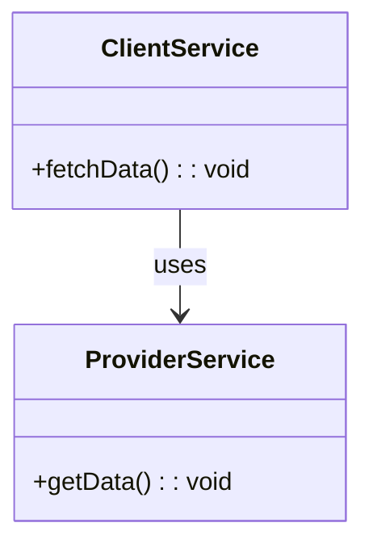
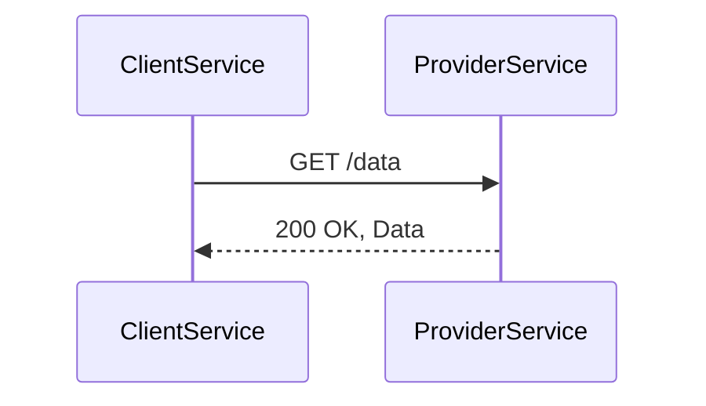

## Definition
Consumer-Side Contract Testing is a type of testing in microservices architecture where a contract (an interface or set of expectations) is verified to ensure that the consumer (service client) can communicate efficiently with the provider (service).

## Intent
The primary intent of Consumer-Side Contract Testing is to make sure that the client service can correctly and reliably interact with the provider service, reducing the risk of integration issues.

## Also Known As
- Consumer-Driven Contracts
- Consumer Contract Testing

## Detailed Definitions and Explanations

### Key Features
1. **Consumer-Driven**: These tests are driven by the consumer service’s expectations.
2. **Contract Verification**: Ensures that the provider service adheres to the contract agreed upon with the consumer.
3. **Decoupling**: Reduces integration issues by clearly defining and verifying expectations.
4. **Automation**: Often a part of CI/CD pipelines to verify communication consistency.

### Benefits
- **Reliability**: Guarantees that the consumer can always communicate with the provider.
- **Decoupled Services**: Minimizes dependencies and integration issues.
- **Early Detection**: Identifies mismatches in contracts early in the development cycle.
- **Automation Friendly**: Easily integrates into automated pipelines.

### Trade-Offs
- **Maintenance**: Contracts need to be maintained as services evolve.
- **Initial Setup**: Requires setting up and understanding of contract definitions.
- **Coordination**: Requires good communication between teams to agree on and evolve contracts.

### Example Use Cases
- Ensuring a frontend service can interact with a backend API.
- Testing communication between microservices in a distributed system.
- Automating integration tests in a CI/CD pipeline.

## Example Code

### `build.gradle` Dependencies
```groovy
dependencies {
    testCompile('org.springframework.cloud:spring-cloud-starter-contract-verifier')
    testCompile('org.springframework.boot:spring-boot-starter-test')
}
```

### Contract Definition in JUnit using REST Assured
```java
@RunWith(SpringRunner.class)
@SpringBootTest(webEnvironment = SpringBootTest.WebEnvironment.MOCK)
@AutoConfigureMockMvc
@AutoConfigureRestDocs(outputDir = "target/snippets")
public class ConsumerSideContractTest {

    @Autowired
    private MockMvc mockMvc;

    @Test
    public void shouldReturnAllProducts() throws Exception {
        mockMvc.perform(get("/products"))
               .andExpect(status().isOk())
               .andExpect(content().contentType(MediaType.APPLICATION_JSON_UTF8))
               .andExpect(jsonPath("$[0].name", is("Product A")));
    }
}
```

### Example Class Diagrams with Explanation
Mermaid class diagrams depict the relationships between services, focusing on the consumer and provider.



**Explanation**: The `ClientService` is dependent on `ProviderService` and uses its `getData` method. This dependency points out where contract testing would be crucial to ensure proper communication.

### Example Sequence Diagrams with Explanation


**Explanation**: This sequence diagram shows the interaction between `ClientService` and `ProviderService`. The client's request (GET /data) and the server's response (200 OK, with data) must adhere to their agreed contract.

### When to Use
- When developing microservices where services constantly communicate.
- In teams with separate responsibilities for developing consumer and provider services.
- To include in automation pipelines to catch integration issues early.

### When Not to Use and Anti-Patterns
- For monolithic applications where integration points are fewer and more controlled.
- When service dependencies are short-lived or rarely change.
- Avoid over-engineering contracts that are too strict and hinder service evolution.

### Related Design Patterns with Descriptions and Comparisons
- **Provider-Side Contract Tests**: Checks the provider’s services but exerts a different focus on ensuring the provider behaves as per the agreed contract.
- **End-to-End Testing**: This checks the full integration but tends to be broader, covering more than specific contract checks.
- **API Gateway Pattern**: Serves as an entry point, consolidating requests and responses which can benefit from consumer-side contract testing.

### References and Credits
Books and resources to further explore:
- [Building Microservices: Designing Fine-Grained Systems](https://amzn.to/3RYRz96) by Sam Newman.
- "Microservices Patterns" by Chris Richardson.
- Official [Spring Cloud Contract Documentation](https://spring.io/projects/spring-cloud-contract).

## Open Source Frameworks, Third Party Tools
- **Spring Cloud Contract**: Automates contract verification between microservices.
- **Pact**: Another popular contract testing tool, enabling consumer provider contract testing across different technologies.

## Cloud Computing Context (SaaS, PaaS, DaaS)
Contract testing ensures data consistency and service communication efficiency crucial in multi-tenant environments offered by SaaS or complex data integrations seen in DaaS and PaaS solutions.

---


