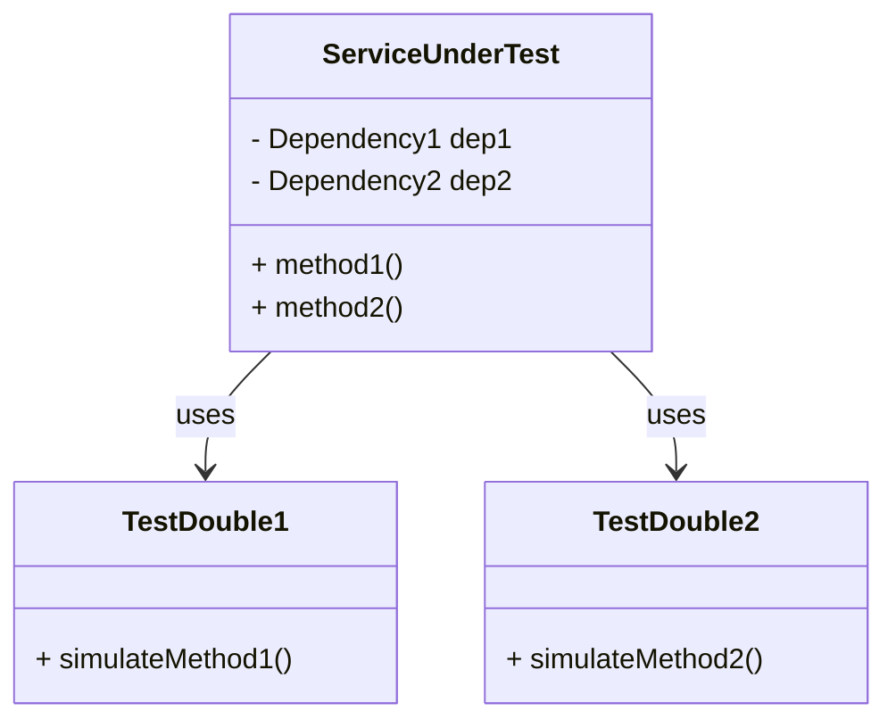
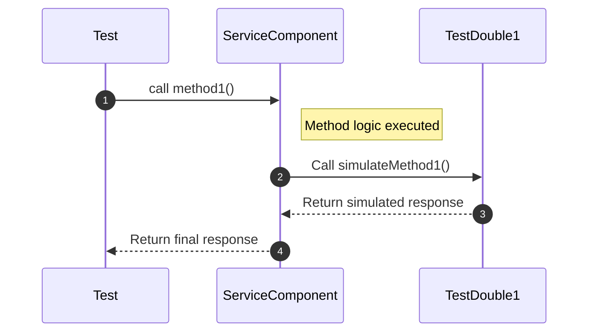
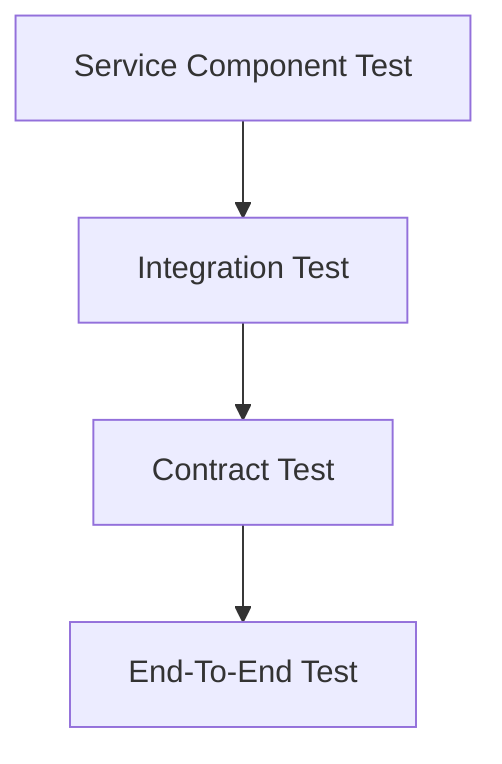

## Overview

### Definition

A **Service Component Test** is a test suite designed to test a service in isolation by using test doubles (mocks, stubs, or fakes) for any services it invokes. This pattern ensures that a microservice can be tested independently from its dependencies, providing a robust framework for catching issues at an early stage.

### Intent

The primary goal of the Service Component Test is to:
- Verify the logic of a single service.
- Ensure that the service behaves correctly under various conditions.
- Validate interactions with other services using test doubles to simulate real dependencies.

### Also Known As

- Isolation Testing
- Unit Integration Testing

---

## Detailed Definition and Explanation

The Service Component Test isolates the service under test from its real dependencies and tests its functionalities with controlled inputs and outputs from simulated dependencies. This approach provides a controlled environment, which helps in identifying bugs early and maintaining service quality.

### Key Features

- **Isolation**: Tests the service without involving real dependent services.
- **Controlled Environment**: Uses test doubles for dependencies, enabling precise control over test conditions.
- **Fast Feedback**: Provides quick feedback about the service's correctness and interaction with dependencies.
- **Catch Issues Early**: Identifies integration issues before they propagate to higher levels of testing.

### Diagrams

#### Example Class Diagram



In this diagram:
- `ServiceUnderTest` uses `TestDouble1` and `TestDouble2` as test doubles to imitate real dependencies `Dependency1` and `Dependency2`.

#### Example Sequence Diagram



---

## Code Examples

### Java Spring Boot Example

#### Service to Test

```java
@Service
public class BillingService {
    private final PaymentService paymentService;
    private final NotificationService notificationService;

    @Autowired
    public BillingService(PaymentService paymentService, NotificationService notificationService) {
        this.paymentService = paymentService;
        this.notificationService = notificationService;
    }

    public String processPayment(double amount) {
        boolean paymentResult = paymentService.processPayment(amount);
        if (paymentResult) {
            notificationService.sendNotification("Payment succeeded");
            return "Payment processed successfully";
        } else {
            notificationService.sendNotification("Payment failed");
            return "Payment failed";
        }
    }
}
```

#### Test with Test Doubles

```java
@RunWith(MockitoJUnitRunner.class)
public class BillingServiceTest {
    
    @Mock
    private PaymentService paymentService;

    @Mock
    private NotificationService notificationService;

    @InjectMocks
    private BillingService billingService;

    @Test
    public void testProcessPaymentSuccess() {
        when(paymentService.processPayment(100.0)).thenReturn(true);

        String result = billingService.processPayment(100.0);

        assertEquals("Payment processed successfully", result);
        verify(notificationService).sendNotification("Payment succeeded");
    }

    @Test
    public void testProcessPaymentFailure() {
        when(paymentService.processPayment(100.0)).thenReturn(false);

        String result = billingService.processPayment(100.0);

        assertEquals("Payment failed", result);
        verify(notificationService).sendNotification("Payment failed");
    }
}
```

---

## Benefits

- **Isolation**: Testing service logic independent of other services ensures a focused and thorough validation.
- **Speed**: Faster tests as they don't involve real dependencies which might be slower or unavailable.
- **Control**: Explicit control over test doubles simplifies the setup for different testing scenarios.
- **Early Bug Detection**: Identifies issues earlier in the development cycle.

## Trade-offs

- **Complex Setup**: Creating and managing test doubles can become complex, especially for services with many dependencies.
- **Limited Scope**: May not catch issues arising from interactions between real services.

## When to Use

- When you need to test the core logic of a service without involving external dependencies.
- When external services are not stable enough for integration testing.
- For rapid feedback during development.

## Example Use Cases

- Billing Systems: Isolating and testing the billing logic independent from payment gateways.
- Inventory Management: Testing inventory deduction logic without database or other dependent services.

## When Not to Use

- When you need to test the interactions and behavior with real services.
- For end-to-end functional tests where the full stack needs verification.

## Anti-patterns

- **Over-Mocking**: Creating excessively detailed and strict test doubles which might mask real issues.
- **Ignoring Tests**: Relying exclusively on dummy services; neglecting integration and end-to-end testing.

## Related Design Patterns

- **Mock Object**: Creating objects that simulate the behavior of real objects.
- **Integration Testing**: Testing combined parts of an application to evaluate their interaction.

## References and Credits

### Open Source Frameworks and Tools

- **Mockito**: A Java mock object framework.
- **JUnit**: A simple framework to write repeatable tests.
- **Spring Boot Test**: Utilities that simplify testing in Spring Boot Contexts.

### Cloud Computing and SAAS Resources

- **Spring Cloud**: Tools for building complex, resilient, and scalable cloud-native applications.

### Books for Further Studies

- "JUnit in Action" by Petar Tahchiev, Felipe Leme, Vincent Massol, and Gary Gregory.
- "Growing Object-Oriented Software, Guided by Tests" by Steve Freeman and Nat Pryce.
- [Effective Java](https://amzn.to/3ztRnbC) by Joshua Bloch.

## Organized Patterns

### Group: Microservices Testing Strategies



In this group:
- **Service Component Test** focuses on isolated functionality.
- **Integration Test** validates the integration between services.
- **Contract Test** ensures compliance with API contracts.
- **End-To-End Test** covers the workflow in a production-like environment.

---

By understanding and implementing Service Component Testing, you can maintain rigorous, fast-feedback cycles for your microservices, ensuring high reliability and performance in your system.
