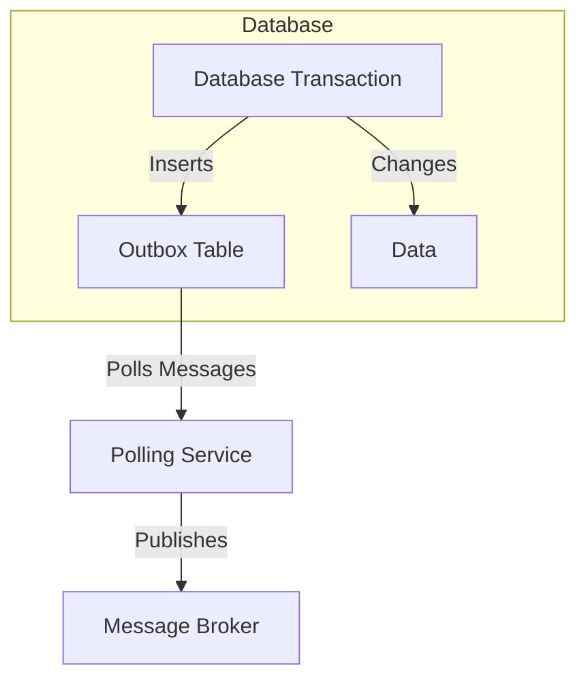
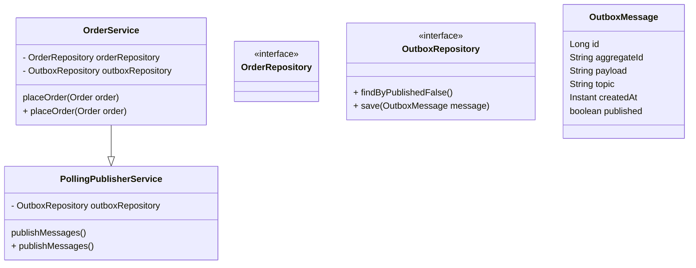
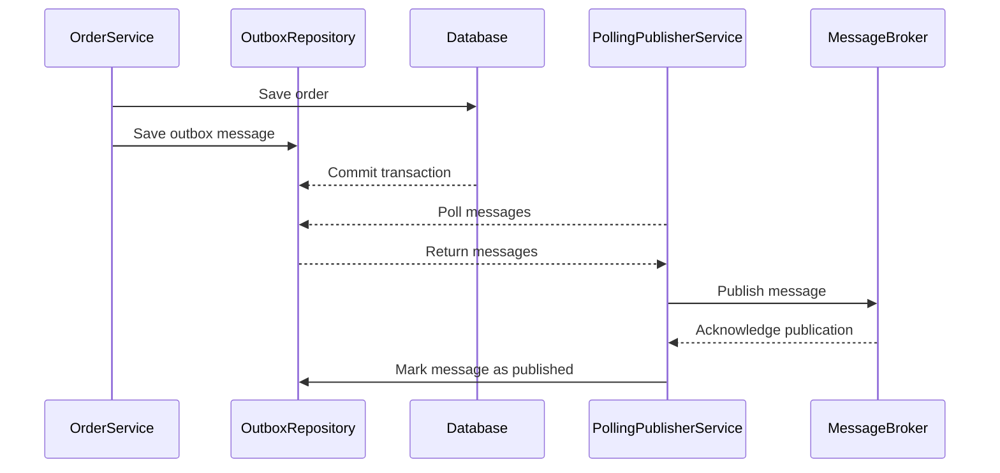

## Polling Publisher Pattern

### Definition
The Polling Publisher Pattern ensures that messages are published in coordination with a database transaction. The pattern aims to address the challenge of transactional messaging in a distributed system where message publishing needs to be atomic with the database transaction.

### Intent
To ensure data consistency and reliability by coordinating the message publishing process with the database transaction, ensuring that messages are published only if the transaction is successfully committed.

### Also Known As
- Transactional Messaging
- Outbox Pattern

### Detailed Definitions and Explanations

The Polling Publisher Pattern involves an auxiliary table (often called an Outbox) where messages to be published are initially stored as part of the database transaction. Once the transaction commits successfully, a separate polling process reads the messages from the outbox and publishes them to the message broker.




### Key Features
- **Atomicity**: Ensures that messages are published only if the database transaction is successful.
- **Idempotency**: Guarantees message publication without duplication.
- **Fault Tolerance**: Recovers and publishes messages in case of failure.

### Code Examples

#### Java Code using Spring Boot and Spring Cloud

Define a table for the Outbox and create an entity class:

```java
@Entity
public class OutboxMessage {
    @Id
    @GeneratedValue(strategy = GenerationType.IDENTITY)
    private Long id;
    private String aggregateId;
    private String payload;
    private String topic;
    private Instant createdAt;
}
```

Repository interface for the Outbox:

```java
public interface OutboxRepository extends JpaRepository<OutboxMessage, Long> {
    List<OutboxMessage> findByPublishedFalse();
}
```

An example of service method saving data and the outbox message atomically:

```java
@Service
public class OrderService {

    @Autowired
    private OrderRepository orderRepository;

    @Autowired
    private OutboxRepository outboxRepository;

    @Transactional
    public void placeOrder(Order order) {
        orderRepository.save(order);
        
        OutboxMessage outboxMessage = new OutboxMessage();
        outboxMessage.setAggregateId(order.getId().toString());
        outboxMessage.setPayload(createPayload(order));
        outboxMessage.setTopic("order.events");
        outboxMessage.setCreatedAt(Instant.now());
        
        outboxRepository.save(outboxMessage);
    }
    
    private String createPayload(Order order) {
        return new ObjectMapper().writeValueAsString(order);
    }
}
```

Polling publisher service:

```java
@Service
public class PollingPublisherService {

    @Autowired
    private OutboxRepository outboxRepository;

    @Transactional
    @Scheduled(fixedRateString = "${outbox.polling.rate}")
    public void publishMessages() {
        List<OutboxMessage> messages = outboxRepository.findByPublishedFalse();
        
        for (OutboxMessage msg : messages) {
            boolean published = publishMessage(msg);
            if (published) {
                msg.setPublished(true);
                outboxRepository.save(msg);
            }
        }
    }

    private boolean publishMessage(OutboxMessage msg) {
        try {
            // Code to publish to the message broker
            return true;
        } catch (Exception e) {
            // Handle exception
            return false;
        }
    }
}
```

### Example Class Diagram



### Example Sequence Diagram



### Benefits
- **Consistency**: Ensures messages are published only if the database changes are committed.
- **Reliability**: Decomposes the concerns of transactional processing and message publishing.
- **Scalability**: Easily scales out the polling publisher service.

### Trade-offs
- **Latency**: There's additional latency as messages are queued for publication.
- **Complexity**: Introduces additional complexity with the outbox table and polling mechanism.
- **Storage**: Requires extra storage for the outbox table.

### When to Use
- When you need to guarantee that messages are published only if the transaction commits.
- When dealing with distributed services where ensuring data consistency is crucial.

### Example Use Cases
- **Order Processing**: Ensure order events are published only after storing order details.
- **Inventory Management**: Synchronize inventory updates with a central system only on transaction success.

### When Not to Use and Anti-patterns
- If the overhead of maintaining a separate outbox table outweighs the benefits.
- For simple systems where transactional guarantees can be achieved by the underlying infrastructure or through simpler means (e.g., database triggers).

### Related Design Patterns
- **Event Sourcing**: Keeps a full history of changes in a system, useful for audit purposes.
- **Two-Phase Commit**: Another way to ensure transaction consistency across distributed systems but may be too heavyweight and complex.

### References and Credits
- Redknee Academy
- Chris Richardson's Microservices Patterns
- Martin Fowler's Blog on Outbox Pattern

### Open Source Frameworks and Third-Party Tools
- Debezium: Captures changes from database and publishes them.
- Kafka Connect: Provides connectors to stream changes.

### Cloud Computing, SAAS, DAAS, PAAS
Using managed services (e.g., AWS RDS, GCP Cloud Spanner) for databases and messaging services (e.g., AWS SNS, Kafka as a Service) further simplifies the implementation.

### Suggested Books for Further Studies
- [Designing Data-Intensive Applications](https://amzn.to/4cuX2Na) by Martin Kleppmann
- "Microservices Patterns" by Chris Richardson
- [Building Microservices: Designing Fine-Grained Systems](https://amzn.to/3RYRz96) by Sam Newman
