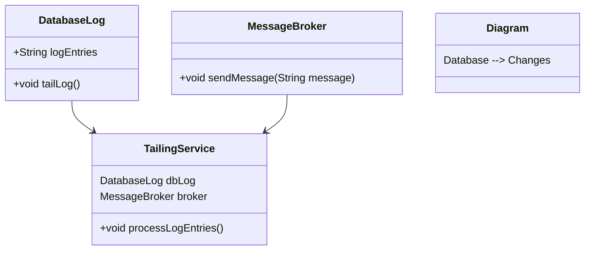
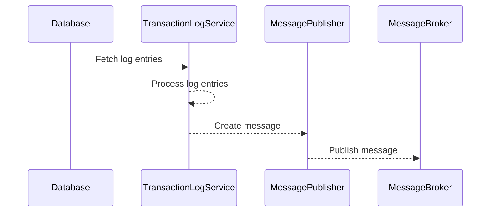
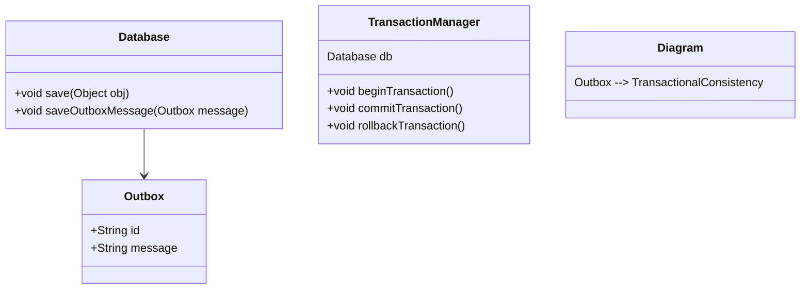
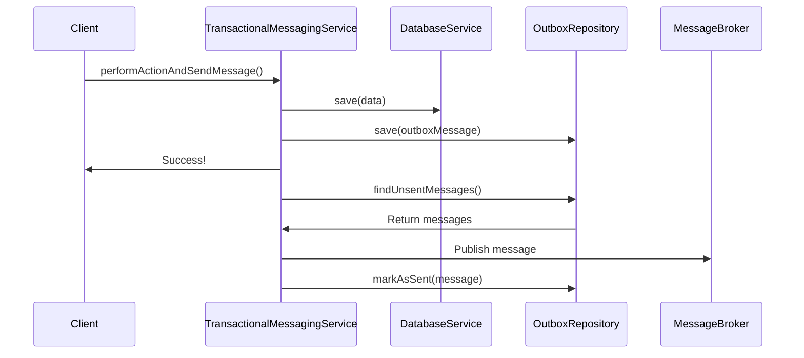
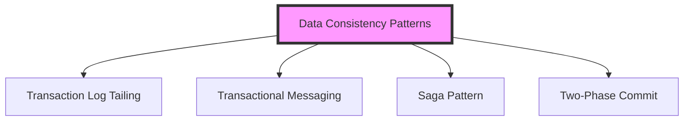

## Transaction Log Tailing and Transactional Messaging

Microservices often need to publish messages as part of a database transaction to ensure data consistency and reliability. This guide covers two techniques that address this requirement: **Transaction Log Tailing** and **Transactional Messaging**.

### Transaction Log Tailing

#### Definition

Transaction Log Tailing involves reading database transaction logs to identify changes that need to be published as messages to other systems. This technique ensures messages are published reliably as it leverages the existing database transaction mechanics.

#### Intent

The primary intent of Transaction Log Tailing is to ensure that any modify operation in the database is captured and propagated accurately to other microservices through messaging systems.

#### Also Known As
- **CDC (Change Data Capture)**
- **Database Replication**

#### Key Features
- **Consistency**: Ensures data consistency by leveraging the database's transaction log.
- **Reliability**: Reduces chances of missing a change event.
- **Decoupling**: Allows for asynchronous processing of data changes.

#### Detailed Explanations



#### Code Example

```java
public class TransactionLogService {

    @Autowired
    private DatabaseLogExtractor logExtractor;

    @Autowired
    private MessagePublisher messagePublisher;

    @Scheduled(fixedRate = 10000)
    public void tailLog() {
        List<LogEntry> logEntries = logExtractor.extractLogEntries();
        logEntries.forEach(entry -> {
            String message = createMessage(entry);
            messagePublisher.publish(message);
        });
    }

    private String createMessage(LogEntry entry) {
        // Format the message from log entry
    }
}

@Component
public class DatabaseLogExtractor {

    public List<LogEntry> extractLogEntries() {
        // Logic to extract log entries from the database
    }
}

@Component
public class MessagePublisher {

    @Autowired
    private MessageBroker broker;

    public void publish(String message) {
        // Publish message to broker
    }
}
```

#### Sequence Diagram



#### Benefits
- Aligns well with most existing databases.
- Allows backtracking and re-processing.
- Ensures strong consistency and reliability.

#### Trade-offs
- May add latency due to periodic log reading.
- Requires access to database internals or configuration.

#### When to Use
- When strong data consistency is crucial.
- For propagating data changes across services.
- When using databases that support transaction logging.

#### When Not to Use
- When dealing with highly time-sensitive operations.
- Databases that don't provide easy access to transaction logs.

#### Related Patterns
- **Event Sourcing**: Instead of capturing changes from logs, captures state changes as events.

### Transactional Messaging

#### Definition

Transactional Messaging ensures that messages publish as part of the same transaction as the database operation. This guarantees that either both actions complete successfully or neither does.

#### Intent

To achieve atomicity in distributed systems by ensuring message publication is consistent with database transactions.

#### Also Known As
- **Outbox Pattern**
- **Reliable Messaging**

#### Key Features
- **Atomicity**: Ensures operations on both sides of the transaction succeed or fail together.
- **Reliability**: Reduces chances of message loss or failure.
- **Consistency**: Provides strong data consistency guarantees.

#### Detailed Explanations



#### Code Example

```java
@Service
public class TransactionalMessagingService {
    
    @Autowired
    private DatabaseService databaseService;

    @Autowired
    private OutboxRepository outboxRepository;

    @Autowired
    private MessageSender messageSender;

    @Transactional
    public void performActionAndSendMessage(Object data, String message) {
        databaseService.save(data);
        Outbox outboxMessage = new Outbox(message);
        outboxRepository.save(outboxMessage);
    }

    @Scheduled(fixedRate = 10000)
    @Transactional
    public void processOutbox() {
        List<Outbox> messages = outboxRepository.findUnsentMessages();
        messages.forEach(message -> {
            messageSender.send(message);
            outboxRepository.markAsSent(message);
        });
    }
}

interface OutboxRepository extends JpaRepository<Outbox, Long> {
    @Query("SELECT o FROM Outbox o WHERE o.sent = false")
    List<Outbox> findUnsentMessages();
}

@Component
public class MessageSender {
    @Autowired
    private MessageBroker messageBroker;

    public void send(Outbox message) {
        // Publish message to message broker
    }
}
```

#### Sequence Diagram



#### Benefits
- Ensures atomicity of message publication.
- Strongly consistent messaging.
- Reliable, avoiding duplicated or missing messages.

#### Trade-offs
- Additional storage mechanism (Outbox table).
- Slight complexity in implementation.
- Requires periodic Outbox processing which can introduce latency.

#### When to Use
- Critical transactions requiring strong atomicity.
- Propagating state changes across microservices.
- When working with asynchronous messaging systems.

#### When Not to Use
- High-throughput systems where outbox processing overhead is unmanageable.

#### Related Patterns
- **Two-Phase Commit (2PC)**: Distributed transaction algorithm that coordinates all the processes participating in a transaction.
- **Saga Pattern**: Distributed transaction pattern for rolling back or compensating incomplete transactions in microservices.

### Grouped Patterns: Ensuring Data Consistency in Microservices



### References and Further Reading
- Design Microservices Architecture with Patterns & Principles (by Kasun Indrasiri and Prabath Siriwardena)
- Building Microservices (by Sam Newman)
- Domain-Driven Design: Tackling Complexity in the Heart of Software (by Eric Evans)

### Open Source Frameworks and Tools
- **Debezium**: Open-source CDC tool
- **Kafka**: Real-time data streaming platform
- **Spring Cloud Stream**: Framework for building event-driven microservices

### Related Design Patterns
- **Outbox Pattern**: Ensures that changes to database state and messages are part of a single atomic transaction.
- **Event Sourcing**: Ensures state changes are stored as a sequence of events.
- **CQRS (Command Query Responsibility Segregation)**: Separates read and write operations in the microservice architecture.

By implementing these patterns, microservices can achieve seamless data consistency and reliability in distributed systems.

