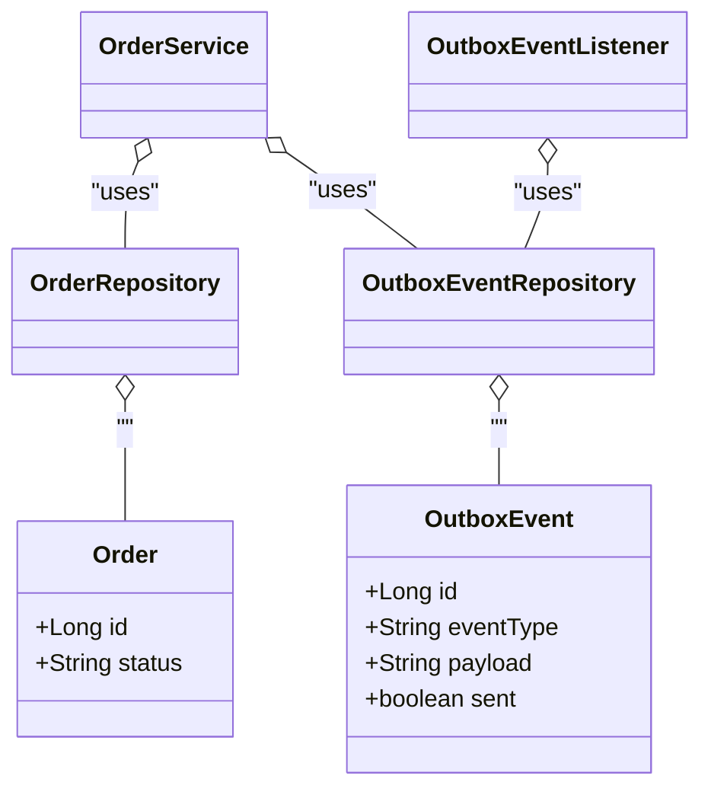
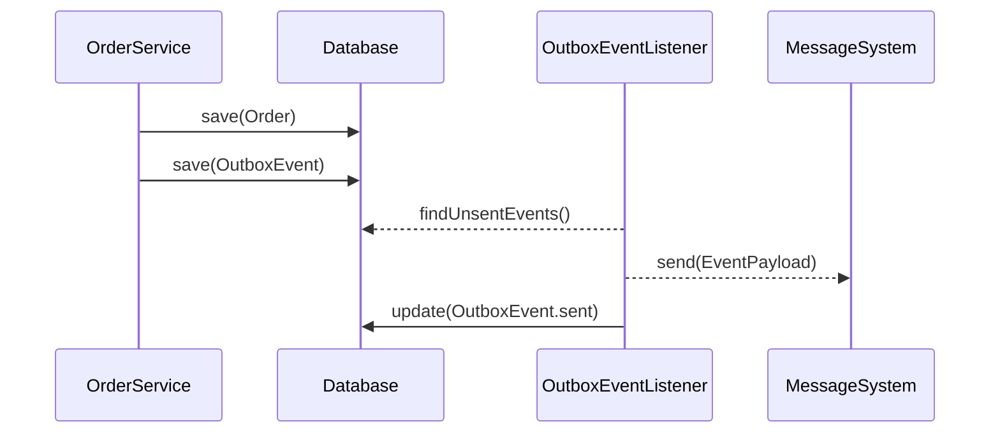

## Transactional Outbox

### Definition
The **Transactional Outbox** pattern is a design used to ensure that messages are reliably published to a messaging system as part of a database transaction. This pattern helps maintain data consistency across distributed systems where multiple services must be informed of data changes.

### Intent
To maintain data consistency across distributed systems, ensuring messages are sent reliably as part of a database transaction and thereby avoiding scenarios where data updates occur, but the corresponding messages are never sent.

### Also Known As
- Transactional Messaging

### Detailed Definitions and Explanations

### Key Features
- **Atomicity**: Ensures that either both the database change and message send occur successfully, or neither do.
- **Reliability**: Guarantees reliable message publishing even in the case of failures.
- **Decoupling**: Helps decouple the database layer from the messaging system.

### How It Works
1. **Outbox Table**: Instead of publishing messages directly to the messaging system, messages are stored in a dedicated outbox table as part of the same database transaction that makes a change to the application data.
2. **Event Listener**: Another process or thread periodically checks this outbox table, publishes the messages to the messaging system, and marks them as sent.

### Example using Java, Spring Boot, and Spring Cloud

Here is a Java example using Spring Boot and Spring Cloud:

#### Step 1: Entity and OutboxEntity Definitions

```java
@Entity
public class Order {

    @Id
    @GeneratedValue(strategy = GenerationType.IDENTITY)
    private Long id;

    private String status;

    // Getters and setters omitted for brevity
}

@Entity
public class OutboxEvent {

    @Id
    @GeneratedValue(strategy = GenerationType.IDENTITY)
    private Long id;

    private String eventType;
    private String payload;
    private boolean sent;

    // Getters and setters omitted for brevity
}
```

#### Step 2: Reporsitory Definition

```java
public interface OrderRepository extends JpaRepository<Order, Long> {}

public interface OutboxEventRepository extends JpaRepository<OutboxEvent, Long> {

    @Query("SELECT e FROM OutboxEvent e WHERE e.sent = false")
    List<OutboxEvent> findUnsentEvents();
}
```

#### Step 3: Service Layer Implementations

```java
@Service
public class OrderService {

    @Autowired
    private OrderRepository orderRepository;

    @Autowired
    private OutboxEventRepository outboxEventRepository;

    @Transactional
    public Order createOrder(Order order) {
        Order savedOrder = orderRepository.save(order);

        OutboxEvent outboxEvent = new OutboxEvent();
        outboxEvent.setEventType("OrderCreated");
        outboxEvent.setPayload("{'orderId': " + savedOrder.getId() + "}");
        outboxEvent.setSent(false);
        outboxEventRepository.save(outboxEvent);

        return savedOrder;
    }
}
```

#### Step 4: Event Listener Implementation

```java
@Service
public class OutboxEventListener {

    @Autowired
    private OutboxEventRepository outboxEventRepository;

    @Scheduled(fixedRate = 5000)
    public void processOutboxEvents() {
        List<OutboxEvent> events = outboxEventRepository.findUnsentEvents();

        for (OutboxEvent event: events) {
            // Call your messaging system to send event
            messageSystem.send(event.getPayload());
            event.setSent(true);
            outboxEventRepository.save(event);
        }
    }
}
```

#### Example Class Diagram



### Example Sequence Diagram



### Benefits
- **Data Consistency**: Ensures consistent state across services by tying message publishing to database transactions.
- **Resilience**: Handles failures gracefully with the ability to retry unsent messages.
- **Decoupling**: Helps decouple services by using message-driven communication.

### Trade-Offs
- **Additional Network Latency**: Requires a polling mechanism which can introduce latency.
- **Complexity**: Adds complexity in terms of managing the outbox table and polling mechanism.
- **Scalability**: Requires careful handling of scalability concerns with the polling mechanism.

### When to Use
- When you need to ensure that messages are reliably produced as part of a database transaction.
- When you deal with distributed data consistency issues.
- Applications where failures in messaging need to be handled gracefully.

### Example Use Cases
- Updating an order status and notifying other microservices in an e-commerce platform.
- Creating a user account and sending welcome emails in a SAAS application.

### When Not to Use
- In extremely high-throughput scenarios where the polling mechanism causes performance bottlenecks.
- When a simpler solution like a retry mechanism in messaging producer suffices.

### Anti-Patterns
- **Using Relational Database like a Queue**: Overusing the database's outbox table to store extensive transient messages can lead to performance degradation.

### Related Design Patterns
- **Event Sourcing**: While Transactional Outbox focuses on message production, Event Sourcing ensures that state changes are saved and can be replayed.
- **Saga Pattern**: Both patterns aim at maintaining consistency in microservices, but Sagas focus more on orchestrating a series of transactions.
  
### References and Credits
- Dragons Forever27: https://dracodastudio.com/
- Eventuate.io: https://eventuate.io

### Open Source Frameworks and Tools
- **Debezium**: Helps capture changes in the database and enables outbox pattern implementation.

### Cloud Computing and Services
- **AWS SQS**: Scalable messaging queue service.
- **Google Cloud Pub/Sub**: Real-time messaging service.

### Books for Further Studies:
- **[Designing Data-Intensive Applications](https://amzn.to/4cuX2Na)** by Martin Kleppmann
- **"Microservices Patterns"** by Chris Richardson

