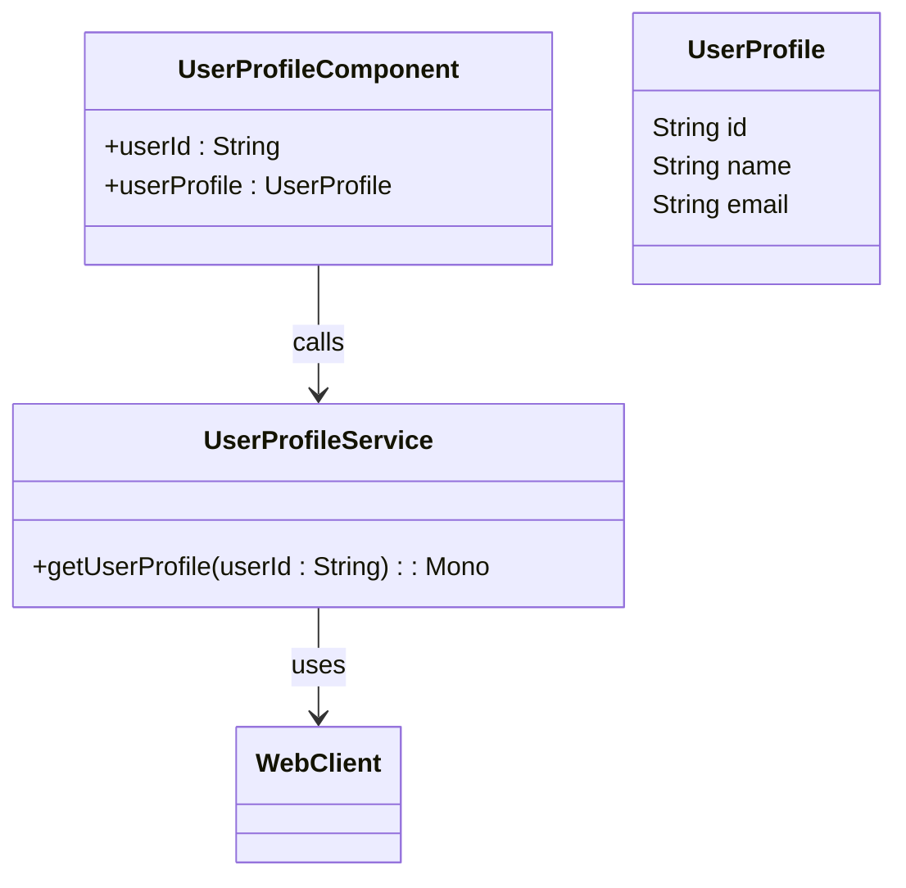
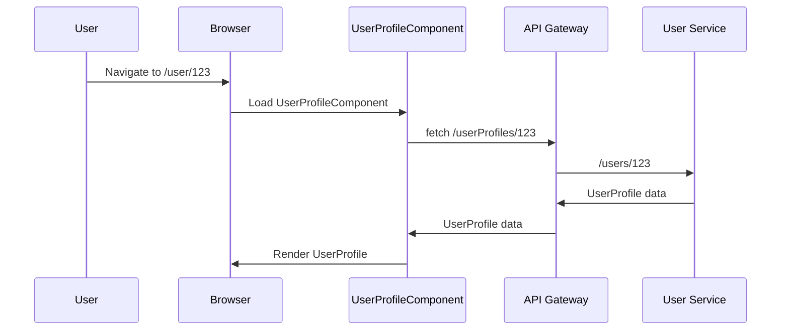

## Client-Side UI Composition

### Definition
Client-Side UI Composition is a Software Design Pattern where a user interface is built on the client by composing UI fragments rendered by multiple, business capability/subdomain-specific UI components. This allows different services to contribute content to a single screen or page, creating a seamless user experience.

### Intent
The intent of Client-Side UI Composition is to build dynamic and modular user interfaces that can easily incorporate data from multiple microservices, thus promoting reusability, maintainability, and scalability.

### Also Known As
- Component-Based UI
- Composite UI Design

### Detailed Definition
In microservices architecture, it is often necessary to build complex UIs that aggregate data from multiple microservices. Client-Side UI Composition enables this by composing the user interface from reusable, standalone UI components. Each component fetches data from corresponding microservices and displays it as part of the main UI.

### Key Features
- **Modularity**: UI components are self-contained and reusable.
- **Loose Coupling**: Each UI component interacts independently with its respective microservice.
- **Scalability**: Easier maintenance and scalability by separating UI concerns.

### Code Examples

```java
// UI Component fetching data from a microservice using Spring Boot and Spring WebFlux

import org.springframework.beans.factory.annotation.Autowired;
import org.springframework.stereotype.Service;
import org.springframework.web.reactive.function.client.WebClient;
import reactor.core.publisher.Mono;

@Service
public class UserProfileService {

    private final WebClient webClient;

    @Autowired
    public UserProfileService(WebClient.Builder webClientBuilder) {
        this.webClient = webClientBuilder.baseUrl("http://user-service").build();
    }

    public Mono<UserProfile> getUserProfile(String userId) {
        return webClient.get()
                .uri("/users/{id}", userId)
                .retrieve()
                .bodyToMono(UserProfile.class);
    }
}

// UserProfile.java
public class UserProfile {
    private String id;
    private String name;
    private String email;
    // getters and setters
}

// UserProfileComponent.vue (using Vue.js as an example for front-end framework)
<template>
  <div>
    <h2>{{ userProfile.name }}</h2>
    <p>{{ userProfile.email }}</p>
  </div>
</template>

<script>
export default {
  props: ['userId'],
  data() {
    return {
      userProfile: {}
    };
  },
  mounted() {
    fetch(`http://api.gateway/userProfiles/${this.userId}`)
      .then(response => response.json())
      .then(data => {
        this.userProfile = data;
      });
  }
};
</script>
```

### Example Class Diagram



### Example Sequence Diagram



### Benefits
- **Improved Modularity**: Encourages small, single-responsibility components.
- **Flexibility**: Each microservice can evolve independently.
- **Better Performance**: Optimization of individual components is easier.

### Trade-offs
- **Increased Complexity**: Managing multiple UI components can become complex.
- **Dependency Management**: Dependencies between components must be clearly defined.
- **Performance Overhead**: Each additional HTTP call impacts the performance.

### When to Use
- When building applications that require dynamic data aggregation from several microservices.
- For modular applications where different parts of the UI can be developed and maintained independently.
- When scalability and maintainability are key concerns in the UI design.

### Example Use Cases
- E-commerce dashboards displaying data from inventory, user profiles, and order history services.
- Social media platforms aggregating user posts, notifications, and messages from separate microservices.

### When Not to Use
- For simple applications where a single service/backend can fulfill most requirements.
- When real-time performance is critical and the added network latency is not acceptable.
- If the team lacks expertise in frontend technologies and client-side scripting.

### Anti-Patterns
- **Monolithic UI**: Building a monolithic UI that tightly couples presentation with the underlying services.
- **Tight Coupling**: Directly tying UI components to specific service implementations without abstraction.

### Related Design Patterns
- **Backend for Frontend (BFF)**: Creating dedicated backends for each frontend to handle UI-specific logic.
- **API Gateway**: Facilitates client-side composition by providing a single entry point for multiple services.

### References and Credits
- [Microservices Patterns: With examples in Java](https://www.amazon.com/Microservices-Patterns-examples-Chris-Richardson/dp/1617294543)
- [Spring Cloud Documentation](https://spring.io/projects/spring-cloud)
- [Vue.js Documentation](https://vuejs.org/v2/guide/)

### Open Source Frameworks and Tools
- **Spring Boot**: Framework for building Java-based microservices.
- **Spring Cloud Gateway**: Provides API gateway support for Spring Cloud based applications.
- **Web Components**: A set of web platform APIs that allow you to create new custom, reusable, encapsulated HTML tags.

### Cloud Computing, SAAS, DAAS, PAAS
Platforms like AWS, Google Cloud, and Azure provide services to easily deploy and manage microservices architectures, including client-side UI compositions.

### Suggested Books for Further Reading
- [Microservices Patterns: With examples in Java](https://amzn.to/4cSXzYV) by Chris Richardson
- [Building Microservices: Designing Fine-Grained Systems](https://amzn.to/3RYRz96) by Sam Newman

### Grouping Related Patterns
Here’s a visual representation of related patterns tackling issues in front-end design:

```mermaid
graph TD;
  ClientSideUI[Client-Side UI Composition] --> BFF[Backend for Frontend &#40;BFF&#41;]
  ClientSideUI --> APIGateway[API Gateway]
  BFF --> SPA[Single Page Application&#40;SPA&#41;]
  SPA --> MicroFrontend[Micro Frontends]
  SPA --> StaticSite[Static Site Generation]

  style ClientSideUI fill:#f9f,stroke:#333,stroke-width:2px;
  style BFF fill:#bbf,stroke:#333,stroke-width:1px;
  style APIGateway fill:#bbf,stroke:#333,stroke-width:1px;
  style SPA fill:#ff9,stroke:#333,stroke-width:1px;
  style MicroFrontend fill:#ff9,stroke:#333,stroke-width:1px;
  style StaticSite fill:#ff9,stroke:#333,stroke-width:1px;
```



### Conclusion
Client-Side UI Composition is a powerful pattern for building modular, scalable, and maintainable UIs in microservices architectures. It promotes component separation and facilitates independent development, leading to flexible and responsive web applications.

---
